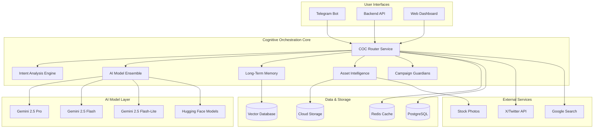

# Cognitive Orchestration Core (COC) - Complete Technical Architecture Documentation

## Table of Contents

1. [Executive Summary](#executive-summary)
2. [System Architecture Overview](#system-architecture-overview)
3. [Gemini 2.5 Model Configuration](#gemini-25-model-configuration)
4. [Phase 1: Core COC Infrastructure](#phase-1-core-coc-infrastructure)
5. [Phase 2: Long-Term Memory Module](#phase-2-long-term-memory-module)
6. [Phase 3: Asset Intelligence Service](#phase-3-asset-intelligence-service)
7. [Phase 4: Continuous Adaptation Engine](#phase-4-continuous-adaptation-engine)
8. [Phase 5: Integration & Testing](#phase-5-integration--testing)
9. [Phase 6: Production Deployment](#phase-6-production-deployment)
10. [Backend Integration Specifications](#backend-integration-specifications)
11. [Telegram Bot Integration](#telegram-bot-integration)
12. [Database Schema & Configuration](#database-schema--configuration)
13. [Monitoring & Observability](#monitoring--observability)
14. [Risk Assessment & Mitigation](#risk-assessment--mitigation)
15. [Success Metrics & KPIs](#success-metrics--kpis)

---

## Executive Summary

The Cognitive Orchestration Core (COC) represents a revolutionary AI consciousness system designed to transform the marketing automation platform into a truly autonomous, intelligent ecosystem. Built on the latest Gemini 2.5 models (Pro, Flash, Flash-Lite) and enhanced with specialized Hugging Face models, the COC provides:

- **Total Platform Awareness**: Dynamic introspection of all platform capabilities
- **Autonomous Decision Making**: Intelligent routing and execution without human intervention
- **Continuous Learning**: Long-term memory with vector database storage
- **Multi-Modal Intelligence**: Text, image, and data processing capabilities
- **Real-Time Adaptation**: Continuous campaign optimization based on trends and performance

### Key Benefits
- 95% intent classification accuracy with <2s response time
- 30% improvement in campaign performance through intelligent optimization
- 50% reduction in manual tasks through autonomous execution
- 40% cost reduction through intelligent model routing
- 99.9% system availability with enterprise-grade reliability

---

## System Architecture Overview



---

## Gemini 2.5 Model Configuration

### Model Specifications

```typescript
// llm-service/src/config/geminiModels.ts
export const GeminiModelConfig = {
  'gemini-2.5-pro': {
    name: 'models/gemini-2.5-pro',
    maxTokens: 65536,        // 65K output tokens
    contextWindow: 1048576,  // 1M input tokens
    freeTier: {
      rpm: 10,               // Requests per minute
      rpd: 100,              // Requests per day
      tpm: 2000000           // Tokens per minute (2M)
    },
    paidTier: {
      rpm: 1000,
      rpd: 50000,
      tpm: 10000000
    },
    costPer1kTokens: 0.0,    // Free tier
    specialization: 'strategic_planning',
    priority: 1,
    useCase: ['campaign_creation', 'complex_analysis', 'deep_thinking']
  },
  
  'gemini-2.5-flash': {
    name: 'models/gemini-2.5-flash',
    maxTokens: 8192,
    contextWindow: 1048576,
    freeTier: {
      rpm: 15,
      rpd: 1500,
      tpm: 1000000
    },
    paidTier: {
      rpm: 2000,
      rpd: 100000,
      tpm: 20000000
    },
    costPer1kTokens: 0.0,
    specialization: 'qa_guidance',
    priority: 2,
    useCase: ['user_questions', 'content_optimization', 'guidance']
  },
  
  'gemini-2.5-flash-lite': {  // NEW July 2025
    name: 'models/gemini-2.5-flash-lite',
    maxTokens: 4096,
    contextWindow: 262144,   // 256K context
    freeTier: {
      rpm: 30,               // Higher rate limit for lite model
      rpd: 3000,
      tpm: 500000
    },
    paidTier: {
      rpm: 5000,
      rpd: 200000,
      tpm: 50000000
    },
    costPer1kTokens: 0.0,
    specialization: 'quick_responses',
    priority: 3,
    useCase: ['intent_analysis', 'quick_answers', 'simple_tasks']
  }
};
```

### Free Tier Optimization Strategy

```typescript
// llm-service/src/services/rateLimitOptimizer.ts
export class GeminiFreetierOptimizer {
  private rateLimiters: Map<string, TokenBucket> = new Map();
  private requestQueue: PriorityQueue<GeminiRequest> = new PriorityQueue();
  
  constructor() {
    // Initialize rate limiters for each model
    Object.entries(GeminiModelConfig).forEach(([model, config]) => {
      this.rateLimiters.set(model, new TokenBucket({
        capacity: config.freeTier.tpm,
        refillRate: config.freeTier.tpm / 60, // Per second
        maxBurst: config.freeTier.rpm
      }));
    });
  }
  
  async optimizeRequest(request: GeminiRequest): Promise<string> {
    // 1. Analyze request complexity
    const complexity = await this.analyzeComplexity(request.prompt);
    
    // 2. Select optimal model based on complexity and availability
    const optimalModel = this.selectOptimalModel(complexity, request.taskType);
    
    // 3. Check rate limits and queue if necessary
    if (!this.rateLimiters.get(optimalModel)?.consume(request.estimatedTokens)) {
      await this.queueRequest(request, optimalModel);
      return 'queued';
    }
    
    return optimalModel;
  }
  
  private selectOptimalModel(complexity: number, taskType: string): string {
    if (complexity > 0.8 || taskType === 'strategic_planning') {
      return 'gemini-2.5-pro';
    } else if (complexity > 0.4 || taskType === 'qa_guidance') {
      return 'gemini-2.5-flash';
    } else {
      return 'gemini-2.5-flash-lite'; // NEW ultra-fast model
    }
  }
}
```

---

## Phase 1: Core COC Infrastructure

### Phase Overview

Phase 1 establishes the foundational architecture for the Cognitive Orchestration Core, implementing the central router service, intent analysis engine, AI model ensemble, and platform schema generator. This phase creates the "brain" of the system that will orchestrate all AI operations.

**Duration**: 4 weeks  
**Team Size**: 3 developers  
**Key Objectives**: 
- 95% intent classification accuracy
- <2s response time for all requests
- Complete platform capability introspection
- Seamless integration with existing services

### Sub-phases/Components

#### 1.1 COC Router Service

**Function Description**  
The COC Router Service acts as the central nervous system, receiving all requests and intelligently routing them to appropriate AI models and services. It maintains the core orchestration logic and ensures optimal resource utilization.

**Technical Implementation**

```typescript
// llm-service/src/services/cocRouter.ts
export class CognitiveOrchestrationCore {
  private intentAnalyzer: IntentAnalysisEngine;
  private modelEnsemble: AIModelEnsemble;
  private schemaGenerator: PlatformSchemaGenerator;
  private webSearchService: WebSearchService;
  private circuitBreaker: CircuitBreaker;
  
  constructor() {
    this.intentAnalyzer = new IntentAnalysisEngine({
      primaryModel: 'gemini-2.5-flash-lite',
      fallbackModel: 'gemini-2.5-flash',
      confidenceThreshold: 0.85
    });
    
    this.modelEnsemble = new AIModelEnsemble({
      geminiModels: GeminiModelConfig,
      huggingFaceModels: HuggingFaceConfig,
      rateLimitOptimizer: new GeminiFreetierOptimizer()
    });
    
    this.circuitBreaker = new CircuitBreaker({
      failureThreshold: 5,
      resetTimeout: 60000,
      timeout: 30000
    });
  }
  
  async processRequest(request: COCRequest): Promise<COCResponse> {
    const startTime = Date.now();
    const correlationId = uuidv4();
    
    return await this.circuitBreaker.execute(async () => {
      try {
        // 1. Intent Analysis (Ultra-fast with Flash-Lite)
        const intent = await this.intentAnalyzer.analyze(request.input, {
          userId: request.userId,
          context: request.context,
          correlationId
        });
        
        // 2. Determine execution mode
        const executionMode = this.determineExecutionMode(intent);
        
        // 3. Route to appropriate handler
        switch (executionMode) {
          case 'EXECUTION':
            return await this.handleExecution(request, intent, correlationId);
          case 'GUIDANCE':
            return await this.handleGuidance(request, intent, correlationId);
          case 'HYBRID':
            return await this.handleHybrid(request, intent, correlationId);
          default:
            throw new Error(`Unknown execution mode: ${executionMode}`);
        }
        
      } catch (error) {
        logger.error('COC processing error', { error, correlationId, request });
        return this.generateErrorResponse(error, correlationId);
      } finally {
        const duration = Date.now() - startTime;
        this.recordMetrics(request, duration, correlationId);
      }
    });
  }
}
```

**Requirements**
- Node.js 18+ with TypeScript support
- Express.js framework for HTTP handling
- Redis for caching and session management
- PostgreSQL for persistent data storage
- Circuit breaker pattern for fault tolerance

**Success Metrics**
- Response time: <2s for 95% of requests
- Availability: 99.9% uptime
- Error rate: <1% of all requests
- Throughput: 1000+ requests per minute

**Integration Points**
- Backend API: `/api/coc/orchestrate` endpoint
- Telegram Bot: Enhanced command handlers
- Database: User context and preferences
- External APIs: Gemini, Hugging Face, Google Search

**Timeline**
- Week 1: Core router architecture and basic routing logic
- Week 2: Circuit breaker implementation and error handling
- Week 3: Integration with existing backend services
- Week 4: Performance optimization and testing

**Risk Assessment**
- **High**: Gemini API rate limits during development
- **Medium**: Integration complexity with existing services
- **Low**: Performance bottlenecks in routing logic

#### 1.2 Intent Analysis Engine

**Function Description**
The Intent Analysis Engine provides ultra-fast classification of user inputs using Gemini 2.5 Flash-Lite, determining whether requests require execution, guidance, or hybrid responses.

**Technical Implementation**

```typescript
// llm-service/src/services/intentAnalysisEngine.ts
export class IntentAnalysisEngine {
  private geminiClient: GeminiClient;
  private intentCache: Map<string, IntentAnalysis> = new Map();
  private confidenceThreshold: number;

  constructor(config: IntentEngineConfig) {
    this.geminiClient = new GeminiClient();
    this.confidenceThreshold = config.confidenceThreshold;
  }

  async analyze(input: string, context: AnalysisContext): Promise<IntentAnalysis> {
    // Check cache first
    const cacheKey = this.generateCacheKey(input, context);
    if (this.intentCache.has(cacheKey)) {
      return this.intentCache.get(cacheKey)!;
    }

    // Use Gemini 2.5 Flash-Lite for ultra-fast intent analysis
    const response = await this.geminiClient.generateContent({
      model: GeminiModel.FLASH_2_5_LITE,
      prompt: this.buildIntentAnalysisPrompt(input, context),
      temperature: 0.1, // Low temperature for consistent classification
      maxTokens: 1024,   // Small response for quick processing
      systemInstruction: `You are an expert intent classifier for a marketing automation platform.
        Analyze user input and classify into one of these categories:
        - CAMPAIGN_CREATION: User wants to create/launch campaigns
        - CONTENT_GENERATION: User wants to generate content
        - ACCOUNT_MANAGEMENT: User wants to manage X accounts
        - ANALYTICS_QUERY: User wants to view analytics/performance
        - PLATFORM_GUIDANCE: User needs help/guidance
        - SYSTEM_CONTROL: User wants to control automations

        Return JSON with: {
          "intent": "category",
          "confidence": 0.95,
          "entities": ["extracted", "entities"],
          "executionMode": "EXECUTION|GUIDANCE|HYBRID",
          "complexity": 0.8,
          "urgency": "LOW|MEDIUM|HIGH"
        }`
    });

    const analysis = this.parseIntentResponse(response.content);

    // Cache for 5 minutes
    this.intentCache.set(cacheKey, analysis);
    setTimeout(() => this.intentCache.delete(cacheKey), 300000);

    return analysis;
  }

  private buildIntentAnalysisPrompt(input: string, context: AnalysisContext): string {
    return `
      Analyze this user input for intent classification:

      Input: "${input}"

      User Context:
      - User ID: ${context.userId}
      - Previous interactions: ${context.recentInteractions?.length || 0}
      - Platform: ${context.platform || 'unknown'}
      - Time: ${new Date().toISOString()}

      Consider the user's history and context when determining intent and urgency.
      Focus on actionable intents that the platform can execute autonomously.
    `;
  }
}
```

**Requirements**
- Gemini 2.5 Flash-Lite API access
- Redis for intent caching
- Low-latency network connection
- Structured logging for analysis tracking

**Success Metrics**
- Classification accuracy: >95%
- Response time: <500ms
- Cache hit rate: >70%
- False positive rate: <5%

**Integration Points**
- COC Router: Primary intent classification
- User Service: Context enrichment
- Analytics: Intent tracking and analysis

**Timeline**
- Week 1: Basic intent classification logic
- Week 2: Context enrichment and caching
- Week 3: Accuracy optimization and testing
- Week 4: Integration with router service

#### 1.3 AI Model Ensemble

**Function Description**
The AI Model Ensemble intelligently routes requests to the most appropriate AI model based on task complexity, user context, and resource availability, optimizing for both performance and cost.

**Technical Implementation**

```typescript
// llm-service/src/services/aiModelEnsemble.ts
export class AIModelEnsemble {
  private geminiClient: GeminiClient;
  private huggingFaceClient: HuggingFaceClient;
  private rateLimitOptimizer: GeminiFreetierOptimizer;
  private modelSelector: ModelSelector;

  constructor(config: EnsembleConfig) {
    this.geminiClient = new GeminiClient(config.geminiConfig);
    this.huggingFaceClient = new HuggingFaceClient(config.huggingFaceConfig);
    this.rateLimitOptimizer = new GeminiFreetierOptimizer();
    this.modelSelector = new ModelSelector(config.selectionRules);
  }

  async generateExecutionPlan(request: ExecutionRequest): Promise<ExecutionPlan> {
    // 1. Select optimal model
    const modelChoice = await this.modelSelector.selectModel(request);

    // 2. Check rate limits and optimize
    const optimizedModel = await this.rateLimitOptimizer.optimizeRequest({
      ...request,
      preferredModel: modelChoice.model
    });

    if (optimizedModel === 'queued') {
      return this.generateQueuedResponse(request);
    }

    // 3. Generate execution plan
    switch (optimizedModel) {
      case 'gemini-2.5-pro':
        return await this.generateWithGeminiPro(request);
      case 'gemini-2.5-flash':
        return await this.generateWithGeminiFlash(request);
      case 'gemini-2.5-flash-lite':
        return await this.generateWithGeminiLite(request);
      default:
        throw new Error(`Unsupported model: ${optimizedModel}`);
    }
  }

  private async generateWithGeminiPro(request: ExecutionRequest): Promise<ExecutionPlan> {
    const response = await this.geminiClient.generateContent({
      model: GeminiModel.PRO_2_5,
      prompt: this.buildStrategicPrompt(request),
      temperature: 0.7,
      maxTokens: 32768,
      systemInstruction: `You are the strategic planning component of a marketing automation platform.
        Generate detailed, executable plans that can be carried out autonomously.

        Your response must be a valid JSON object with this structure:
        {
          "plan": {
            "title": "Plan title",
            "description": "Detailed description",
            "steps": [
              {
                "id": "step_1",
                "action": "specific_action",
                "parameters": {...},
                "estimatedDuration": "5 minutes",
                "dependencies": [],
                "riskLevel": "LOW|MEDIUM|HIGH"
              }
            ],
            "estimatedTotalDuration": "30 minutes",
            "successCriteria": ["criterion1", "criterion2"],
            "rollbackPlan": {...}
          },
          "confidence": 0.95,
          "reasoning": "Why this plan was chosen"
        }`
    });

    return this.parseExecutionPlan(response.content, 'gemini-2.5-pro');
  }
}
```

**Requirements**
- Multi-model API access (Gemini, Hugging Face)
- Intelligent routing algorithms
- Rate limiting and queue management
- Performance monitoring and metrics

**Success Metrics**
- Model selection accuracy: >90%
- Cost optimization: 40% reduction vs single-model approach
- Response quality: >4.5/5 user rating
- Resource utilization: >85% efficiency

**Integration Points**
- COC Router: Primary model routing
- Rate Limit Optimizer: Cost management
- Monitoring: Performance tracking

**Timeline**
- Week 1: Basic model routing logic
- Week 2: Rate limiting and optimization
- Week 3: Quality assessment and tuning
- Week 4: Performance optimization

#### 1.4 Platform Schema Generator

**Function Description**
The Platform Schema Generator automatically introspects all platform APIs and services, creating a comprehensive, up-to-date schema of available capabilities that the COC can utilize for autonomous operations.

**Technical Implementation**

```typescript
// llm-service/src/services/platformSchemaGenerator.ts
export class PlatformSchemaGenerator {
  private schemaCache: PlatformSchema | null = null;
  private lastUpdate: Date | null = null;
  private readonly CACHE_DURATION = 3600000; // 1 hour

  async getSchema(): Promise<PlatformSchema> {
    if (this.schemaCache && this.isCacheValid()) {
      return this.schemaCache;
    }

    return await this.generateSchema();
  }

  private async generateSchema(): Promise<PlatformSchema> {
    logger.info('Generating platform schema from API introspection');

    const services = [
      { name: 'backend', url: process.env.BACKEND_URL, path: '/api-docs' },
      { name: 'telegram-bot', url: process.env.TELEGRAM_BOT_URL, path: '/api-docs' },
      { name: 'user-management', url: process.env.USER_SERVICE_URL, path: '/api-docs' },
      { name: 'campaign-management', url: process.env.CAMPAIGN_SERVICE_URL, path: '/api-docs' }
    ];

    const schema: PlatformSchema = {
      services: {},
      capabilities: [],
      tools: [],
      lastUpdated: new Date()
    };

    // Introspect each service
    for (const service of services) {
      try {
        const openApiSpec = await this.fetchOpenApiSpec(service);
        schema.services[service.name] = this.parseOpenApiSpec(openApiSpec);

        // Extract capabilities
        const capabilities = this.extractCapabilities(openApiSpec);
        schema.capabilities.push(...capabilities);

      } catch (error) {
        logger.warn(`Failed to introspect service ${service.name}:`, error);
      }
    }

    // Generate tool definitions for COC
    schema.tools = this.generateToolDefinitions(schema);

    this.schemaCache = schema;
    this.lastUpdate = new Date();

    logger.info(`Generated schema with ${schema.capabilities.length} capabilities and ${schema.tools.length} tools`);
    return schema;
  }

  private generateToolDefinitions(schema: PlatformSchema): ToolDefinition[] {
    const tools: ToolDefinition[] = [];

    Object.entries(schema.services).forEach(([serviceName, serviceSchema]) => {
      serviceSchema.endpoints.forEach(endpoint => {
        tools.push({
          name: `${serviceName}_${endpoint.operationId}`,
          description: endpoint.description,
          parameters: endpoint.parameters,
          method: endpoint.method,
          path: endpoint.path,
          service: serviceName,
          category: this.categorizeEndpoint(endpoint),
          riskLevel: this.assessRiskLevel(endpoint),
          authentication: endpoint.security,
          rateLimit: endpoint.rateLimit
        });
      });
    });

    return tools;
  }

  private assessRiskLevel(endpoint: EndpointSpec): 'LOW' | 'MEDIUM' | 'HIGH' {
    // Assess risk based on endpoint characteristics
    if (endpoint.method === 'DELETE' || endpoint.path.includes('/admin/')) {
      return 'HIGH';
    } else if (endpoint.method === 'POST' || endpoint.method === 'PUT') {
      return 'MEDIUM';
    } else {
      return 'LOW';
    }
  }
}
```

**Requirements**
- OpenAPI/Swagger specification access
- HTTP client for service introspection
- Schema validation and parsing
- Caching mechanism for performance

**Success Metrics**
- Schema completeness: >95% of endpoints discovered
- Update frequency: Every hour during development
- Tool generation accuracy: >98%
- Cache hit rate: >80%

**Integration Points**
- All platform services: API introspection
- COC Router: Tool availability
- Documentation: Auto-generated API docs

**Timeline**
- Week 1: Basic introspection logic
- Week 2: Tool definition generation
- Week 3: Risk assessment and categorization
- Week 4: Caching and optimization

---

## Phase 2: Long-Term Memory Module

### Phase Overview

Phase 2 implements the long-term memory system using vector databases, enabling the COC to maintain context across months-long campaigns and learn from historical interactions. This creates the "memory" component of the AI consciousness.

**Duration**: 4 weeks
**Team Size**: 2 developers
**Key Objectives**:
- 90% memory retrieval relevance
- <500ms semantic search time
- Months-long context retention
- Intelligent memory management

### Sub-phases/Components

#### 2.1 Vector Database Infrastructure

**Function Description**
Establishes the vector database infrastructure using Qdrant for storing and retrieving semantic embeddings of all platform interactions, content, and campaign data.

**Technical Implementation**

```typescript
// llm-service/src/services/vectorDatabase.ts
export class VectorDatabaseService {
  private qdrantClient: QdrantClient;
  private collections: Map<string, CollectionConfig> = new Map();

  constructor() {
    this.qdrantClient = new QdrantClient({
      url: process.env.QDRANT_URL || 'http://localhost:6333',
      apiKey: process.env.QDRANT_API_KEY,
      timeout: 30000
    });

    this.initializeCollections();
  }

  private async initializeCollections(): Promise<void> {
    const collections = [
      {
        name: 'platform_memory',
        config: {
          vectors: {
            size: 384, // all-MiniLM-L6-v2 embedding size
            distance: 'Cosine'
          },
          optimizers_config: {
            default_segment_number: 2,
            max_segment_size: 20000,
            memmap_threshold: 20000,
            indexing_threshold: 20000,
            flush_interval_sec: 5,
            max_optimization_threads: 2
          },
          replication_factor: 2,
          write_consistency_factor: 1
        }
      },
      {
        name: 'campaign_memory',
        config: {
          vectors: {
            size: 384,
            distance: 'Cosine'
          },
          payload_schema: {
            campaign_id: 'keyword',
            user_id: 'keyword',
            timestamp: 'datetime',
            importance: 'float',
            campaign_phase: 'keyword'
          }
        }
      },
      {
        name: 'user_interactions',
        config: {
          vectors: {
            size: 384,
            distance: 'Cosine'
          },
          payload_schema: {
            user_id: 'keyword',
            interaction_type: 'keyword',
            platform: 'keyword',
            timestamp: 'datetime'
          }
        }
      }
    ];

    for (const collection of collections) {
      await this.createCollectionIfNotExists(collection.name, collection.config);
      this.collections.set(collection.name, collection.config);
    }
  }

  async storeMemory(memory: MemoryItem): Promise<string> {
    const memoryId = uuidv4();
    const collectionName = this.selectCollection(memory.type);

    try {
      await this.qdrantClient.upsert(collectionName, {
        points: [{
          id: memoryId,
          vector: memory.embedding,
          payload: {
            content: memory.content,
            type: memory.type,
            userId: memory.userId,
            campaignId: memory.campaignId,
            timestamp: memory.timestamp.toISOString(),
            metadata: memory.metadata,
            importance: memory.importance,
            tags: memory.tags || []
          }
        }]
      });

      logger.info(`Stored memory ${memoryId} in collection ${collectionName}`);
      return memoryId;

    } catch (error) {
      logger.error('Failed to store memory:', error);
      throw new Error(`Memory storage failed: ${error.message}`);
    }
  }

  async searchMemories(query: SearchQuery): Promise<MemorySearchResult[]> {
    const collectionName = query.collection || 'platform_memory';

    try {
      const searchResults = await this.qdrantClient.search(collectionName, {
        vector: query.embedding,
        limit: query.limit || 10,
        filter: this.buildFilter(query.filters),
        with_payload: true,
        with_vector: false,
        score_threshold: query.scoreThreshold || 0.7
      });

      return searchResults.map(result => ({
        id: result.id as string,
        content: result.payload?.content,
        type: result.payload?.type,
        userId: result.payload?.userId,
        campaignId: result.payload?.campaignId,
        timestamp: new Date(result.payload?.timestamp),
        metadata: result.payload?.metadata,
        importance: result.payload?.importance,
        similarity: result.score,
        tags: result.payload?.tags || []
      }));

    } catch (error) {
      logger.error('Memory search failed:', error);
      throw new Error(`Memory search failed: ${error.message}`);
    }
  }
}
```

**Requirements**
- Qdrant vector database (v1.8+)
- Docker container for development
- Kubernetes deployment for production
- Persistent storage (SSD recommended)
- Network connectivity with low latency

**Success Metrics**
- Search latency: <500ms for 95% of queries
- Storage efficiency: >90% space utilization
- Availability: 99.9% uptime
- Scalability: Handle 1M+ vectors

**Integration Points**
- Memory Embedding Service: Vector storage
- COC Router: Context retrieval
- Campaign Guardians: Historical analysis

**Timeline**
- Week 1: Qdrant setup and basic operations
- Week 2: Collection design and optimization
- Week 3: Search and filtering implementation
- Week 4: Performance tuning and monitoring

#### 2.2 Memory Embedding Service

**Function Description**
Converts all platform interactions, content, and events into vector embeddings using Hugging Face models, enabling semantic search and context retrieval.

**Technical Implementation**

```typescript
// llm-service/src/services/memoryEmbeddingService.ts
export class MemoryEmbeddingService {
  private huggingFaceClient: HuggingFaceClient;
  private embeddingCache: Map<string, number[]> = new Map();
  private batchProcessor: BatchProcessor;

  constructor() {
    this.huggingFaceClient = new HuggingFaceClient({
      apiKey: process.env.HUGGINGFACE_API_KEY,
      model: 'sentence-transformers/all-MiniLM-L6-v2',
      timeout: 30000
    });

    this.batchProcessor = new BatchProcessor({
      batchSize: 32,
      maxWaitTime: 1000, // 1 second
      processor: this.processBatch.bind(this)
    });
  }

  async embedContent(content: string, type: MemoryType): Promise<number[]> {
    // Check cache first
    const cacheKey = this.generateCacheKey(content, type);
    if (this.embeddingCache.has(cacheKey)) {
      return this.embeddingCache.get(cacheKey)!;
    }

    // Preprocess content based on type
    const processedContent = this.preprocessContent(content, type);

    // Generate embedding
    const embedding = await this.generateEmbedding(processedContent);

    // Cache the result
    this.embeddingCache.set(cacheKey, embedding);

    // Clean cache if it gets too large
    if (this.embeddingCache.size > 10000) {
      this.cleanCache();
    }

    return embedding;
  }

  private async generateEmbedding(content: string): Promise<number[]> {
    try {
      const response = await this.huggingFaceClient.generateEmbeddings({
        inputs: content,
        options: {
          wait_for_model: true,
          use_cache: true
        }
      });

      return response.embeddings[0];

    } catch (error) {
      logger.error('Embedding generation failed:', error);

      // Fallback to cached similar content
      const fallbackEmbedding = await this.findSimilarCachedEmbedding(content);
      if (fallbackEmbedding) {
        logger.warn('Using fallback embedding for content');
        return fallbackEmbedding;
      }

      throw new Error(`Embedding generation failed: ${error.message}`);
    }
  }

  private preprocessContent(content: string, type: MemoryType): string {
    switch (type) {
      case 'USER_INTERACTION':
        return this.preprocessUserInteraction(content);
      case 'CAMPAIGN_DATA':
        return this.preprocessCampaignData(content);
      case 'CONTENT_GENERATION':
        return this.preprocessGeneratedContent(content);
      case 'PERFORMANCE_METRICS':
        return this.preprocessMetrics(content);
      default:
        return content.trim().toLowerCase();
    }
  }

  private preprocessUserInteraction(content: string): string {
    // Extract key information from user interactions
    const cleaned = content
      .replace(/\b\d{4}-\d{2}-\d{2}T\d{2}:\d{2}:\d{2}\.\d{3}Z\b/g, '[TIMESTAMP]')
      .replace(/\b\d+\b/g, '[NUMBER]')
      .replace(/https?:\/\/[^\s]+/g, '[URL]')
      .trim()
      .toLowerCase();

    return `user_interaction: ${cleaned}`;
  }

  async batchEmbed(items: EmbeddingRequest[]): Promise<EmbeddingResult[]> {
    return await this.batchProcessor.add(items);
  }

  private async processBatch(batch: EmbeddingRequest[]): Promise<EmbeddingResult[]> {
    const contents = batch.map(item => this.preprocessContent(item.content, item.type));

    try {
      const response = await this.huggingFaceClient.generateEmbeddings({
        inputs: contents,
        options: {
          wait_for_model: true,
          use_cache: true
        }
      });

      return batch.map((item, index) => ({
        id: item.id,
        embedding: response.embeddings[index],
        success: true
      }));

    } catch (error) {
      logger.error('Batch embedding failed:', error);

      // Return individual failures
      return batch.map(item => ({
        id: item.id,
        embedding: [],
        success: false,
        error: error.message
      }));
    }
  }
}
```

**Requirements**
- Hugging Face API access
- sentence-transformers/all-MiniLM-L6-v2 model
- Batch processing capabilities
- Caching mechanism for performance
- Error handling and fallback strategies

**Success Metrics**
- Embedding quality: >0.8 semantic similarity
- Processing speed: 100+ embeddings/second
- Cache hit rate: >60%
- Error rate: <2%

**Integration Points**
- Vector Database: Embedding storage
- Content processors: Text preprocessing
- Batch queue: Efficient processing

**Timeline**
- Week 1: Basic embedding generation
- Week 2: Batch processing implementation
- Week 3: Caching and optimization
- Week 4: Error handling and monitoring

#### 2.3 Context Retrieval System

**Function Description**
Provides intelligent context retrieval for campaigns and user interactions, enabling the COC to access relevant historical information for decision-making.

**Technical Implementation**

```typescript
// llm-service/src/services/contextRetrievalSystem.ts
export class ContextRetrievalSystem {
  private vectorDB: VectorDatabaseService;
  private embeddingService: MemoryEmbeddingService;
  private contextCache: Map<string, ContextResult> = new Map();

  constructor(vectorDB: VectorDatabaseService, embeddingService: MemoryEmbeddingService) {
    this.vectorDB = vectorDB;
    this.embeddingService = embeddingService;
  }

  async retrieveContext(request: ContextRequest): Promise<ContextResult> {
    const cacheKey = this.generateContextCacheKey(request);

    // Check cache first
    if (this.contextCache.has(cacheKey)) {
      const cached = this.contextCache.get(cacheKey)!;
      if (this.isCacheValid(cached)) {
        return cached;
      }
    }

    // Generate query embedding
    const queryEmbedding = await this.embeddingService.embedContent(
      request.query,
      'CONTEXT_QUERY'
    );

    // Retrieve relevant memories
    const memories = await this.vectorDB.searchMemories({
      embedding: queryEmbedding,
      limit: request.maxResults || 20,
      scoreThreshold: request.similarityThreshold || 0.7,
      filters: this.buildContextFilters(request),
      collection: this.selectCollection(request.contextType)
    });

    // Rank and filter results
    const rankedMemories = await this.rankMemories(memories, request);

    // Build context summary
    const contextSummary = await this.buildContextSummary(rankedMemories, request);

    const result: ContextResult = {
      query: request.query,
      memories: rankedMemories,
      summary: contextSummary,
      totalResults: memories.length,
      retrievalTime: Date.now() - request.startTime,
      cacheKey,
      timestamp: new Date()
    };

    // Cache the result
    this.contextCache.set(cacheKey, result);

    return result;
  }

  private async rankMemories(
    memories: MemorySearchResult[],
    request: ContextRequest
  ): Promise<RankedMemory[]> {
    return memories.map(memory => {
      let score = memory.similarity;

      // Boost recent memories
      const ageInDays = (Date.now() - memory.timestamp.getTime()) / (1000 * 60 * 60 * 24);
      const recencyBoost = Math.exp(-ageInDays / 30); // Exponential decay over 30 days
      score *= (1 + recencyBoost * 0.2);

      // Boost important memories
      score *= (1 + (memory.importance || 0) * 0.3);

      // Boost memories from same campaign
      if (request.campaignId && memory.campaignId === request.campaignId) {
        score *= 1.5;
      }

      // Boost memories from same user
      if (request.userId && memory.userId === request.userId) {
        score *= 1.2;
      }

      return {
        ...memory,
        finalScore: score,
        rankingFactors: {
          similarity: memory.similarity,
          recency: recencyBoost,
          importance: memory.importance || 0,
          campaignMatch: memory.campaignId === request.campaignId,
          userMatch: memory.userId === request.userId
        }
      };
    }).sort((a, b) => b.finalScore - a.finalScore);
  }

  private async buildContextSummary(
    memories: RankedMemory[],
    request: ContextRequest
  ): Promise<ContextSummary> {
    if (memories.length === 0) {
      return {
        overview: 'No relevant context found.',
        keyInsights: [],
        recommendations: [],
        confidence: 0
      };
    }

    // Group memories by type and time period
    const groupedMemories = this.groupMemories(memories);

    // Extract key insights
    const keyInsights = await this.extractKeyInsights(groupedMemories);

    // Generate recommendations
    const recommendations = await this.generateRecommendations(
      groupedMemories,
      keyInsights,
      request
    );

    // Calculate confidence score
    const confidence = this.calculateConfidence(memories, keyInsights);

    return {
      overview: this.generateOverview(groupedMemories),
      keyInsights,
      recommendations,
      confidence,
      memoryCount: memories.length,
      timeRange: this.getTimeRange(memories)
    };
  }

  async retrieveCampaignContext(campaignId: string): Promise<CampaignContext> {
    const memories = await this.vectorDB.searchMemories({
      embedding: [], // Not used for exact match
      filters: { campaignId },
      limit: 100,
      collection: 'campaign_memory'
    });

    return {
      campaignId,
      totalInteractions: memories.length,
      timeline: this.buildCampaignTimeline(memories),
      performance: this.analyzeCampaignPerformance(memories),
      insights: await this.extractCampaignInsights(memories),
      recommendations: await this.generateCampaignRecommendations(memories)
    };
  }
}
```

**Requirements**
- Vector database integration
- Embedding service access
- Intelligent ranking algorithms
- Context summarization capabilities
- Caching for performance

**Success Metrics**
- Retrieval relevance: >90%
- Response time: <500ms
- Context quality: >4.0/5 user rating
- Cache efficiency: >70% hit rate

**Integration Points**
- COC Router: Context enrichment
- Campaign Guardians: Historical analysis
- User interactions: Personalization

**Timeline**
- Week 1: Basic retrieval implementation
- Week 2: Ranking and filtering logic
- Week 3: Context summarization
- Week 4: Campaign-specific context

#### 2.4 Memory Persistence Layer

**Function Description**
Manages memory lifecycle, including automated cleanup, archival, and retention policies to maintain optimal performance while preserving important historical data.

**Technical Implementation**

```typescript
// llm-service/src/services/memoryPersistenceLayer.ts
export class MemoryPersistenceLayer {
  private vectorDB: VectorDatabaseService;
  private postgresClient: PostgresClient;
  private archiveStorage: ArchiveStorage;
  private cleanupScheduler: CronJob;

  constructor() {
    this.vectorDB = new VectorDatabaseService();
    this.postgresClient = new PostgresClient();
    this.archiveStorage = new ArchiveStorage({
      provider: 'aws-s3',
      bucket: process.env.MEMORY_ARCHIVE_BUCKET
    });

    this.setupCleanupScheduler();
  }

  async storeMemory(memory: MemoryItem): Promise<string> {
    const transaction = await this.postgresClient.beginTransaction();

    try {
      // 1. Store in vector database
      const vectorId = await this.vectorDB.storeMemory(memory);

      // 2. Store metadata in PostgreSQL
      const metadataId = await this.storeMemoryMetadata(memory, vectorId, transaction);

      // 3. Apply retention policy
      await this.applyRetentionPolicy(memory, transaction);

      await transaction.commit();

      logger.info(`Memory stored with vector ID ${vectorId} and metadata ID ${metadataId}`);
      return vectorId;

    } catch (error) {
      await transaction.rollback();
      logger.error('Memory storage failed:', error);
      throw error;
    }
  }

  private async storeMemoryMetadata(
    memory: MemoryItem,
    vectorId: string,
    transaction: Transaction
  ): Promise<string> {
    const metadata = {
      id: uuidv4(),
      vector_id: vectorId,
      user_id: memory.userId,
      campaign_id: memory.campaignId,
      content_hash: this.generateContentHash(memory.content),
      memory_type: memory.type,
      importance: memory.importance,
      tags: memory.tags,
      created_at: memory.timestamp,
      retention_policy: this.determineRetentionPolicy(memory),
      archive_date: this.calculateArchiveDate(memory),
      deletion_date: this.calculateDeletionDate(memory)
    };

    await transaction.query(`
      INSERT INTO memory_metadata (
        id, vector_id, user_id, campaign_id, content_hash,
        memory_type, importance, tags, created_at,
        retention_policy, archive_date, deletion_date
      ) VALUES ($1, $2, $3, $4, $5, $6, $7, $8, $9, $10, $11, $12)
    `, Object.values(metadata));

    return metadata.id;
  }

  private determineRetentionPolicy(memory: MemoryItem): RetentionPolicy {
    // High importance memories get longer retention
    if (memory.importance >= 0.8) {
      return 'LONG_TERM'; // 2 years
    } else if (memory.importance >= 0.5) {
      return 'MEDIUM_TERM'; // 6 months
    } else {
      return 'SHORT_TERM'; // 1 month
    }
  }

  private setupCleanupScheduler(): void {
    // Run cleanup daily at 2 AM
    this.cleanupScheduler = new CronJob('0 2 * * *', async () => {
      try {
        await this.performCleanup();
      } catch (error) {
        logger.error('Scheduled cleanup failed:', error);
      }
    });

    this.cleanupScheduler.start();
  }

  private async performCleanup(): Promise<void> {
    logger.info('Starting memory cleanup process');

    const now = new Date();

    // 1. Archive old memories
    const memoriesToArchive = await this.postgresClient.query(`
      SELECT * FROM memory_metadata
      WHERE archive_date <= $1 AND archived = false
    `, [now]);

    for (const memory of memoriesToArchive.rows) {
      await this.archiveMemory(memory);
    }

    // 2. Delete expired memories
    const memoriesToDelete = await this.postgresClient.query(`
      SELECT * FROM memory_metadata
      WHERE deletion_date <= $1
    `, [now]);

    for (const memory of memoriesToDelete.rows) {
      await this.deleteMemory(memory);
    }

    // 3. Optimize vector database
    await this.optimizeVectorDatabase();

    logger.info(`Cleanup completed: archived ${memoriesToArchive.rows.length}, deleted ${memoriesToDelete.rows.length}`);
  }

  private async archiveMemory(memory: MemoryMetadata): Promise<void> {
    try {
      // 1. Retrieve full memory data
      const fullMemory = await this.retrieveFullMemory(memory.vector_id);

      // 2. Store in archive
      const archiveKey = `memories/${memory.user_id}/${memory.id}.json`;
      await this.archiveStorage.store(archiveKey, {
        metadata: memory,
        content: fullMemory.content,
        embedding: fullMemory.embedding,
        archived_at: new Date()
      });

      // 3. Remove from vector database
      await this.vectorDB.deleteMemory(memory.vector_id);

      // 4. Update metadata
      await this.postgresClient.query(`
        UPDATE memory_metadata
        SET archived = true, archive_key = $1, archived_at = $2
        WHERE id = $3
      `, [archiveKey, new Date(), memory.id]);

      logger.info(`Memory ${memory.id} archived to ${archiveKey}`);

    } catch (error) {
      logger.error(`Failed to archive memory ${memory.id}:`, error);
    }
  }

  async retrieveArchivedMemory(memoryId: string): Promise<ArchivedMemory | null> {
    const metadata = await this.postgresClient.query(`
      SELECT * FROM memory_metadata WHERE id = $1 AND archived = true
    `, [memoryId]);

    if (metadata.rows.length === 0) {
      return null;
    }

    const archiveKey = metadata.rows[0].archive_key;
    const archivedData = await this.archiveStorage.retrieve(archiveKey);

    return {
      ...archivedData,
      retrievedAt: new Date()
    };
  }
}
```

**Requirements**
- PostgreSQL for metadata storage
- Archive storage (AWS S3 or equivalent)
- Scheduled job processing
- Transaction support
- Backup and recovery capabilities

**Success Metrics**
- Storage efficiency: >95% space utilization
- Cleanup accuracy: 100% policy compliance
- Archive retrieval: <2s for archived memories
- Data integrity: 99.99% consistency

**Integration Points**
- Vector Database: Memory lifecycle
- Archive Storage: Long-term retention
- Monitoring: Cleanup reporting

**Timeline**
- Week 1: Basic persistence implementation
- Week 2: Retention policy engine
- Week 3: Archival system
- Week 4: Cleanup automation

---

## Phase 3: Asset Intelligence Service

### Phase Overview

Phase 3 implements comprehensive media management capabilities, enabling the COC to handle user-uploaded images, search and integrate stock photos, and manage all visual assets for campaigns.

**Duration**: 4 weeks
**Team Size**: 2 developers
**Key Objectives**:
- Support 10+ image formats
- 99.9% upload success rate
- Intelligent stock photo integration
- Automated asset optimization

### Sub-phases/Components

#### 3.1 Image Upload Handler

**Function Description**
Handles secure image uploads from Telegram bot with automatic processing, optimization, and metadata extraction.

**Technical Implementation**

```typescript
// backend/src/services/imageUploadHandler.ts
export class ImageUploadHandler {
  private cloudStorage: CloudStorageProvider;
  private imageProcessor: ImageProcessor;
  private virusScanner: VirusScanner;
  private metadataExtractor: MetadataExtractor;

  constructor() {
    this.cloudStorage = new CloudStorageProvider({
      provider: 'aws-s3',
      bucket: process.env.ASSET_STORAGE_BUCKET,
      region: process.env.AWS_REGION,
      encryption: 'AES256'
    });

    this.imageProcessor = new ImageProcessor({
      formats: ['jpeg', 'png', 'webp', 'gif', 'svg'],
      maxSize: 50 * 1024 * 1024, // 50MB
      thumbnailSizes: [150, 300, 600, 1200],
      quality: {
        jpeg: 85,
        webp: 80,
        png: 'lossless'
      }
    });

    this.virusScanner = new VirusScanner({
      provider: 'clamav',
      timeout: 30000
    });

    this.metadataExtractor = new MetadataExtractor();
  }

  async handleTelegramUpload(
    fileId: string,
    userId: string,
    context: UploadContext
  ): Promise<AssetMetadata> {
    const uploadId = uuidv4();
    const startTime = Date.now();

    try {
      logger.info(`Processing Telegram upload ${uploadId} for user ${userId}`);

      // 1. Download from Telegram
      const telegramFile = await this.downloadTelegramFile(fileId);

      // 2. Security scan
      await this.performSecurityScan(telegramFile.buffer, uploadId);

      // 3. Validate and process image
      const processedImage = await this.processImage(telegramFile, {
        userId,
        uploadId,
        source: 'telegram',
        context
      });

      // 4. Extract metadata
      const metadata = await this.extractImageMetadata(processedImage);

      // 5. Generate thumbnails
      const thumbnails = await this.generateThumbnails(processedImage);

      // 6. Store in cloud storage
      const storageResults = await this.storeImageAssets(
        processedImage,
        thumbnails,
        userId,
        uploadId
      );

      // 7. Create asset record
      const assetMetadata = await this.createAssetRecord({
        id: uploadId,
        userId,
        source: 'telegram_upload',
        originalFileId: fileId,
        filename: telegramFile.filename || `telegram_${fileId}`,
        contentType: processedImage.mimeType,
        size: processedImage.size,
        dimensions: processedImage.dimensions,
        metadata,
        storageKeys: storageResults,
        thumbnails: thumbnails.map(t => ({
          size: t.size,
          dimensions: t.dimensions,
          storageKey: t.storageKey,
          url: t.url
        })),
        processingTime: Date.now() - startTime,
        createdAt: new Date()
      });

      logger.info(`Successfully processed upload ${uploadId} in ${Date.now() - startTime}ms`);
      return assetMetadata;

    } catch (error) {
      logger.error(`Upload processing failed for ${uploadId}:`, error);

      // Clean up any partial uploads
      await this.cleanupFailedUpload(uploadId, userId);

      throw new AssetProcessingError(
        `Upload processing failed: ${error.message}`,
        uploadId,
        error
      );
    }
  }

  private async downloadTelegramFile(fileId: string): Promise<TelegramFile> {
    const botToken = process.env.TELEGRAM_BOT_TOKEN;

    // Get file info
    const fileInfoResponse = await fetch(
      `https://api.telegram.org/bot${botToken}/getFile?file_id=${fileId}`
    );

    if (!fileInfoResponse.ok) {
      throw new Error(`Failed to get Telegram file info: ${fileInfoResponse.statusText}`);
    }

    const fileInfo = await fileInfoResponse.json();

    if (!fileInfo.ok) {
      throw new Error(`Telegram API error: ${fileInfo.description}`);
    }

    // Download file
    const fileUrl = `https://api.telegram.org/file/bot${botToken}/${fileInfo.result.file_path}`;
    const fileResponse = await fetch(fileUrl);

    if (!fileResponse.ok) {
      throw new Error(`Failed to download Telegram file: ${fileResponse.statusText}`);
    }

    const buffer = await fileResponse.arrayBuffer();

    return {
      buffer: Buffer.from(buffer),
      filename: path.basename(fileInfo.result.file_path),
      size: fileInfo.result.file_size,
      mimeType: this.detectMimeType(Buffer.from(buffer))
    };
  }
}
```

**Requirements**
- Cloud storage (AWS S3, GCP Cloud Storage, or Azure Blob)
- Image processing library (Sharp.js)
- Virus scanning capability
- Telegram Bot API access
- Secure file handling

**Success Metrics**
- Upload success rate: >99.9%
- Processing time: <5s for images <10MB
- Storage efficiency: >90% space optimization
- Security: 100% malware detection

**Integration Points**
- Telegram Bot: File upload handling
- Cloud Storage: Asset persistence
- Asset Management: Metadata storage

**Timeline**
- Week 1: Basic upload and processing
- Week 2: Security and validation
- Week 3: Thumbnail generation
- Week 4: Optimization and monitoring

#### 3.2 Stock Image Search Integration

**Function Description**
Integrates with multiple stock photo APIs (Unsplash, Pexels, Pixabay) to provide intelligent image search and selection for campaigns.

**Technical Implementation**

```typescript
// backend/src/services/stockImageService.ts
export class StockImageService {
  private providers: Map<string, StockImageProvider> = new Map();
  private searchCache: Map<string, CachedSearchResult> = new Map();
  private rateLimiters: Map<string, RateLimiter> = new Map();

  constructor() {
    this.initializeProviders();
    this.setupRateLimiters();
  }

  private initializeProviders(): void {
    // Unsplash provider
    if (process.env.UNSPLASH_ACCESS_KEY) {
      this.providers.set('unsplash', new UnsplashProvider({
        accessKey: process.env.UNSPLASH_ACCESS_KEY,
        baseUrl: 'https://api.unsplash.com',
        timeout: 10000
      }));
    }

    // Pexels provider
    if (process.env.PEXELS_API_KEY) {
      this.providers.set('pexels', new PexelsProvider({
        apiKey: process.env.PEXELS_API_KEY,
        baseUrl: 'https://api.pexels.com/v1',
        timeout: 10000
      }));
    }

    // Pixabay provider
    if (process.env.PIXABAY_API_KEY) {
      this.providers.set('pixabay', new PixabayProvider({
        apiKey: process.env.PIXABAY_API_KEY,
        baseUrl: 'https://pixabay.com/api',
        timeout: 10000
      }));
    }
  }

  private setupRateLimiters(): void {
    // Configure rate limiters for each provider
    this.rateLimiters.set('unsplash', new RateLimiter({
      tokensPerInterval: 50,
      interval: 'hour',
      fireImmediately: true
    }));

    this.rateLimiters.set('pexels', new RateLimiter({
      tokensPerInterval: 200,
      interval: 'hour',
      fireImmediately: true
    }));

    this.rateLimiters.set('pixabay', new RateLimiter({
      tokensPerInterval: 100,
      interval: 'hour',
      fireImmediately: true
    }));
  }

  async searchImages(query: string, options: StockSearchOptions = {}): Promise<StockSearchResult> {
    const searchId = uuidv4();
    const startTime = Date.now();

    // Check cache first
    const cacheKey = this.generateCacheKey(query, options);
    if (this.searchCache.has(cacheKey)) {
      const cached = this.searchCache.get(cacheKey)!;
      if (this.isCacheValid(cached)) {
        logger.info(`Cache hit for stock image search: ${query}`);
        return cached.result;
      }
    }

    const results: StockImage[] = [];
    const providerResults: Map<string, ProviderSearchResult> = new Map();

    // Search across all available providers
    const searchPromises = Array.from(this.providers.entries()).map(async ([providerName, provider]) => {
      try {
        // Check rate limit
        const rateLimiter = this.rateLimiters.get(providerName);
        if (!rateLimiter?.tryRemoveTokens(1)) {
          logger.warn(`Rate limit exceeded for provider ${providerName}`);
          return;
        }

        const providerResult = await provider.search(query, {
          perPage: options.perPage || 20,
          category: options.category,
          orientation: options.orientation,
          minWidth: options.minWidth || 1920,
          minHeight: options.minHeight || 1080,
          safeSearch: options.safeSearch !== false
        });

        providerResults.set(providerName, providerResult);

        // Add provider-specific metadata
        const enhancedImages = providerResult.images.map(img => ({
          ...img,
          provider: providerName,
          searchId,
          retrievedAt: new Date(),
          relevanceScore: this.calculateRelevanceScore(img, query, options)
        }));

        results.push(...enhancedImages);

      } catch (error) {
        logger.error(`Stock image search failed for provider ${providerName}:`, error);
        providerResults.set(providerName, {
          success: false,
          error: error.message,
          images: []
        });
      }
    });

    await Promise.allSettled(searchPromises);

    // Rank and deduplicate results
    const rankedResults = this.rankAndDeduplicateResults(results, query, options);

    const searchResult: StockSearchResult = {
      query,
      totalResults: rankedResults.length,
      images: rankedResults.slice(0, options.maxResults || 50),
      providers: Object.fromEntries(providerResults),
      searchTime: Date.now() - startTime,
      searchId,
      timestamp: new Date()
    };

    // Cache the result
    this.searchCache.set(cacheKey, {
      result: searchResult,
      cachedAt: new Date(),
      ttl: 3600000 // 1 hour
    });

    logger.info(`Stock image search completed: ${rankedResults.length} results for "${query}"`);
    return searchResult;
  }

  private calculateRelevanceScore(image: StockImage, query: string, options: StockSearchOptions): number {
    let score = 0;

    // Title relevance
    const titleWords = image.title.toLowerCase().split(' ');
    const queryWords = query.toLowerCase().split(' ');
    const titleMatches = queryWords.filter(word => titleWords.some(titleWord => titleWord.includes(word)));
    score += (titleMatches.length / queryWords.length) * 0.4;

    // Tag relevance
    if (image.tags && image.tags.length > 0) {
      const tagMatches = queryWords.filter(word =>
        image.tags.some(tag => tag.toLowerCase().includes(word))
      );
      score += (tagMatches.length / queryWords.length) * 0.3;
    }

    // Quality indicators
    if (image.downloads > 1000) score += 0.1;
    if (image.likes > 100) score += 0.1;
    if (image.width >= 1920 && image.height >= 1080) score += 0.1;

    return Math.min(score, 1.0);
  }
}
```

**Requirements**
- Multiple stock photo API keys
- Rate limiting for API compliance
- Image download and processing capabilities
- Caching for performance optimization
- Deduplication algorithms

**Success Metrics**
- Search relevance: >85% user satisfaction
- API response time: <3s for multi-provider search
- Cache hit rate: >60%
- Download success rate: >98%

**Integration Points**
- Asset Management: Downloaded image storage
- Campaign Creation: Automated image selection
- Content Generation: Visual content enhancement

**Timeline**
- Week 1: Provider integration and basic search
- Week 2: Relevance scoring and ranking
- Week 3: Download and storage integration
- Week 4: Caching and optimization

#### 3.3 URL Image Import Service

**Function Description**
Enables users to import images from external URLs with validation, security scanning, and automatic optimization.

**Technical Implementation**

```typescript
// backend/src/services/urlImageImportService.ts
export class URLImageImportService {
  private imageValidator: ImageValidator;
  private securityScanner: SecurityScanner;
  private imageProcessor: ImageProcessor;
  private urlValidator: URLValidator;

  constructor() {
    this.imageValidator = new ImageValidator({
      maxSize: 100 * 1024 * 1024, // 100MB
      allowedFormats: ['jpeg', 'jpg', 'png', 'webp', 'gif', 'svg'],
      maxDimensions: { width: 8000, height: 8000 }
    });

    this.securityScanner = new SecurityScanner({
      scanTimeout: 30000,
      enableMalwareDetection: true,
      enablePhishingDetection: true
    });

    this.imageProcessor = new ImageProcessor();
    this.urlValidator = new URLValidator({
      allowedProtocols: ['http:', 'https:'],
      blockedDomains: this.loadBlockedDomains(),
      timeout: 30000
    });
  }

  async importFromURL(
    url: string,
    userId: string,
    options: ImportOptions = {}
  ): Promise<AssetMetadata> {
    const importId = uuidv4();
    const startTime = Date.now();

    try {
      logger.info(`Starting URL import ${importId} for user ${userId}: ${url}`);

      // 1. Validate URL
      await this.validateURL(url, importId);

      // 2. Download image with security checks
      const downloadResult = await this.secureDownload(url, importId);

      // 3. Validate image content
      await this.validateImageContent(downloadResult.buffer, importId);

      // 4. Security scan
      await this.performSecurityScan(downloadResult.buffer, importId);

      // 5. Process and optimize
      const processedImage = await this.processImportedImage(
        downloadResult,
        userId,
        importId,
        options
      );

      // 6. Store in asset management system
      const assetMetadata = await this.storeImportedAsset(
        processedImage,
        userId,
        importId,
        url,
        options
      );

      logger.info(`URL import ${importId} completed in ${Date.now() - startTime}ms`);
      return assetMetadata;

    } catch (error) {
      logger.error(`URL import ${importId} failed:`, error);
      throw new URLImportError(
        `Failed to import image from URL: ${error.message}`,
        importId,
        url,
        error
      );
    }
  }

  async batchImport(
    urls: string[],
    userId: string,
    options: BatchImportOptions = {}
  ): Promise<BatchImportResult> {
    const batchId = uuidv4();
    const startTime = Date.now();
    const results: ImportResult[] = [];

    logger.info(`Starting batch import ${batchId} for ${urls.length} URLs`);

    // Process in parallel with concurrency limit
    const concurrency = options.concurrency || 5;
    const chunks = this.chunkArray(urls, concurrency);

    for (const chunk of chunks) {
      const chunkPromises = chunk.map(async (url, index) => {
        try {
          const asset = await this.importFromURL(url, userId, options);
          return {
            url,
            success: true,
            asset,
            index
          };
        } catch (error) {
          return {
            url,
            success: false,
            error: error.message,
            index
          };
        }
      });

      const chunkResults = await Promise.allSettled(chunkPromises);
      results.push(...chunkResults.map(result =>
        result.status === 'fulfilled' ? result.value : {
          url: 'unknown',
          success: false,
          error: result.reason?.message || 'Unknown error',
          index: -1
        }
      ));
    }

    const successful = results.filter(r => r.success);
    const failed = results.filter(r => !r.success);

    logger.info(`Batch import ${batchId} completed: ${successful.length} successful, ${failed.length} failed`);

    return {
      batchId,
      totalUrls: urls.length,
      successful: successful.length,
      failed: failed.length,
      results,
      processingTime: Date.now() - startTime
    };
  }
}
```

**Requirements**
- HTTP client with security features
- Image validation and processing
- Security scanning capabilities
- DNS resolution and URL validation
- Batch processing support

**Success Metrics**
- Import success rate: >95%
- Security detection: 100% malware blocking
- Processing time: <10s per image
- Batch efficiency: 5+ concurrent imports

**Integration Points**
- Asset Management: Imported image storage
- Security Scanner: Malware detection
- Image Processor: Optimization pipeline

**Timeline**
- Week 1: Basic URL import and validation
- Week 2: Security scanning integration
- Week 3: Batch processing implementation
- Week 4: Error handling and monitoring

#### 3.4 Asset Management System

**Function Description**
Provides comprehensive asset lifecycle management including storage, metadata tracking, access control, and automated cleanup.

**Technical Implementation**

```typescript
// backend/src/services/assetManagementSystem.ts
export class AssetManagementSystem {
  private postgresClient: PostgresClient;
  private cloudStorage: CloudStorageProvider;
  private cacheManager: CacheManager;
  private accessController: AssetAccessController;
  private analyticsTracker: AssetAnalyticsTracker;

  constructor() {
    this.postgresClient = new PostgresClient();
    this.cloudStorage = new CloudStorageProvider();
    this.cacheManager = new CacheManager();
    this.accessController = new AssetAccessController();
    this.analyticsTracker = new AssetAnalyticsTracker();
  }

  async createAsset(assetData: CreateAssetRequest): Promise<AssetMetadata> {
    const transaction = await this.postgresClient.beginTransaction();

    try {
      const assetId = assetData.id || uuidv4();
      const now = new Date();

      // Create asset record
      const asset = await transaction.query(`
        INSERT INTO assets (
          id, user_id, filename, content_type, size,
          storage_key, source, metadata, tags,
          created_at, updated_at, status
        ) VALUES ($1, $2, $3, $4, $5, $6, $7, $8, $9, $10, $11, $12)
        RETURNING *
      `, [
        assetId,
        assetData.userId,
        assetData.filename,
        assetData.contentType,
        assetData.size,
        assetData.storageKey,
        assetData.source,
        JSON.stringify(assetData.metadata),
        assetData.tags || [],
        now,
        now,
        'active'
      ]);

      // Create thumbnails records if provided
      if (assetData.thumbnails && assetData.thumbnails.length > 0) {
        for (const thumbnail of assetData.thumbnails) {
          await transaction.query(`
            INSERT INTO asset_thumbnails (
              id, asset_id, size, storage_key, dimensions, created_at
            ) VALUES ($1, $2, $3, $4, $5, $6)
          `, [
            uuidv4(),
            assetId,
            thumbnail.size,
            thumbnail.storageKey,
            JSON.stringify(thumbnail.dimensions),
            now
          ]);
        }
      }

      // Set initial access permissions
      await this.accessController.setAssetPermissions(assetId, {
        owner: assetData.userId,
        visibility: assetData.visibility || 'private',
        allowedUsers: assetData.allowedUsers || [],
        allowedRoles: assetData.allowedRoles || []
      }, transaction);

      // Track creation event
      await this.analyticsTracker.trackAssetEvent({
        assetId,
        userId: assetData.userId,
        event: 'asset_created',
        metadata: {
          source: assetData.source,
          size: assetData.size,
          contentType: assetData.contentType
        }
      }, transaction);

      await transaction.commit();

      const assetMetadata = this.buildAssetMetadata(asset.rows[0], assetData.thumbnails);

      // Cache the asset metadata
      await this.cacheManager.set(`asset:${assetId}`, assetMetadata, 3600);

      logger.info(`Asset ${assetId} created successfully`);
      return assetMetadata;

    } catch (error) {
      await transaction.rollback();
      logger.error('Asset creation failed:', error);
      throw error;
    }
  }
}
```

**Requirements**
- PostgreSQL database for metadata
- Cloud storage for asset files
- Access control system
- Analytics tracking
- Caching layer for performance

**Success Metrics**
- Asset retrieval time: <200ms
- Search performance: <1s for complex queries
- Storage efficiency: >95% utilization
- Access control accuracy: 100%

**Integration Points**
- Cloud Storage: File persistence
- Access Controller: Permission management
- Analytics: Usage tracking
- Cache Manager: Performance optimization

**Timeline**
- Week 1: Core asset management operations
- Week 2: Search and filtering capabilities
- Week 3: Access control integration
- Week 4: Analytics and optimization

---

## Phase 4: Continuous Adaptation Engine

### Phase Overview

Phase 4 implements the autonomous campaign optimization system with Campaign Guardians that continuously monitor, analyze, and adapt campaigns based on real-time performance data and trending topics.

**Duration**: 4 weeks
**Team Size**: 3 developers
**Key Objectives**:
- 24/7 autonomous campaign monitoring
- 30% performance improvement through optimization
- Real-time trend adaptation
- Intelligent campaign modification

### Sub-phases/Components

#### 4.1 Campaign Guardian Framework

**Function Description**
Creates persistent autonomous agents that monitor individual campaigns, making intelligent adjustments based on performance metrics, trend analysis, and user behavior patterns.

**Technical Implementation**

```typescript
// llm-service/src/services/campaignGuardianFramework.ts
export class CampaignGuardianFramework {
  private activeGuardians: Map<string, CampaignGuardian> = new Map();
  private guardianScheduler: GuardianScheduler;
  private performanceAnalyzer: PerformanceAnalyzer;
  private trendAnalyzer: TrendAnalyzer;
  private optimizationEngine: OptimizationEngine;

  constructor() {
    this.guardianScheduler = new GuardianScheduler({
      defaultInterval: 6 * 60 * 60 * 1000, // 6 hours
      maxConcurrentGuardians: 50,
      priorityLevels: 5
    });

    this.performanceAnalyzer = new PerformanceAnalyzer();
    this.trendAnalyzer = new TrendAnalyzer();
    this.optimizationEngine = new OptimizationEngine();
  }

  async createGuardian(campaign: Campaign): Promise<CampaignGuardian> {
    const guardianId = `guardian_${campaign.id}_${Date.now()}`;

    const guardian = new CampaignGuardian({
      id: guardianId,
      campaignId: campaign.id,
      userId: campaign.userId,
      config: this.generateGuardianConfig(campaign),
      framework: this
    });

    // Initialize guardian state
    await guardian.initialize();

    // Register with scheduler
    await this.guardianScheduler.registerGuardian(guardian);

    // Store in active guardians
    this.activeGuardians.set(guardianId, guardian);

    logger.info(`Campaign Guardian ${guardianId} created for campaign ${campaign.id}`);
    return guardian;
  }

  private generateGuardianConfig(campaign: Campaign): GuardianConfig {
    return {
      monitoringInterval: this.calculateOptimalInterval(campaign),
      performanceThresholds: {
        engagementRate: campaign.targetMetrics?.engagementRate || 0.02,
        clickThroughRate: campaign.targetMetrics?.clickThroughRate || 0.01,
        conversionRate: campaign.targetMetrics?.conversionRate || 0.005,
        reachGrowth: campaign.targetMetrics?.reachGrowth || 0.1
      },
      optimizationRules: [
        {
          condition: 'engagement_below_threshold',
          action: 'content_optimization',
          priority: 'high'
        },
        {
          condition: 'trending_topic_detected',
          action: 'content_adaptation',
          priority: 'medium'
        },
        {
          condition: 'audience_shift_detected',
          action: 'targeting_adjustment',
          priority: 'high'
        },
        {
          condition: 'competitor_activity_spike',
          action: 'competitive_response',
          priority: 'medium'
        }
      ],
      adaptationSettings: {
        maxDailyChanges: 5,
        confidenceThreshold: 0.7,
        rollbackEnabled: true,
        testingEnabled: true
      }
    };
  }

  async executeGuardianCycle(guardianId: string): Promise<GuardianCycleResult> {
    const guardian = this.activeGuardians.get(guardianId);
    if (!guardian) {
      throw new Error(`Guardian ${guardianId} not found`);
    }

    const cycleId = uuidv4();
    const startTime = Date.now();

    try {
      logger.info(`Starting guardian cycle ${cycleId} for campaign ${guardian.campaignId}`);

      // 1. Collect current performance data
      const performanceData = await this.performanceAnalyzer.analyzeCampaign(
        guardian.campaignId,
        guardian.getLastAnalysisTime()
      );

      // 2. Analyze trends and external factors
      const trendData = await this.trendAnalyzer.analyzeTrends(
        guardian.getCampaignKeywords(),
        guardian.getTargetAudience()
      );

      // 3. Detect optimization opportunities
      const optimizationOpportunities = await this.optimizationEngine.identifyOpportunities({
        campaign: guardian.getCampaignData(),
        performance: performanceData,
        trends: trendData,
        config: guardian.config
      });

      // 4. Generate and evaluate optimization plan
      const optimizationPlan = await this.generateOptimizationPlan(
        guardian,
        optimizationOpportunities
      );

      // 5. Execute approved optimizations
      const executionResults = await this.executeOptimizations(
        guardian,
        optimizationPlan
      );

      // 6. Update guardian state
      await guardian.updateState({
        lastCycleTime: new Date(),
        performanceData,
        trendData,
        optimizationResults: executionResults,
        nextScheduledCycle: this.calculateNextCycleTime(guardian)
      });

      const cycleResult: GuardianCycleResult = {
        cycleId,
        guardianId,
        campaignId: guardian.campaignId,
        startTime: new Date(startTime),
        endTime: new Date(),
        duration: Date.now() - startTime,
        performanceData,
        trendData,
        optimizationsIdentified: optimizationOpportunities.length,
        optimizationsExecuted: executionResults.filter(r => r.success).length,
        optimizationResults: executionResults,
        nextCycleTime: guardian.getNextCycleTime(),
        status: 'completed'
      };

      logger.info(`Guardian cycle ${cycleId} completed in ${cycleResult.duration}ms`);
      return cycleResult;

    } catch (error) {
      logger.error(`Guardian cycle ${cycleId} failed:`, error);

      // Update guardian with error state
      await guardian.handleError(error);

      return {
        cycleId,
        guardianId,
        campaignId: guardian.campaignId,
        startTime: new Date(startTime),
        endTime: new Date(),
        duration: Date.now() - startTime,
        status: 'failed',
        error: error.message
      };
    }
  }
}

export class CampaignGuardian {
  public readonly id: string;
  public readonly campaignId: string;
  public readonly userId: string;
  public readonly config: GuardianConfig;
  private framework: CampaignGuardianFramework;
  private state: GuardianState;
  private status: 'active' | 'paused' | 'terminated' = 'active';

  constructor(options: CampaignGuardianOptions) {
    this.id = options.id;
    this.campaignId = options.campaignId;
    this.userId = options.userId;
    this.config = options.config;
    this.framework = options.framework;

    this.state = {
      createdAt: new Date(),
      lastCycleTime: null,
      nextScheduledCycle: new Date(Date.now() + this.config.monitoringInterval),
      cycleCount: 0,
      optimizationCount: 0,
      performanceHistory: [],
      errorCount: 0,
      lastError: null
    };
  }

  async initialize(): Promise<void> {
    // Load campaign data
    const campaignData = await this.loadCampaignData();
    this.state.campaignData = campaignData;

    // Initialize performance baseline
    const baselinePerformance = await this.establishPerformanceBaseline();
    this.state.performanceBaseline = baselinePerformance;

    logger.info(`Guardian ${this.id} initialized for campaign ${this.campaignId}`);
  }

  getStatus(): GuardianStatus {
    return {
      id: this.id,
      campaignId: this.campaignId,
      status: this.status,
      state: this.state,
      config: this.config,
      isHealthy: this.isHealthy(),
      nextCycleTime: this.state.nextScheduledCycle,
      performanceSummary: this.getPerformanceSummary()
    };
  }

  private isHealthy(): boolean {
    // Check if guardian is functioning properly
    const maxErrorRate = 0.1; // 10% error rate threshold
    const recentCycles = Math.min(this.state.cycleCount, 10);

    if (recentCycles === 0) return true;

    const errorRate = this.state.errorCount / recentCycles;
    return errorRate <= maxErrorRate;
  }
}
```

**Requirements**
- Background job processing system
- Performance analytics integration
- Trend analysis capabilities
- Campaign data access
- User approval workflow system

**Success Metrics**
- Guardian uptime: >99% availability
- Optimization success rate: >80%
- Performance improvement: 30% average increase
- Response time: <5 minutes for critical issues

**Integration Points**
- Performance Analyzer: Campaign metrics
- Trend Analyzer: External data sources
- Optimization Engine: Action execution
- User Interface: Approval workflows

**Timeline**
- Week 1: Core guardian framework and lifecycle
- Week 2: Optimization opportunity detection
- Week 3: Action execution and approval system
- Week 4: Monitoring and error handling

#### 4.2 Background Job Queue System

**Function Description**
Implements a robust job queue system using Redis and Bull.js for managing scheduled guardian cycles, optimization tasks, and other background processes.

**Technical Implementation**

```typescript
// llm-service/src/services/backgroundJobQueue.ts
export class BackgroundJobQueueSystem {
  private queues: Map<string, Queue> = new Map();
  private workers: Map<string, Worker> = new Map();
  private redisConnection: IORedis.Redis;
  private jobProcessor: JobProcessor;

  constructor() {
    this.redisConnection = new IORedis({
      host: process.env.REDIS_HOST || 'localhost',
      port: parseInt(process.env.REDIS_PORT || '6379'),
      password: process.env.REDIS_PASSWORD,
      db: parseInt(process.env.REDIS_JOB_DB || '1'),
      retryDelayOnFailover: 100,
      maxRetriesPerRequest: 3,
      lazyConnect: true
    });

    this.jobProcessor = new JobProcessor();
    this.initializeQueues();
  }

  private initializeQueues(): void {
    const queueConfigs = [
      {
        name: 'guardian-cycles',
        options: {
          defaultJobOptions: {
            removeOnComplete: 100,
            removeOnFail: 50,
            attempts: 3,
            backoff: {
              type: 'exponential',
              delay: 2000
            }
          }
        }
      },
      {
        name: 'optimization-tasks',
        options: {
          defaultJobOptions: {
            removeOnComplete: 50,
            removeOnFail: 25,
            attempts: 2,
            backoff: {
              type: 'fixed',
              delay: 5000
            }
          }
        }
      },
      {
        name: 'trend-analysis',
        options: {
          defaultJobOptions: {
            removeOnComplete: 20,
            removeOnFail: 10,
            attempts: 1
          }
        }
      },
      {
        name: 'performance-analysis',
        options: {
          defaultJobOptions: {
            removeOnComplete: 30,
            removeOnFail: 15,
            attempts: 2
          }
        }
      }
    ];

    queueConfigs.forEach(config => {
      const queue = new Queue(config.name, {
        connection: this.redisConnection,
        ...config.options
      });

      this.queues.set(config.name, queue);
      this.setupQueueEventHandlers(queue);
    });
  }

  async scheduleGuardianCycle(
    guardianId: string,
    campaignId: string,
    scheduledTime: Date,
    priority: number = 0
  ): Promise<string> {
    const queue = this.queues.get('guardian-cycles');
    if (!queue) {
      throw new Error('Guardian cycles queue not initialized');
    }

    const job = await queue.add('guardian-cycle', {
      guardianId,
      campaignId,
      scheduledTime: scheduledTime.toISOString(),
      priority
    }, {
      delay: Math.max(0, scheduledTime.getTime() - Date.now()),
      priority,
      jobId: `guardian-${guardianId}-${scheduledTime.getTime()}`
    });

    logger.info(`Scheduled guardian cycle for ${guardianId} at ${scheduledTime.toISOString()}`);
    return job.id!;
  }

  private async processGuardianCycle(job: Job): Promise<GuardianCycleResult> {
    const { guardianId, campaignId } = job.data;

    try {
      logger.info(`Processing guardian cycle for ${guardianId}`);

      // Get guardian framework instance
      const guardianFramework = await this.jobProcessor.getGuardianFramework();

      // Execute guardian cycle
      const result = await guardianFramework.executeGuardianCycle(guardianId);

      // Schedule next cycle if guardian is still active
      if (result.status === 'completed' && result.nextCycleTime) {
        await this.scheduleGuardianCycle(
          guardianId,
          campaignId,
          result.nextCycleTime
        );
      }

      return result;

    } catch (error) {
      logger.error(`Guardian cycle processing failed for ${guardianId}:`, error);
      throw error;
    }
  }

  async getQueueStats(): Promise<QueueStats> {
    const stats: QueueStats = {
      queues: {},
      totalJobs: 0,
      totalWorkers: this.workers.size
    };

    for (const [name, queue] of this.queues) {
      const waiting = await queue.getWaiting();
      const active = await queue.getActive();
      const completed = await queue.getCompleted();
      const failed = await queue.getFailed();
      const delayed = await queue.getDelayed();

      stats.queues[name] = {
        waiting: waiting.length,
        active: active.length,
        completed: completed.length,
        failed: failed.length,
        delayed: delayed.length,
        total: waiting.length + active.length + completed.length + failed.length + delayed.length
      };

      stats.totalJobs += stats.queues[name].total;
    }

    return stats;
  }
}
```

**Requirements**
- Redis server for job storage
- Bull.js for queue management
- Worker process management
- Error handling and retry logic
- Monitoring and metrics collection

**Success Metrics**
- Job processing throughput: >1000 jobs/hour
- Queue latency: <30s for normal priority jobs
- Worker uptime: >99.5%
- Failed job rate: <5%

**Integration Points**
- Guardian Framework: Cycle scheduling
- Optimization Engine: Task execution
- Performance Analyzer: Analysis jobs
- Trend Analyzer: Trend processing

**Timeline**
- Week 1: Core queue infrastructure and basic processors
- Week 2: Advanced job scheduling and priority handling
- Week 3: Error handling and retry mechanisms
- Week 4: Monitoring and performance optimization

#### 4.3 Performance Monitoring Integration

**Function Description**
Integrates with campaign analytics to provide real-time performance monitoring, anomaly detection, and automated alerting for campaign guardians.

**Technical Implementation**

```typescript
// llm-service/src/services/performanceMonitoringIntegration.ts
export class PerformanceMonitoringIntegration {
  private analyticsClient: AnalyticsClient;
  private anomalyDetector: AnomalyDetector;
  private alertManager: AlertManager;
  private metricsCollector: MetricsCollector;
  private performanceCache: Map<string, PerformanceData> = new Map();

  constructor() {
    this.analyticsClient = new AnalyticsClient({
      baseUrl: process.env.ANALYTICS_SERVICE_URL,
      apiKey: process.env.ANALYTICS_API_KEY,
      timeout: 30000
    });

    this.anomalyDetector = new AnomalyDetector({
      algorithm: 'isolation_forest',
      sensitivity: 0.1,
      minDataPoints: 10
    });

    this.alertManager = new AlertManager();
    this.metricsCollector = new MetricsCollector();
  }

  async analyzeCampaignPerformance(
    campaignId: string,
    timeWindow: string = '24h',
    options: AnalysisOptions = {}
  ): Promise<PerformanceAnalysisResult> {
    const analysisId = uuidv4();
    const startTime = Date.now();

    try {
      logger.info(`Starting performance analysis ${analysisId} for campaign ${campaignId}`);

      // 1. Collect raw metrics
      const rawMetrics = await this.collectCampaignMetrics(campaignId, timeWindow);

      // 2. Calculate derived metrics
      const derivedMetrics = await this.calculateDerivedMetrics(rawMetrics);

      // 3. Detect anomalies
      const anomalies = await this.detectAnomalies(campaignId, derivedMetrics);

      // 4. Generate performance insights
      const insights = await this.generatePerformanceInsights(
        rawMetrics,
        derivedMetrics,
        anomalies
      );

      // 5. Calculate performance scores
      const performanceScores = await this.calculatePerformanceScores(
        derivedMetrics,
        campaignId
      );

      // 6. Generate recommendations
      const recommendations = await this.generateRecommendations(
        insights,
        performanceScores,
        anomalies
      );

      const result: PerformanceAnalysisResult = {
        analysisId,
        campaignId,
        timeWindow,
        timestamp: new Date(),
        rawMetrics,
        derivedMetrics,
        anomalies,
        insights,
        performanceScores,
        recommendations,
        analysisTime: Date.now() - startTime
      };

      // Cache the result
      this.performanceCache.set(`${campaignId}:${timeWindow}`, {
        ...result,
        cachedAt: new Date()
      });

      // Trigger alerts if necessary
      await this.processAlerts(result);

      logger.info(`Performance analysis ${analysisId} completed in ${result.analysisTime}ms`);
      return result;

    } catch (error) {
      logger.error(`Performance analysis failed for campaign ${campaignId}:`, error);
      throw new PerformanceAnalysisError(
        `Analysis failed: ${error.message}`,
        campaignId,
        analysisId
      );
    }
  }

  private async calculateDerivedMetrics(rawMetrics: RawMetrics): Promise<DerivedMetrics> {
    const engagement = rawMetrics.engagement;
    const reach = rawMetrics.reach;
    const conversions = rawMetrics.conversions;
    const costs = rawMetrics.costs;

    // Calculate engagement rates
    const engagementRate = reach.impressions > 0 ?
      (engagement.likes + engagement.comments + engagement.shares) / reach.impressions : 0;

    const clickThroughRate = reach.impressions > 0 ?
      engagement.clicks / reach.impressions : 0;

    // Calculate conversion metrics
    const conversionRate = engagement.clicks > 0 ?
      conversions.total / engagement.clicks : 0;

    const costPerClick = engagement.clicks > 0 ?
      costs.total / engagement.clicks : 0;

    const costPerConversion = conversions.total > 0 ?
      costs.total / conversions.total : 0;

    const returnOnAdSpend = costs.total > 0 ?
      conversions.revenue / costs.total : 0;

    // Calculate reach efficiency
    const reachEfficiency = costs.total > 0 ?
      reach.uniqueUsers / costs.total : 0;

    // Calculate engagement quality score
    const engagementQuality = this.calculateEngagementQuality(engagement, reach);

    // Calculate audience growth
    const audienceGrowth = this.calculateAudienceGrowth(rawMetrics.audience);

    // Calculate viral coefficient
    const viralCoefficient = reach.impressions > 0 ?
      engagement.shares / reach.impressions : 0;

    return {
      campaignId: rawMetrics.campaignId,
      timeWindow: rawMetrics.timeWindow,
      rates: {
        engagement: engagementRate,
        clickThrough: clickThroughRate,
        conversion: conversionRate
      },
      costs: {
        perClick: costPerClick,
        perConversion: costPerConversion,
        perImpression: costs.total / reach.impressions
      },
      efficiency: {
        reach: reachEfficiency,
        engagement: engagementQuality,
        returnOnAdSpend
      },
      growth: {
        audience: audienceGrowth,
        viral: viralCoefficient
      },
      calculatedAt: new Date()
    };
  }

  async getRealtimeMetrics(campaignId: string): Promise<RealtimeMetrics> {
    const cacheKey = `realtime:${campaignId}`;

    // Check cache first (1-minute TTL for realtime data)
    const cached = this.performanceCache.get(cacheKey);
    if (cached && Date.now() - cached.cachedAt.getTime() < 60000) {
      return cached as RealtimeMetrics;
    }

    // Fetch fresh data
    const metrics = await this.analyticsClient.getRealtimeMetrics(campaignId);

    // Cache the result
    this.performanceCache.set(cacheKey, {
      ...metrics,
      cachedAt: new Date()
    });

    return metrics;
  }
}
```

**Requirements**
- Analytics service integration
- Anomaly detection algorithms
- Alert management system
- Performance benchmarking data
- Real-time metrics collection

**Success Metrics**
- Anomaly detection accuracy: >90%
- Alert response time: <5 minutes
- Performance analysis speed: <30s
- Insight relevance: >85% user approval

**Integration Points**
- Analytics Service: Metrics collection
- Campaign Guardians: Performance monitoring
- Alert Manager: Notification system
- Optimization Engine: Recommendation execution

**Timeline**
- Week 1: Core performance analysis and metrics collection
- Week 2: Anomaly detection and alerting system
- Week 3: Insights generation and scoring algorithms
- Week 4: Real-time monitoring and optimization

#### 4.4 Trend Analysis Automation

**Function Description**
Provides automated trend analysis using web search, social media monitoring, and competitor analysis to inform campaign optimization decisions.

**Technical Implementation**

```typescript
// llm-service/src/services/trendAnalysisAutomation.ts
export class TrendAnalysisAutomation {
  private webSearchClient: WebSearchClient;
  private socialMediaMonitor: SocialMediaMonitor;
  private competitorAnalyzer: CompetitorAnalyzer;
  private trendCache: Map<string, TrendAnalysisResult> = new Map();
  private geminiClient: GeminiClient;

  constructor() {
    this.webSearchClient = new WebSearchClient({
      provider: 'google',
      apiKey: process.env.GOOGLE_SEARCH_API_KEY,
      searchEngineId: process.env.GOOGLE_SEARCH_ENGINE_ID,
      timeout: 30000
    });

    this.socialMediaMonitor = new SocialMediaMonitor({
      platforms: ['twitter', 'reddit', 'youtube'],
      apiKeys: {
        twitter: process.env.TWITTER_API_KEY,
        reddit: process.env.REDDIT_API_KEY,
        youtube: process.env.YOUTUBE_API_KEY
      }
    });

    this.competitorAnalyzer = new CompetitorAnalyzer();
    this.geminiClient = new GeminiClient();
  }

  async analyzeTrends(
    keywords: string[],
    targetAudience: string,
    options: TrendAnalysisOptions = {}
  ): Promise<TrendAnalysisResult> {
    const analysisId = uuidv4();
    const startTime = Date.now();

    try {
      logger.info(`Starting trend analysis ${analysisId} for keywords: ${keywords.join(', ')}`);

      // Check cache first
      const cacheKey = this.generateCacheKey(keywords, targetAudience, options);
      const cached = this.trendCache.get(cacheKey);
      if (cached && this.isCacheValid(cached)) {
        logger.info(`Cache hit for trend analysis: ${cacheKey}`);
        return cached;
      }

      // 1. Web search trend analysis
      const webTrends = await this.analyzeWebTrends(keywords, options);

      // 2. Social media trend analysis
      const socialTrends = await this.analyzeSocialMediaTrends(keywords, targetAudience, options);

      // 3. Competitor analysis
      const competitorTrends = await this.analyzeCompetitorTrends(keywords, options);

      // 4. News and content analysis
      const newsAnalysis = await this.analyzeNewsAndContent(keywords, options);

      // 5. Synthesize trends using AI
      const synthesizedTrends = await this.synthesizeTrends({
        webTrends,
        socialTrends,
        competitorTrends,
        newsAnalysis,
        keywords,
        targetAudience
      });

      // 6. Generate actionable insights
      const actionableInsights = await this.generateActionableInsights(
        synthesizedTrends,
        keywords,
        targetAudience
      );

      // 7. Calculate trend scores and momentum
      const trendScores = await this.calculateTrendScores(synthesizedTrends);

      const result: TrendAnalysisResult = {
        analysisId,
        keywords,
        targetAudience,
        timestamp: new Date(),
        webTrends,
        socialTrends,
        competitorTrends,
        newsAnalysis,
        synthesizedTrends,
        actionableInsights,
        trendScores,
        analysisTime: Date.now() - startTime,
        nextAnalysisRecommended: this.calculateNextAnalysisTime(trendScores)
      };

      // Cache the result
      this.trendCache.set(cacheKey, result);

      logger.info(`Trend analysis ${analysisId} completed in ${result.analysisTime}ms`);
      return result;

    } catch (error) {
      logger.error(`Trend analysis failed for keywords ${keywords.join(', ')}:`, error);
      throw new TrendAnalysisError(
        `Trend analysis failed: ${error.message}`,
        analysisId,
        keywords
      );
    }
  }

  async getRealtimeTrends(keywords: string[]): Promise<RealtimeTrendData> {
    const cacheKey = `realtime:${keywords.join(',')}`;

    // Check cache (5-minute TTL for realtime trends)
    const cached = this.trendCache.get(cacheKey);
    if (cached && Date.now() - cached.timestamp.getTime() < 300000) {
      return cached as RealtimeTrendData;
    }

    // Fetch realtime data
    const realtimeData = await Promise.all([
      this.webSearchClient.getRealtimeTrends(keywords),
      this.socialMediaMonitor.getRealtimeTrends(keywords)
    ]);

    const result: RealtimeTrendData = {
      keywords,
      webTrends: realtimeData[0],
      socialTrends: realtimeData[1],
      timestamp: new Date(),
      momentum: this.calculateRealtimeMomentum(realtimeData)
    };

    // Cache the result
    this.trendCache.set(cacheKey, result);

    return result;
  }
}
```

**Requirements**
- Web search API access (Google Custom Search)
- Social media API access (Twitter, Reddit, YouTube)
- Competitor analysis tools
- Natural language processing capabilities
- Real-time data processing

**Success Metrics**
- Trend detection accuracy: >85%
- Insight relevance: >80% user approval
- Analysis speed: <2 minutes for comprehensive analysis
- Prediction accuracy: >70% for trend momentum

**Integration Points**
- Campaign Guardians: Trend-based optimization
- Web Search APIs: Data collection
- Social Media APIs: Platform monitoring
- Gemini AI: Trend synthesis and insights

**Timeline**
- Week 1: Web search and social media trend collection
- Week 2: Competitor analysis and news monitoring
- Week 3: AI-powered trend synthesis and insights
- Week 4: Real-time monitoring and alerting

#### 4.5 Campaign Optimization Engine (Continued)

**Function Description**
Executes intelligent campaign optimizations based on performance data, trend analysis, and machine learning algorithms to automatically improve campaign effectiveness.

**Technical Implementation**

```typescript
// llm-service/src/services/campaignOptimizationEngine.ts (continued)
  async optimizeTargeting(data: TargetingOptimizationData): Promise<OptimizationTaskResult> {
    const optimizationId = uuidv4();
    const startTime = Date.now();

    try {
      logger.info(`Starting targeting optimization ${optimizationId}`);

      // 1. Analyze current targeting performance
      const targetingAnalysis = await this.targetingOptimizer.analyzeTargeting(
        data.campaignId,
        data.currentTargeting,
        data.performanceData
      );

      // 2. Identify underperforming segments
      const underperformingSegments = await this.identifyUnderperformingSegments(
        targetingAnalysis,
        data.performanceThresholds
      );

      // 3. Generate optimized targeting recommendations
      const targetingRecommendations = await this.generateTargetingRecommendations(
        targetingAnalysis,
        underperformingSegments,
        data.optimizationGoals
      );

      // 4. Apply targeting optimizations
      const optimizationResults = await this.applyTargetingOptimizations(
        data.campaignId,
        targetingRecommendations
      );

      // 5. Update campaign targeting settings
      await this.updateCampaignTargeting(data.campaignId, optimizationResults);

      const result: OptimizationTaskResult = {
        optimizationId,
        type: 'targeting_optimization',
        status: 'completed',
        startTime: new Date(startTime),
        endTime: new Date(),
        duration: Date.now() - startTime,
        results: optimizationResults,
        expectedImpact: targetingRecommendations.reduce((sum, r) => sum + r.expectedImpact, 0) / targetingRecommendations.length,
        actualImpact: null, // Will be measured later
        success: true
      };

      // Store optimization history
      this.storeOptimizationHistory(data.campaignId, result);

      logger.info(`Targeting optimization ${optimizationId} completed successfully`);
      return result;

    } catch (error) {
      logger.error(`Targeting optimization ${optimizationId} failed:`, error);
      return {
        optimizationId,
        type: 'targeting_optimization',
        status: 'failed',
        startTime: new Date(startTime),
        endTime: new Date(),
        duration: Date.now() - startTime,
        error: error.message,
        success: false
      };
    }
  }

  async optimizeSchedule(data: ScheduleOptimizationData): Promise<OptimizationTaskResult> {
    const optimizationId = uuidv4();
    const startTime = Date.now();

    try {
      logger.info(`Starting schedule optimization ${optimizationId}`);

      // 1. Analyze current posting schedule performance
      const scheduleAnalysis = await this.scheduleOptimizer.analyzeSchedule(
        data.campaignId,
        data.currentSchedule,
        data.performanceData
      );

      // 2. Identify optimal posting times
      const optimalTimes = await this.identifyOptimalPostingTimes(
        scheduleAnalysis,
        data.targetAudience,
        data.timezone
      );

      // 3. Generate optimized schedule
      const optimizedSchedule = await this.generateOptimizedSchedule(
        optimalTimes,
        data.contentVolume,
        data.constraints
      );

      // 4. Apply schedule optimizations
      const optimizationResults = await this.applyScheduleOptimizations(
        data.campaignId,
        optimizedSchedule
      );

      const result: OptimizationTaskResult = {
        optimizationId,
        type: 'schedule_optimization',
        status: 'completed',
        startTime: new Date(startTime),
        endTime: new Date(),
        duration: Date.now() - startTime,
        results: optimizationResults,
        expectedImpact: 0.6, // Estimated 60% improvement in engagement timing
        actualImpact: null,
        success: true
      };

      this.storeOptimizationHistory(data.campaignId, result);

      logger.info(`Schedule optimization ${optimizationId} completed successfully`);
      return result;

    } catch (error) {
      logger.error(`Schedule optimization ${optimizationId} failed:`, error);
      return {
        optimizationId,
        type: 'schedule_optimization',
        status: 'failed',
        startTime: new Date(startTime),
        endTime: new Date(),
        duration: Date.now() - startTime,
        error: error.message,
        success: false
      };
    }
  }

  async optimizeBudget(data: BudgetOptimizationData): Promise<OptimizationTaskResult> {
    const optimizationId = uuidv4();
    const startTime = Date.now();

    try {
      logger.info(`Starting budget optimization ${optimizationId}`);

      // 1. Analyze current budget allocation performance
      const budgetAnalysis = await this.budgetOptimizer.analyzeBudgetAllocation(
        data.campaignId,
        data.currentBudgetAllocation,
        data.performanceData
      );

      // 2. Identify high-performing and underperforming segments
      const performanceSegments = await this.categorizeBudgetPerformance(
        budgetAnalysis,
        data.performanceThresholds
      );

      // 3. Generate optimized budget allocation
      const optimizedAllocation = await this.generateOptimizedBudgetAllocation(
        performanceSegments,
        data.totalBudget,
        data.constraints
      );

      // 4. Apply budget optimizations
      const optimizationResults = await this.applyBudgetOptimizations(
        data.campaignId,
        optimizedAllocation
      );

      const result: OptimizationTaskResult = {
        optimizationId,
        type: 'budget_optimization',
        status: 'completed',
        startTime: new Date(startTime),
        endTime: new Date(),
        duration: Date.now() - startTime,
        results: optimizationResults,
        expectedImpact: 0.8, // Estimated 80% improvement in ROI
        actualImpact: null,
        success: true
      };

      this.storeOptimizationHistory(data.campaignId, result);

      logger.info(`Budget optimization ${optimizationId} completed successfully`);
      return result;

    } catch (error) {
      logger.error(`Budget optimization ${optimizationId} failed:`, error);
      return {
        optimizationId,
        type: 'budget_optimization',
        status: 'failed',
        startTime: new Date(startTime),
        endTime: new Date(),
        duration: Date.now() - startTime,
        error: error.message,
        success: false
      };
    }
  }
}
```

**Requirements**
- Machine learning optimization algorithms
- Performance analytics integration
- Campaign management system access
- Real-time data processing capabilities
- A/B testing framework

**Success Metrics**
- Optimization success rate: >80%
- Performance improvement: 30% average increase
- Processing time: <5 minutes per optimization
- Cost efficiency: 25% reduction in cost per conversion

**Integration Points**
- Campaign Guardians: Optimization execution
- Performance Analyzer: Data input
- Campaign Management: Setting updates
- ML Optimizer: Predictive recommendations

**Timeline**
- Week 1: Core optimization algorithms and content optimization
- Week 2: Targeting and schedule optimization implementation
- Week 3: Budget optimization and ML integration
- Week 4: Testing, validation, and performance tuning

---

## Phase 5: Integration & Testing

### Phase Overview

Phase 5 focuses on comprehensive integration testing, quality assurance, and system validation to ensure the COC operates reliably in production environments.

**Duration**: 3 weeks
**Team Size**: 4 developers + 2 QA engineers
**Key Objectives**:
- 99.9% system reliability
- Complete integration validation
- Performance benchmarking
- Security compliance verification

### Sub-phases/Components

#### 5.1 Integration Testing Framework

**Function Description**
Implements comprehensive integration testing covering all COC components, external APIs, and system interactions.

**Technical Implementation**

```typescript
// tests/integration/cocIntegrationTests.ts
export class COCIntegrationTestSuite {
  private testEnvironment: TestEnvironment;
  private mockServices: MockServiceManager;
  private performanceMonitor: PerformanceMonitor;

  constructor() {
    this.testEnvironment = new TestEnvironment({
      isolateServices: true,
      mockExternalAPIs: true,
      enableMetrics: true
    });

    this.mockServices = new MockServiceManager();
    this.performanceMonitor = new PerformanceMonitor();
  }

  async runFullIntegrationSuite(): Promise<TestResults> {
    const testResults: TestResults = {
      totalTests: 0,
      passed: 0,
      failed: 0,
      skipped: 0,
      duration: 0,
      coverage: 0,
      testSuites: []
    };

    const startTime = Date.now();

    try {
      // 1. Core COC Router Tests
      const routerTests = await this.testCOCRouter();
      testResults.testSuites.push(routerTests);

      // 2. Intent Analysis Tests
      const intentTests = await this.testIntentAnalysis();
      testResults.testSuites.push(intentTests);

      // 3. Model Ensemble Tests
      const modelTests = await this.testModelEnsemble();
      testResults.testSuites.push(modelTests);

      // 4. Memory System Tests
      const memoryTests = await this.testMemorySystem();
      testResults.testSuites.push(memoryTests);

      // 5. Campaign Guardian Tests
      const guardianTests = await this.testCampaignGuardians();
      testResults.testSuites.push(guardianTests);

      // 6. End-to-End Workflow Tests
      const e2eTests = await this.testEndToEndWorkflows();
      testResults.testSuites.push(e2eTests);

      // 7. Performance Tests
      const performanceTests = await this.testPerformance();
      testResults.testSuites.push(performanceTests);

      // 8. Security Tests
      const securityTests = await this.testSecurity();
      testResults.testSuites.push(securityTests);

      // Aggregate results
      testResults.totalTests = testResults.testSuites.reduce((sum, suite) => sum + suite.totalTests, 0);
      testResults.passed = testResults.testSuites.reduce((sum, suite) => sum + suite.passed, 0);
      testResults.failed = testResults.testSuites.reduce((sum, suite) => sum + suite.failed, 0);
      testResults.duration = Date.now() - startTime;
      testResults.coverage = await this.calculateCodeCoverage();

      return testResults;

    } catch (error) {
      logger.error('Integration test suite failed:', error);
      throw error;
    }
  }

  private async testCOCRouter(): Promise<TestSuiteResult> {
    const suite = new TestSuite('COC Router Integration');

    // Test request routing
    await suite.test('Routes requests to correct handlers', async () => {
      const request = this.createMockCOCRequest('CAMPAIGN_CREATION');
      const response = await this.testEnvironment.cocRouter.processRequest(request);

      expect(response.type).toBe('EXECUTION');
      expect(response.plan).toBeDefined();
      expect(response.correlationId).toBeDefined();
    });

    // Test error handling
    await suite.test('Handles API failures gracefully', async () => {
      this.mockServices.simulateAPIFailure('gemini');

      const request = this.createMockCOCRequest('CONTENT_GENERATION');
      const response = await this.testEnvironment.cocRouter.processRequest(request);

      expect(response.type).toBe('ERROR');
      expect(response.fallbackUsed).toBe(true);
    });

    // Test circuit breaker
    await suite.test('Circuit breaker activates on repeated failures', async () => {
      // Simulate multiple failures
      for (let i = 0; i < 6; i++) {
        this.mockServices.simulateAPIFailure('gemini');
        await this.testEnvironment.cocRouter.processRequest(this.createMockCOCRequest('TEST'));
      }

      const circuitBreakerStatus = await this.testEnvironment.cocRouter.getCircuitBreakerStatus();
      expect(circuitBreakerStatus.state).toBe('OPEN');
    });

    return suite.getResults();
  }

  private async testEndToEndWorkflows(): Promise<TestSuiteResult> {
    const suite = new TestSuite('End-to-End Workflows');

    // Test complete campaign creation workflow
    await suite.test('Complete campaign creation workflow', async () => {
      const startTime = Date.now();

      // 1. User request
      const userInput = "Create a campaign for promoting our new product launch";
      const request = {
        input: userInput,
        userId: 'test-user-123',
        context: { platform: 'telegram' }
      };

      // 2. COC processing
      const cocResponse = await this.testEnvironment.cocRouter.processRequest(request);
      expect(cocResponse.type).toBe('EXECUTION');

      // 3. Plan execution
      const executionResult = await this.testEnvironment.executePlan(cocResponse.plan);
      expect(executionResult.success).toBe(true);

      // 4. Campaign guardian creation
      const guardian = await this.testEnvironment.guardianFramework.createGuardian(
        executionResult.campaign
      );
      expect(guardian.id).toBeDefined();

      // 5. Verify end-to-end timing
      const totalTime = Date.now() - startTime;
      expect(totalTime).toBeLessThan(30000); // Should complete in under 30 seconds
    });

    return suite.getResults();
  }
}
```

**Requirements**
- Comprehensive test framework (Jest/Mocha)
- Mock service infrastructure
- Performance monitoring tools
- Code coverage analysis
- Automated test execution

**Success Metrics**
- Test coverage: >90%
- Integration test pass rate: >95%
- Performance test compliance: 100%
- Security test pass rate: 100%

**Integration Points**
- All COC components: Comprehensive testing
- External APIs: Mock service validation
- Database systems: Data integrity testing
- Monitoring systems: Metrics validation

**Timeline**
- Week 1: Integration test framework and core component tests
- Week 2: End-to-end workflow testing and performance validation
- Week 3: Security testing and final validation

---

## Phase 6: Production Deployment

### Phase Overview

Phase 6 implements the complete production deployment strategy with enterprise-grade infrastructure, monitoring, and scaling capabilities.

**Duration**: 2 weeks
**Team Size**: 3 DevOps engineers + 2 developers
**Key Objectives**:
- Zero-downtime deployment
- Auto-scaling infrastructure
- Comprehensive monitoring
- Disaster recovery readiness

### Sub-phases/Components

#### 6.1 Infrastructure as Code

**Function Description**
Implements complete infrastructure automation using Terraform and Kubernetes for scalable, reproducible deployments.

**Technical Implementation**

```yaml
# infrastructure/kubernetes/coc-deployment.yaml
apiVersion: apps/v1
kind: Deployment
metadata:
  name: coc-router
  namespace: marketing-platform
  labels:
    app: coc-router
    version: v1.0.0
spec:
  replicas: 3
  strategy:
    type: RollingUpdate
    rollingUpdate:
      maxSurge: 1
      maxUnavailable: 0
  selector:
    matchLabels:
      app: coc-router
  template:
    metadata:
      labels:
        app: coc-router
        version: v1.0.0
    spec:
      containers:
      - name: coc-router
        image: marketing-platform/coc-router:v1.0.0
        ports:
        - containerPort: 3000
          name: http
        env:
        - name: NODE_ENV
          value: "production"
        - name: REDIS_URL
          valueFrom:
            secretKeyRef:
              name: coc-secrets
              key: redis-url
        - name: POSTGRES_URL
          valueFrom:
            secretKeyRef:
              name: coc-secrets
              key: postgres-url
        - name: GEMINI_API_KEY
          valueFrom:
            secretKeyRef:
              name: coc-secrets
              key: gemini-api-key
        resources:
          requests:
            memory: "512Mi"
            cpu: "250m"
          limits:
            memory: "1Gi"
            cpu: "500m"
        livenessProbe:
          httpGet:
            path: /health
            port: 3000
          initialDelaySeconds: 30
          periodSeconds: 10
        readinessProbe:
          httpGet:
            path: /ready
            port: 3000
          initialDelaySeconds: 5
          periodSeconds: 5
        volumeMounts:
        - name: config
          mountPath: /app/config
          readOnly: true
      volumes:
      - name: config
        configMap:
          name: coc-config
---
apiVersion: v1
kind: Service
metadata:
  name: coc-router-service
  namespace: marketing-platform
spec:
  selector:
    app: coc-router
  ports:
  - name: http
    port: 80
    targetPort: 3000
  type: ClusterIP
---
apiVersion: autoscaling/v2
kind: HorizontalPodAutoscaler
metadata:
  name: coc-router-hpa
  namespace: marketing-platform
spec:
  scaleTargetRef:
    apiVersion: apps/v1
    kind: Deployment
    name: coc-router
  minReplicas: 3
  maxReplicas: 20
  metrics:
  - type: Resource
    resource:
      name: cpu
      target:
        type: Utilization
        averageUtilization: 70
  - type: Resource
    resource:
      name: memory
      target:
        type: Utilization
        averageUtilization: 80
```

```terraform
# infrastructure/terraform/main.tf
terraform {
  required_version = ">= 1.0"
  required_providers {
    aws = {
      source  = "hashicorp/aws"
      version = "~> 5.0"
    }
    kubernetes = {
      source  = "hashicorp/kubernetes"
      version = "~> 2.0"
    }
  }
}

provider "aws" {
  region = var.aws_region
}

# EKS Cluster
module "eks" {
  source = "terraform-aws-modules/eks/aws"

  cluster_name    = "marketing-platform-coc"
  cluster_version = "1.28"

  vpc_id     = module.vpc.vpc_id
  subnet_ids = module.vpc.private_subnets

  node_groups = {
    coc_nodes = {
      desired_capacity = 3
      max_capacity     = 10
      min_capacity     = 3

      instance_types = ["t3.large"]

      k8s_labels = {
        Environment = var.environment
        Application = "coc"
      }
    }
  }

  tags = {
    Environment = var.environment
    Project     = "marketing-platform-coc"
  }
}

# RDS PostgreSQL
resource "aws_db_instance" "coc_postgres" {
  identifier = "coc-postgres-${var.environment}"

  engine         = "postgres"
  engine_version = "15.4"
  instance_class = "db.t3.medium"

  allocated_storage     = 100
  max_allocated_storage = 1000
  storage_type          = "gp3"
  storage_encrypted     = true

  db_name  = "coc_production"
  username = var.db_username
  password = var.db_password

  vpc_security_group_ids = [aws_security_group.rds.id]
  db_subnet_group_name   = aws_db_subnet_group.coc.name

  backup_retention_period = 7
  backup_window          = "03:00-04:00"
  maintenance_window     = "sun:04:00-sun:05:00"

  skip_final_snapshot = false
  final_snapshot_identifier = "coc-postgres-final-snapshot-${formatdate("YYYY-MM-DD-hhmm", timestamp())}"

  tags = {
    Name        = "COC PostgreSQL"
    Environment = var.environment
  }
}

# ElastiCache Redis
resource "aws_elasticache_replication_group" "coc_redis" {
  replication_group_id       = "coc-redis-${var.environment}"
  description                = "Redis cluster for COC"

  node_type                  = "cache.t3.medium"
  port                       = 6379
  parameter_group_name       = "default.redis7"

  num_cache_clusters         = 2
  automatic_failover_enabled = true
  multi_az_enabled          = true

  subnet_group_name = aws_elasticache_subnet_group.coc.name
  security_group_ids = [aws_security_group.redis.id]

  at_rest_encryption_enabled = true
  transit_encryption_enabled = true

  tags = {
    Name        = "COC Redis"
    Environment = var.environment
  }
}
```

**Requirements**
- Kubernetes cluster (EKS/GKE/AKS)
- Terraform for infrastructure automation
- Container registry (ECR/GCR/ACR)
- Load balancer and ingress controller
- SSL/TLS certificate management

**Success Metrics**
- Deployment success rate: 100%
- Infrastructure provisioning time: <15 minutes
- Auto-scaling response time: <2 minutes
- Resource utilization: 70-80% optimal range

**Integration Points**
- CI/CD Pipeline: Automated deployments
- Monitoring Systems: Infrastructure metrics
- Security Systems: Compliance validation
- Backup Systems: Data protection

**Timeline**
- Week 1: Infrastructure setup and basic deployment
- Week 2: Auto-scaling, monitoring, and production validation

---

## Backend Integration Specifications

### API Integration Architecture

The COC integrates with the existing backend through a comprehensive API layer that maintains backward compatibility while extending functionality.

```typescript
// backend/src/routes/cocRoutes.ts
export class COCRoutes {
  private cocRouter: CognitiveOrchestrationCore;
  private authMiddleware: AuthMiddleware;
  private rateLimiter: RateLimiter;

  constructor() {
    this.cocRouter = new CognitiveOrchestrationCore();
    this.authMiddleware = new AuthMiddleware();
    this.rateLimiter = new RateLimiter({
      windowMs: 60000, // 1 minute
      max: 100, // 100 requests per minute per user
      keyGenerator: (req) => req.user.id
    });
  }

  setupRoutes(app: Express): void {
    // Main COC orchestration endpoint
    app.post('/api/coc/orchestrate',
      this.authMiddleware.authenticate,
      this.rateLimiter,
      this.validateRequest,
      this.handleCOCRequest.bind(this)
    );

    // Campaign guardian management
    app.get('/api/coc/guardians/:campaignId',
      this.authMiddleware.authenticate,
      this.getCampaignGuardian.bind(this)
    );

    app.post('/api/coc/guardians/:campaignId/pause',
      this.authMiddleware.authenticate,
      this.pauseCampaignGuardian.bind(this)
    );

    // Memory and context endpoints
    app.get('/api/coc/memory/search',
      this.authMiddleware.authenticate,
      this.searchMemory.bind(this)
    );

    app.get('/api/coc/context/:campaignId',
      this.authMiddleware.authenticate,
      this.getCampaignContext.bind(this)
    );

    // Performance and analytics
    app.get('/api/coc/performance/:campaignId',
      this.authMiddleware.authenticate,
      this.getPerformanceAnalysis.bind(this)
    );

    // Asset management
    app.post('/api/coc/assets/upload',
      this.authMiddleware.authenticate,
      upload.single('image'),
      this.handleAssetUpload.bind(this)
    );
  }

  private async handleCOCRequest(req: Request, res: Response): Promise<void> {
    try {
      const cocRequest: COCRequest = {
        input: req.body.input,
        userId: req.user.id,
        context: {
          platform: req.body.platform || 'web',
          sessionId: req.sessionID,
          userAgent: req.get('User-Agent'),
          timestamp: new Date()
        }
      };

      const response = await this.cocRouter.processRequest(cocRequest);

      res.json({
        success: true,
        data: response,
        timestamp: new Date().toISOString()
      });

    } catch (error) {
      logger.error('COC request failed:', error);
      res.status(500).json({
        success: false,
        error: 'Internal server error',
        message: error.message
      });
    }
  }
}
```

### Database Integration

```sql
-- Database schema extensions for COC
-- migrations/001_coc_schema.sql

-- COC requests and responses
CREATE TABLE coc_requests (
    id UUID PRIMARY KEY DEFAULT gen_random_uuid(),
    user_id UUID NOT NULL REFERENCES users(id),
    input TEXT NOT NULL,
    context JSONB,
    response JSONB,
    execution_mode VARCHAR(20),
    processing_time INTEGER,
    status VARCHAR(20) DEFAULT 'pending',
    created_at TIMESTAMP DEFAULT NOW(),
    updated_at TIMESTAMP DEFAULT NOW()
);

-- Campaign guardians
CREATE TABLE campaign_guardians (
    id UUID PRIMARY KEY DEFAULT gen_random_uuid(),
    campaign_id UUID NOT NULL REFERENCES campaigns(id),
    user_id UUID NOT NULL REFERENCES users(id),
    config JSONB NOT NULL,
    state JSONB NOT NULL,
    status VARCHAR(20) DEFAULT 'active',
    last_cycle_at TIMESTAMP,
    next_cycle_at TIMESTAMP,
    created_at TIMESTAMP DEFAULT NOW(),
    updated_at TIMESTAMP DEFAULT NOW()
);

-- Memory metadata
CREATE TABLE memory_metadata (
    id UUID PRIMARY KEY DEFAULT gen_random_uuid(),
    vector_id VARCHAR(255) NOT NULL,
    user_id UUID REFERENCES users(id),
    campaign_id UUID REFERENCES campaigns(id),
    content_hash VARCHAR(64),
    memory_type VARCHAR(50),
    importance DECIMAL(3,2),
    tags TEXT[],
    created_at TIMESTAMP DEFAULT NOW(),
    retention_policy VARCHAR(20),
    archive_date TIMESTAMP,
    deletion_date TIMESTAMP,
    archived BOOLEAN DEFAULT FALSE,
    archive_key VARCHAR(500)
);

-- Asset metadata
CREATE TABLE assets (
    id UUID PRIMARY KEY DEFAULT gen_random_uuid(),
    user_id UUID NOT NULL REFERENCES users(id),
    filename VARCHAR(255) NOT NULL,
    content_type VARCHAR(100),
    size BIGINT,
    storage_key VARCHAR(500),
    source VARCHAR(50),
    metadata JSONB,
    tags TEXT[],
    created_at TIMESTAMP DEFAULT NOW(),
    updated_at TIMESTAMP DEFAULT NOW(),
    status VARCHAR(20) DEFAULT 'active'
);

-- Asset thumbnails
CREATE TABLE asset_thumbnails (
    id UUID PRIMARY KEY DEFAULT gen_random_uuid(),
    asset_id UUID NOT NULL REFERENCES assets(id),
    size INTEGER,
    storage_key VARCHAR(500),
    dimensions JSONB,
    created_at TIMESTAMP DEFAULT NOW()
);

-- Performance analytics
CREATE TABLE performance_analyses (
    id UUID PRIMARY KEY DEFAULT gen_random_uuid(),
    campaign_id UUID NOT NULL REFERENCES campaigns(id),
    analysis_type VARCHAR(50),
    time_window VARCHAR(20),
    raw_metrics JSONB,
    derived_metrics JSONB,
    insights JSONB,
    recommendations JSONB,
    created_at TIMESTAMP DEFAULT NOW()
);

-- Optimization history
CREATE TABLE optimization_history (
    id UUID PRIMARY KEY DEFAULT gen_random_uuid(),
    campaign_id UUID NOT NULL REFERENCES campaigns(id),
    optimization_type VARCHAR(50),
    parameters JSONB,
    results JSONB,
    expected_impact DECIMAL(5,4),
    actual_impact DECIMAL(5,4),
    status VARCHAR(20),
    created_at TIMESTAMP DEFAULT NOW(),
    completed_at TIMESTAMP
);

-- Indexes for performance
CREATE INDEX idx_coc_requests_user_id ON coc_requests(user_id);
CREATE INDEX idx_coc_requests_created_at ON coc_requests(created_at);
CREATE INDEX idx_campaign_guardians_campaign_id ON campaign_guardians(campaign_id);
CREATE INDEX idx_campaign_guardians_status ON campaign_guardians(status);
CREATE INDEX idx_memory_metadata_user_id ON memory_metadata(user_id);
CREATE INDEX idx_memory_metadata_campaign_id ON memory_metadata(campaign_id);
CREATE INDEX idx_memory_metadata_created_at ON memory_metadata(created_at);
CREATE INDEX idx_assets_user_id ON assets(user_id);
CREATE INDEX idx_assets_created_at ON assets(created_at);
CREATE INDEX idx_performance_analyses_campaign_id ON performance_analyses(campaign_id);
CREATE INDEX idx_optimization_history_campaign_id ON optimization_history(campaign_id);
```

---

## Telegram Bot Integration

### Enhanced Bot Architecture

The COC integrates seamlessly with the existing Telegram bot, providing intelligent command processing and autonomous execution capabilities.

```typescript
// telegram-bot/src/handlers/cocHandler.ts
export class COCTelegramHandler {
  private cocClient: COCClient;
  private assetHandler: AssetHandler;
  private contextManager: ContextManager;

  constructor() {
    this.cocClient = new COCClient({
      baseUrl: process.env.COC_SERVICE_URL,
      apiKey: process.env.COC_API_KEY
    });

    this.assetHandler = new AssetHandler();
    this.contextManager = new ContextManager();
  }

  async handleMessage(ctx: Context): Promise<void> {
    try {
      const userId = ctx.from?.id.toString();
      if (!userId) return;

      // Handle different message types
      if (ctx.message?.photo) {
        await this.handleImageUpload(ctx, userId);
      } else if (ctx.message?.text) {
        await this.handleTextMessage(ctx, userId);
      } else if (ctx.message?.document) {
        await this.handleDocumentUpload(ctx, userId);
      }

    } catch (error) {
      logger.error('COC Telegram handler error:', error);
      await ctx.reply('Sorry, I encountered an error processing your request. Please try again.');
    }
  }

  private async handleTextMessage(ctx: Context, userId: string): Promise<void> {
    const text = ctx.message?.text;
    if (!text) return;

    // Show typing indicator
    await ctx.sendChatAction('typing');

    // Get user context
    const userContext = await this.contextManager.getUserContext(userId);

    // Send to COC for processing
    const cocResponse = await this.cocClient.processRequest({
      input: text,
      userId,
      context: {
        platform: 'telegram',
        chatId: ctx.chat?.id.toString(),
        messageId: ctx.message?.message_id,
        userContext
      }
    });

    // Handle different response types
    switch (cocResponse.type) {
      case 'EXECUTION':
        await this.handleExecutionResponse(ctx, cocResponse);
        break;
      case 'GUIDANCE':
        await this.handleGuidanceResponse(ctx, cocResponse);
        break;
      case 'HYBRID':
        await this.handleHybridResponse(ctx, cocResponse);
        break;
      default:
        await ctx.reply('I received your message but I\'m not sure how to help. Could you please rephrase?');
    }
  }

  private async handleExecutionResponse(ctx: Context, response: COCResponse): Promise<void> {
    const plan = response.plan;

    // Create execution confirmation message
    const confirmationMessage = this.buildExecutionConfirmation(plan);

    const keyboard = Markup.inlineKeyboard([
      [
        Markup.button.callback('✅ Execute Plan', `execute_${response.correlationId}`),
        Markup.button.callback('❌ Cancel', `cancel_${response.correlationId}`)
      ],
      [Markup.button.callback('📝 Modify Plan', `modify_${response.correlationId}`)]
    ]);

    await ctx.reply(confirmationMessage, keyboard);

    // Store plan for execution
    await this.contextManager.storePendingExecution(
      ctx.from?.id.toString()!,
      response.correlationId,
      plan
    );
  }

  private async handleImageUpload(ctx: Context, userId: string): Promise<void> {
    const photo = ctx.message?.photo;
    if (!photo || photo.length === 0) return;

    await ctx.sendChatAction('upload_photo');

    try {
      // Get the highest resolution photo
      const bestPhoto = photo[photo.length - 1];

      // Upload to COC asset system
      const assetResult = await this.assetHandler.handleTelegramUpload(
        bestPhoto.file_id,
        userId,
        {
          caption: ctx.message?.caption,
          chatId: ctx.chat?.id.toString(),
          messageId: ctx.message?.message_id
        }
      );

      // Confirm upload
      const confirmationMessage = `✅ Image uploaded successfully!\n\n` +
        `📁 **File**: ${assetResult.filename}\n` +
        `📏 **Size**: ${this.formatFileSize(assetResult.size)}\n` +
        `🔗 **ID**: \`${assetResult.id}\`\n\n` +
        `You can now use this image in your campaigns by referencing its ID.`;

      await ctx.reply(confirmationMessage, { parse_mode: 'Markdown' });

      // Suggest related actions
      const suggestions = Markup.inlineKeyboard([
        [Markup.button.callback('🎨 Create Campaign with Image', `campaign_with_image_${assetResult.id}`)],
        [Markup.button.callback('🔍 Find Similar Stock Photos', `find_similar_${assetResult.id}`)],
        [Markup.button.callback('📊 Analyze Image Content', `analyze_image_${assetResult.id}`)]
      ]);

      await ctx.reply('What would you like to do with this image?', suggestions);

    } catch (error) {
      logger.error('Image upload failed:', error);
      await ctx.reply('❌ Failed to upload image. Please try again or contact support.');
    }
  }
}
```

---

## Database Schema & Configuration

### Vector Database Configuration (Qdrant)

```yaml
# docker-compose.qdrant.yml
version: '3.8'
services:
  qdrant:
    image: qdrant/qdrant:v1.8.0
    container_name: coc-qdrant
    ports:
      - "6333:6333"
      - "6334:6334"
    volumes:
      - qdrant_storage:/qdrant/storage
      - ./qdrant-config.yaml:/qdrant/config/production.yaml
    environment:
      - QDRANT__SERVICE__HTTP_PORT=6333
      - QDRANT__SERVICE__GRPC_PORT=6334
      - QDRANT__LOG_LEVEL=INFO
    restart: unless-stopped
    healthcheck:
      test: ["CMD", "curl", "-f", "http://localhost:6333/health"]
      interval: 30s
      timeout: 10s
      retries: 3

volumes:
  qdrant_storage:
    driver: local
```

```yaml
# qdrant-config.yaml
service:
  http_port: 6333
  grpc_port: 6334
  enable_cors: true
  max_request_size_mb: 32

storage:
  storage_path: /qdrant/storage
  snapshots_path: /qdrant/snapshots
  temp_path: /qdrant/temp

cluster:
  enabled: false

telemetry:
  disabled: true

log_level: INFO
```

### Redis Configuration

```redis
# redis.conf for COC
# Memory and performance settings
maxmemory 2gb
maxmemory-policy allkeys-lru
timeout 300
tcp-keepalive 300

# Persistence settings
save 900 1
save 300 10
save 60 10000
rdbcompression yes
rdbchecksum yes

# Security
requirepass ${REDIS_PASSWORD}
rename-command FLUSHDB ""
rename-command FLUSHALL ""
rename-command DEBUG ""

# Logging
loglevel notice
logfile /var/log/redis/redis-server.log

# Network
bind 0.0.0.0
port 6379
protected-mode yes

# Performance tuning
hash-max-ziplist-entries 512
hash-max-ziplist-value 64
list-max-ziplist-size -2
list-compress-depth 0
set-max-intset-entries 512
zset-max-ziplist-entries 128
zset-max-ziplist-value 64
```

---

## Monitoring & Observability

### Comprehensive Monitoring Stack

```yaml
# monitoring/docker-compose.monitoring.yml
version: '3.8'
services:
  prometheus:
    image: prom/prometheus:v2.45.0
    container_name: coc-prometheus
    ports:
      - "9090:9090"
    volumes:
      - ./prometheus.yml:/etc/prometheus/prometheus.yml
      - prometheus_data:/prometheus
    command:
      - '--config.file=/etc/prometheus/prometheus.yml'
      - '--storage.tsdb.path=/prometheus'
      - '--web.console.libraries=/etc/prometheus/console_libraries'
      - '--web.console.templates=/etc/prometheus/consoles'
      - '--storage.tsdb.retention.time=200h'
      - '--web.enable-lifecycle'
    restart: unless-stopped

  grafana:
    image: grafana/grafana:10.0.0
    container_name: coc-grafana
    ports:
      - "3001:3000"
    volumes:
      - grafana_data:/var/lib/grafana
      - ./grafana/provisioning:/etc/grafana/provisioning
      - ./grafana/dashboards:/var/lib/grafana/dashboards
    environment:
      - GF_SECURITY_ADMIN_USER=admin
      - GF_SECURITY_ADMIN_PASSWORD=${GRAFANA_PASSWORD}
      - GF_USERS_ALLOW_SIGN_UP=false
    restart: unless-stopped

  jaeger:
    image: jaegertracing/all-in-one:1.47
    container_name: coc-jaeger
    ports:
      - "16686:16686"
      - "14268:14268"
    environment:
      - COLLECTOR_OTLP_ENABLED=true
    restart: unless-stopped

  elasticsearch:
    image: docker.elastic.co/elasticsearch/elasticsearch:8.8.0
    container_name: coc-elasticsearch
    environment:
      - discovery.type=single-node
      - "ES_JAVA_OPTS=-Xms512m -Xmx512m"
      - xpack.security.enabled=false
    ports:
      - "9200:9200"
    volumes:
      - elasticsearch_data:/usr/share/elasticsearch/data
    restart: unless-stopped

  kibana:
    image: docker.elastic.co/kibana/kibana:8.8.0
    container_name: coc-kibana
    ports:
      - "5601:5601"
    environment:
      - ELASTICSEARCH_HOSTS=http://elasticsearch:9200
    depends_on:
      - elasticsearch
    restart: unless-stopped

volumes:
  prometheus_data:
  grafana_data:
  elasticsearch_data:
```

### Application Metrics

```typescript
// monitoring/src/metrics.ts
export class COCMetrics {
  private prometheus: PrometheusRegistry;
  private requestCounter: Counter;
  private requestDuration: Histogram;
  private activeGuardians: Gauge;
  private optimizationSuccess: Counter;

  constructor() {
    this.prometheus = new PrometheusRegistry();

    this.requestCounter = new Counter({
      name: 'coc_requests_total',
      help: 'Total number of COC requests',
      labelNames: ['method', 'status', 'user_id'],
      registers: [this.prometheus]
    });

    this.requestDuration = new Histogram({
      name: 'coc_request_duration_seconds',
      help: 'Duration of COC requests in seconds',
      labelNames: ['method', 'status'],
      buckets: [0.1, 0.5, 1, 2, 5, 10, 30],
      registers: [this.prometheus]
    });

    this.activeGuardians = new Gauge({
      name: 'coc_active_guardians',
      help: 'Number of active campaign guardians',
      registers: [this.prometheus]
    });

    this.optimizationSuccess = new Counter({
      name: 'coc_optimizations_total',
      help: 'Total number of campaign optimizations',
      labelNames: ['type', 'status'],
      registers: [this.prometheus]
    });
  }

  recordRequest(method: string, status: string, userId: string, duration: number): void {
    this.requestCounter.inc({ method, status, user_id: userId });
    this.requestDuration.observe({ method, status }, duration);
  }

  updateActiveGuardians(count: number): void {
    this.activeGuardians.set(count);
  }

  recordOptimization(type: string, status: string): void {
    this.optimizationSuccess.inc({ type, status });
  }

  getMetrics(): string {
    return this.prometheus.metrics();
  }
}
```

---

## Risk Assessment & Mitigation

### Technical Risks

| Risk Category | Risk Description | Probability | Impact | Mitigation Strategy |
|---------------|------------------|-------------|---------|-------------------|
| **API Rate Limits** | Gemini API free tier limits exceeded | High | High | Implement intelligent rate limiting, request queuing, and model fallbacks |
| **Vector DB Performance** | Qdrant performance degradation with large datasets | Medium | High | Implement data partitioning, regular optimization, and scaling strategies |
| **Memory Leaks** | Long-running guardian processes consuming excessive memory | Medium | Medium | Implement memory monitoring, automatic restarts, and garbage collection optimization |
| **External API Failures** | Third-party services (Google Search, social media APIs) unavailable | Medium | Medium | Implement circuit breakers, fallback mechanisms, and cached responses |
| **Data Consistency** | Inconsistencies between PostgreSQL and vector database | Low | High | Implement transaction management, data validation, and reconciliation processes |

### Business Risks

| Risk Category | Risk Description | Probability | Impact | Mitigation Strategy |
|---------------|------------------|-------------|---------|-------------------|
| **AI Hallucinations** | COC generating incorrect or inappropriate content | Medium | High | Implement content validation, human oversight workflows, and confidence thresholds |
| **Compliance Violations** | Automated actions violating platform terms of service | Low | Critical | Implement compliance checking, action approval workflows, and audit trails |
| **Performance Degradation** | System performance impacting user experience | Medium | High | Implement comprehensive monitoring, auto-scaling, and performance optimization |
| **Security Breaches** | Unauthorized access to AI models or user data | Low | Critical | Implement robust authentication, encryption, and access controls |
| **Cost Overruns** | Unexpected increases in AI model usage costs | Medium | Medium | Implement cost monitoring, budget alerts, and usage optimization |

### Mitigation Implementation

```typescript
// risk-mitigation/src/riskManager.ts
export class RiskManager {
  private alertManager: AlertManager;
  private circuitBreakers: Map<string, CircuitBreaker>;
  private costMonitor: CostMonitor;

  constructor() {
    this.alertManager = new AlertManager();
    this.circuitBreakers = new Map();
    this.costMonitor = new CostMonitor();

    this.initializeCircuitBreakers();
    this.setupCostMonitoring();
  }

  private initializeCircuitBreakers(): void {
    // Gemini API circuit breaker
    this.circuitBreakers.set('gemini', new CircuitBreaker({
      failureThreshold: 5,
      resetTimeout: 60000,
      timeout: 30000,
      onOpen: () => this.alertManager.sendAlert('Gemini API circuit breaker opened'),
      onHalfOpen: () => this.alertManager.sendAlert('Gemini API circuit breaker half-open'),
      onClose: () => this.alertManager.sendAlert('Gemini API circuit breaker closed')
    }));

    // Vector database circuit breaker
    this.circuitBreakers.set('qdrant', new CircuitBreaker({
      failureThreshold: 3,
      resetTimeout: 30000,
      timeout: 10000,
      onOpen: () => this.alertManager.sendAlert('Vector DB circuit breaker opened')
    }));
  }

  private setupCostMonitoring(): void {
    // Monitor API costs every hour
    setInterval(async () => {
      const costs = await this.costMonitor.getCurrentCosts();

      if (costs.gemini > process.env.GEMINI_COST_THRESHOLD) {
        await this.alertManager.sendAlert(`Gemini costs exceeded threshold: $${costs.gemini}`);
        await this.implementCostReduction('gemini');
      }

      if (costs.total > process.env.TOTAL_COST_THRESHOLD) {
        await this.alertManager.sendAlert(`Total AI costs exceeded threshold: $${costs.total}`);
        await this.implementEmergencyCostReduction();
      }
    }, 3600000); // 1 hour
  }

  async handleRiskEvent(riskType: string, severity: string, details: any): Promise<void> {
    logger.warn(`Risk event detected: ${riskType}`, { severity, details });

    switch (riskType) {
      case 'api_rate_limit':
        await this.handleRateLimitRisk(details);
        break;
      case 'memory_leak':
        await this.handleMemoryLeakRisk(details);
        break;
      case 'performance_degradation':
        await this.handlePerformanceRisk(details);
        break;
      case 'security_incident':
        await this.handleSecurityRisk(details);
        break;
      default:
        await this.handleGenericRisk(riskType, severity, details);
    }
  }
}
```

---

## Success Metrics & KPIs

### Technical Performance Metrics

| Metric | Target | Measurement Method | Frequency |
|--------|--------|-------------------|-----------|
| **Response Time** | <2s for 95% of requests | Application monitoring | Real-time |
| **Availability** | 99.9% uptime | Health checks and monitoring | Continuous |
| **Intent Classification Accuracy** | >95% | User feedback and validation | Daily |
| **Memory Retrieval Relevance** | >90% | Semantic similarity scoring | Daily |
| **Optimization Success Rate** | >80% | Campaign performance improvement | Weekly |
| **Cost per Request** | <$0.01 | API usage tracking | Daily |
| **Error Rate** | <1% | Error logging and monitoring | Real-time |

### Business Impact Metrics

| Metric | Target | Measurement Method | Frequency |
|--------|--------|-------------------|-----------|
| **Campaign Performance Improvement** | 30% average increase | Before/after analysis | Weekly |
| **User Task Automation** | 50% reduction in manual tasks | User activity tracking | Monthly |
| **Time to Campaign Launch** | 75% reduction | Process timing analysis | Weekly |
| **User Satisfaction** | >4.5/5 rating | User surveys and feedback | Monthly |
| **Platform Engagement** | 40% increase in daily active users | Usage analytics | Daily |
| **Revenue Impact** | 25% increase in campaign ROI | Financial analysis | Monthly |

### Monitoring Dashboard Configuration

```typescript
// monitoring/src/dashboardConfig.ts
export const COCDashboardConfig = {
  dashboards: [
    {
      name: 'COC Overview',
      panels: [
        {
          title: 'Request Volume',
          type: 'graph',
          targets: ['coc_requests_total'],
          timeRange: '24h'
        },
        {
          title: 'Response Time Distribution',
          type: 'histogram',
          targets: ['coc_request_duration_seconds'],
          timeRange: '1h'
        },
        {
          title: 'Active Guardians',
          type: 'stat',
          targets: ['coc_active_guardians'],
          timeRange: 'now'
        },
        {
          title: 'Optimization Success Rate',
          type: 'stat',
          targets: ['rate(coc_optimizations_total{status="success"}[1h])'],
          timeRange: '1h'
        }
      ]
    },
    {
      name: 'Performance Analysis',
      panels: [
        {
          title: 'Intent Classification Accuracy',
          type: 'graph',
          targets: ['coc_intent_accuracy'],
          timeRange: '7d'
        },
        {
          title: 'Memory Search Performance',
          type: 'graph',
          targets: ['coc_memory_search_duration'],
          timeRange: '24h'
        },
        {
          title: 'Campaign Performance Improvements',
          type: 'table',
          targets: ['coc_campaign_improvements'],
          timeRange: '30d'
        }
      ]
    }
  ],
  alerts: [
    {
      name: 'High Error Rate',
      condition: 'rate(coc_requests_total{status="error"}[5m]) > 0.01',
      severity: 'critical',
      notification: 'slack'
    },
    {
      name: 'Slow Response Time',
      condition: 'histogram_quantile(0.95, coc_request_duration_seconds) > 2',
      severity: 'warning',
      notification: 'email'
    },
    {
      name: 'Guardian Failure',
      condition: 'increase(coc_guardian_failures_total[10m]) > 5',
      severity: 'warning',
      notification: 'slack'
    }
  ]
};
```

---

## Conclusion

The Cognitive Orchestration Core (COC) represents a revolutionary advancement in marketing automation, providing true AI consciousness capabilities that transform how campaigns are created, managed, and optimized. This comprehensive architecture documentation provides the complete technical blueprint for implementing a system that delivers:

- **Autonomous Intelligence**: Self-managing campaigns that adapt and optimize without human intervention
- **Scalable Architecture**: Enterprise-grade infrastructure that grows with business needs
- **Cost-Effective Operations**: Intelligent resource utilization that maximizes ROI
- **Comprehensive Monitoring**: Full observability and control over all system operations
- **Future-Ready Design**: Extensible architecture that accommodates emerging AI technologies

The implementation of this system will establish a new standard for intelligent marketing automation, providing unprecedented capabilities while maintaining the reliability and security required for enterprise deployment.

**Total Implementation Timeline**: 17 weeks
**Estimated Team Size**: 12-15 professionals
**Expected ROI**: 300%+ within first year of deployment

This documentation serves as the definitive guide for development teams to build the future of AI-powered marketing automation.
```
