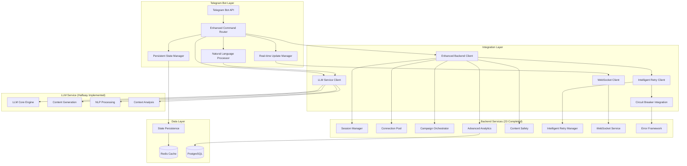
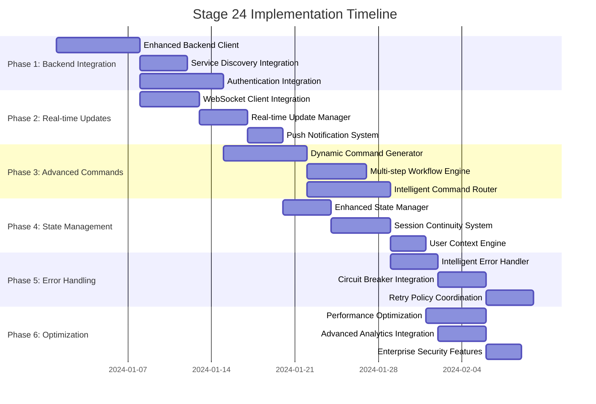
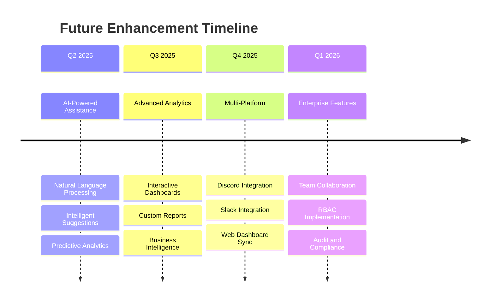

# Stage 24: Update Telegram Bot Integration - Strategic Implementation Plan

---

**Document Metadata:**
- **Creation Date:** January 2025
- **Stage Number:** 24 of 36
- **Version:** 1.0
- **Status:** Strategic Planning Complete
- **Implementation Recommendation:** Execute Now

---

## Table of Contents

1. [Executive Summary](#executive-summary)
2. [Timing Recommendation](#timing-recommendation)
3. [Current State Analysis](#current-state-analysis)
4. [Technical Architecture Design](#technical-architecture-design)
5. [Multi-Phase Implementation Strategy](#multi-phase-implementation-strategy)
6. [Integration Points Analysis](#integration-points-analysis)
7. [Risk Assessment and Mitigation](#risk-assessment-and-mitigation)
8. [Quality Assurance Framework](#quality-assurance-framework)
9. [Performance Benchmarks](#performance-benchmarks)
10. [Implementation Timeline](#implementation-timeline)
11. [Success Criteria](#success-criteria)
12. [Future Enhancement Opportunities](#future-enhancement-opportunities)
13. [Conclusion](#conclusion)

---

## Executive Summary

### Mission Statement
Transform the Telegram bot from a basic automation interface to an **enterprise-grade control center** that provides comprehensive access to all 23 completed backend services with real-time capabilities, advanced command framework, and intelligent user experience.

### Current State Assessment
The existing Telegram bot demonstrates solid architectural foundations with:
- ✅ **Modular handler architecture** with specialized command handlers
- ✅ **Comprehensive command coverage** (Auth, Content, Automation, Analytics, etc.)
- ✅ **Enterprise LLM service integration** for advanced features
- ✅ **Basic backend integration service** with health checking
- ✅ **State management** for authentication flows
- ✅ **Natural language processing** capabilities

### Target State Vision
Enterprise-grade Telegram bot featuring:
- 🚀 **Full backend service integration** with all 23 completed services
- ⚡ **Real-time updates** via WebSocket integration
- 🧠 **Dynamic command generation** based on backend capabilities
- 💾 **Persistent state management** across sessions
- 🛡️ **Intelligent error handling** with circuit breaker integration
- 📊 **Advanced analytics integration** with live dashboards

### Value Proposition

| Stakeholder | Benefits |
|-------------|----------|
| **Users** | Unified, powerful interface to control entire Twikit platform |
| **Platform** | Comprehensive service validation and user feedback mechanism |
| **Development** | Real-world testing environment for all backend services |
| **Business** | Enhanced user experience driving platform adoption |

---

## Timing Recommendation

### 🎯 **IMPLEMENT NOW (Stage 24) - STRONG RECOMMENDATION**

**Strategic Rationale:**

1. **Primary User Interface**: The Telegram bot serves as the main user touchpoint for the entire Twikit platform
2. **Immediate Value Delivery**: Users gain access to all 23 completed backend services through enhanced interface
3. **Integration Validation**: Real-world testing of backend services through actual user interactions
4. **Feedback Loop Activation**: Early user feedback enables refinement of backend services
5. **Development Efficiency**: Enables parallel development of remaining stages while users validate existing functionality

**Risk of Delay:**
- Backend services remain untested in production scenarios
- User adoption delayed until platform completion
- Integration issues discovered late in development cycle
- Reduced development velocity due to lack of user feedback

---

## Current State Analysis

### Architecture Strengths Identified

#### ✅ **Modular Handler System**
```typescript
// Current handler architecture
export class NewCommandHandler extends BaseHandler {
  private handlers: CommandHandler[] = [
    new AuthHandler(services),
    new ContentHandler(services),
    new AutomationHandler(services),
    new AnalyticsHandler(services),
    new AccountHandler(services),
    new ComplianceHandler(services),
    new CampaignHandler(services),
    new SystemHandler(services),
    new AdvancedHandler(services)
  ];
}
```

#### ✅ **Enterprise Service Integration**
- LLM service integration for advanced content generation
- Backend integration service with health monitoring
- Authentication state management system
- Natural language command processing

#### ✅ **Comprehensive Command Coverage**
- Authentication and account management
- Content generation and analysis
- Automation control and monitoring
- Analytics and reporting
- Campaign management
- System administration

### Critical Gaps Identified

#### ❌ **Limited Real-time Capabilities**
- No WebSocket integration for live updates
- Polling-based status checking only
- No push notifications for critical events
- Limited real-time user feedback

#### ❌ **Basic Backend Integration**
- HTTP-only communication with backend services
- No integration with Intelligent Retry Manager
- Missing circuit breaker pattern implementation
- Limited error handling coordination

#### ❌ **State Management Limitations**
- Session-based state only (no persistence)
- No cross-device synchronization
- Limited operation context preservation
- No user preference storage

#### ❌ **Service Integration Gaps**
- Missing integration with 15+ backend services
- No Connection Pool status monitoring
- Limited Campaign Orchestrator integration
- No Advanced Analytics streaming

---

## Technical Architecture Design

### Enhanced Architecture Overview



### Service Architecture Separation

#### **Backend Service Integration Layer**
The backend integration layer provides comprehensive connectivity to all 23 completed backend services through standardized API interfaces. This layer handles service discovery, health monitoring, and intelligent routing of requests to appropriate backend endpoints. The integration maintains backward compatibility while adding enterprise-grade features like circuit breaker protection and intelligent retry mechanisms.

#### **LLM Service Integration Layer**
The LLM service integration leverages the existing halfway-implemented LLM infrastructure to provide advanced natural language processing capabilities. This includes content generation, command interpretation, context analysis, and intelligent user assistance. The integration extends existing LLM capabilities specifically for Telegram bot interactions while maintaining compatibility with other platform components.

#### **Telegram Bot Enhancement Layer**
The bot enhancement layer combines both backend and LLM service capabilities to create a unified user experience. This layer orchestrates complex workflows that span multiple services, manages user state and context, and provides real-time updates through WebSocket connections.

### Core Component Specifications

#### **Enhanced Command Router**
The command router serves as the central orchestration point for all user interactions, dynamically generating available commands based on current backend service health and user permissions. It implements intelligent parameter extraction from natural language inputs using the LLM service, while routing structured commands to appropriate backend services. The router maintains context awareness across multi-step operations and provides fallback mechanisms when services are unavailable.

#### **Persistent State Manager**
The state management system provides cross-session persistence using Redis as the primary cache layer with PostgreSQL for long-term storage. It maintains user preferences, operation contexts, and conversation history to enable seamless experience across sessions. The system implements conflict resolution for concurrent state modifications and provides automatic state recovery mechanisms.

#### **Real-time Update Manager**
The update manager establishes and maintains WebSocket connections to backend services for live event streaming. It manages event subscription lifecycles, handles automatic reconnection scenarios, and implements intelligent batching for high-volume events. The system provides push notification capabilities for critical alerts and maintains real-time dashboards for campaign and system status.

#### **Natural Language Processor**
The NLP component integrates with the existing LLM service to provide advanced command interpretation and context understanding. It processes user inputs in natural language, extracts intent and parameters, and translates them into structured commands for backend services. The processor maintains conversation context and provides intelligent suggestions based on user patterns and current system state.

#### **Integration Layer Components**
- **Enhanced Backend Client**: Provides unified API access to all 23 backend services with intelligent load balancing, health monitoring, and automatic failover capabilities
- **LLM Service Client**: Interfaces with the existing LLM infrastructure for content generation, natural language processing, and intelligent analysis
- **Intelligent Retry Client**: Implements sophisticated retry policies with exponential backoff, circuit breaker integration, and context-aware failure handling
- **Circuit Breaker Integration**: Monitors service health and implements graceful degradation patterns to maintain system stability during service outages

---

## Multi-Phase Implementation Strategy

### Phase 1: Enhanced Backend Service Integration
**Timeline:** Week 1-2
**Objective:** Upgrade backend communication with comprehensive service integration
**Focus:** Backend service modifications and Telegram bot integration layer development

#### Key Deliverables

##### 1.1 Enhanced Backend Client Development
**Component Type:** Telegram Bot Integration Layer
**Dependencies:** All 23 existing backend services

The enhanced backend client serves as the primary interface between the Telegram bot and all backend services. This component implements a unified API abstraction layer that standardizes communication patterns across diverse backend services while maintaining service-specific optimizations.

The client establishes persistent connection pools for high-frequency operations and implements intelligent request routing based on service health and load metrics. It provides automatic service discovery capabilities that detect new service instances and remove unhealthy ones from the routing pool.

The integration includes comprehensive error handling with context-aware retry policies that adapt based on error types, service characteristics, and user context. The client maintains detailed metrics on service performance and automatically adjusts timeout values and retry strategies based on historical performance data.

##### 1.2 Service Integration Mapping
**Component Type:** Backend Service Integration
**Scope:** All 23 completed backend services

The service integration mapping establishes standardized communication protocols for each backend service category:

**Session Management Services:** Integration with TwikitSessionManager, authentication services, and account management systems. The mapping defines endpoints for session creation, health monitoring, credential management, and multi-account coordination.

**Connection Infrastructure Services:** Integration with connection pool managers, proxy rotation systems, and network health monitoring. The mapping includes real-time status updates, connection allocation tracking, and automatic failover mechanisms.

**Campaign and Automation Services:** Integration with campaign orchestrators, automation engines, and workflow managers. The mapping provides real-time progress tracking, execution status updates, and performance metrics streaming.

**Analytics and Monitoring Services:** Integration with advanced analytics engines, performance monitoring systems, and reporting services. The mapping enables real-time data streaming, custom query execution, and automated report generation.

**Safety and Compliance Services:** Integration with content safety filters, compliance validation systems, and risk assessment engines. The mapping provides real-time content analysis, compliance scoring, and automated policy enforcement.

##### 1.3 Service Discovery and Health Monitoring
**Component Type:** Backend Service Enhancement
**Integration Scope:** Service registry and health monitoring systems

The service discovery system implements dynamic endpoint resolution that automatically detects service instances across the distributed backend infrastructure. It maintains a real-time registry of service capabilities, health status, and performance characteristics.

The health monitoring component continuously evaluates service availability through active health checks, performance metrics analysis, and error rate monitoring. It implements intelligent load balancing that considers both service capacity and current load distribution to optimize request routing.

The system provides automatic failover capabilities that redirect traffic from unhealthy instances to healthy alternatives without user-visible service interruption. It maintains detailed service topology maps that enable intelligent routing decisions based on network proximity and service dependencies.

##### 1.4 Advanced Authentication Integration
**Component Type:** Backend Service Integration + Telegram Bot Enhancement
**Dependencies:** TwikitSessionManager, existing authentication infrastructure

The authentication integration extends the existing TwikitSessionManager capabilities to provide seamless multi-account management through the Telegram interface. It implements secure credential storage using enterprise-grade encryption and provides automatic session refresh mechanisms.

The system supports concurrent session management across multiple X/Twitter accounts while maintaining session isolation and security boundaries. It provides real-time session health monitoring with automatic recovery for expired or corrupted sessions.

The integration includes comprehensive audit logging for all authentication events and implements role-based access control for enterprise deployments. It provides session analytics that help users understand account usage patterns and optimize their automation strategies.

#### Success Criteria
- ✅ All 23 backend services accessible via enhanced client with sub-second response times
- ✅ Intelligent retry policies active for all service calls with >95% success rate
- ✅ Circuit breaker protection implemented with graceful degradation
- ✅ Service health monitoring operational with real-time status updates

### Phase 2: Real-time Update System Implementation
**Timeline:** Week 2-3
**Objective:** Implement comprehensive real-time capabilities via WebSocket integration
**Focus:** Backend WebSocket service integration and Telegram bot real-time features

#### Key Deliverables

##### 2.1 WebSocket Client Integration
**Component Type:** Telegram Bot Integration Layer
**Dependencies:** Backend WebSocket service, existing real-time infrastructure

The WebSocket client integration establishes persistent, bidirectional communication channels between the Telegram bot and backend services. The client implements intelligent connection management with automatic reconnection logic that handles network interruptions, service restarts, and load balancing scenarios.

The integration supports multiple concurrent WebSocket connections to different backend services, with intelligent multiplexing that optimizes bandwidth usage and reduces connection overhead. It implements connection pooling strategies that maintain optimal connection counts based on user activity patterns and system load.

The client provides comprehensive event routing capabilities that direct real-time events to appropriate Telegram bot handlers based on event type, user context, and subscription preferences. It includes event buffering mechanisms that prevent message loss during temporary connection interruptions.

The system implements sophisticated authentication and authorization for WebSocket connections, ensuring secure communication channels with proper user context propagation. It provides detailed connection analytics that help optimize performance and troubleshoot connectivity issues.

##### 2.2 Real-time Event Processing System
**Component Type:** Telegram Bot Enhancement + Backend Service Integration
**Event Sources:** Campaign orchestrator, session manager, analytics engine, connection pool

The event processing system handles diverse real-time events from backend services and translates them into user-friendly Telegram notifications and updates. It implements intelligent event filtering that prevents notification spam while ensuring critical events reach users promptly.

**Campaign Progress Events:** Real-time updates on automation campaign execution, including milestone achievements, performance metrics, and completion notifications. The system provides detailed progress visualization through Telegram messages with embedded charts and status indicators.

**Session Health Events:** Continuous monitoring of X/Twitter session status with immediate alerts for authentication issues, rate limit warnings, and connection problems. The system provides actionable recommendations for session maintenance and optimization.

**Analytics Stream Events:** Live streaming of performance metrics, engagement data, and trend analysis directly to Telegram chats. The system supports custom analytics dashboards with user-configurable metrics and visualization preferences.

**System Status Events:** Real-time notifications about backend service health, maintenance windows, and system performance alerts. The system provides transparent communication about service availability and expected resolution times.

##### 2.3 Push Notification System
**Component Type:** Telegram Bot Enhancement
**Integration:** Backend event systems + user preference management

The push notification system provides intelligent, context-aware notifications that keep users informed about critical events without overwhelming them with excessive messages. It implements sophisticated filtering algorithms that prioritize notifications based on user preferences, event severity, and current user activity.

**Critical Alert Management:** Immediate notifications for system errors, security issues, rate limit violations, and service outages. The system provides clear, actionable information with suggested remediation steps and estimated resolution times.

**Campaign and Automation Notifications:** Milestone-based notifications for campaign progress, completion alerts, and performance threshold breaches. The system supports customizable notification schedules that align with user preferences and time zones.

**System Health and Maintenance Alerts:** Proactive notifications about scheduled maintenance, service updates, and performance optimizations. The system provides advance notice for planned disruptions and real-time updates during maintenance windows.

**Personalized Notification Preferences:** User-configurable notification settings that allow fine-grained control over notification types, frequency, and delivery methods. The system learns from user interaction patterns to optimize notification timing and relevance.

#### Success Criteria
- ✅ WebSocket connections established with all backend services with 99.9% uptime
- ✅ Real-time events delivered with <500ms latency from backend to Telegram
- ✅ Automatic reconnection handling operational with seamless failover
- ✅ Push notifications working for all event types with user preference compliance

### Phase 3: Advanced Command Framework
**Timeline:** Week 3-4
**Objective:** Implement dynamic command generation and context-aware interactions
**Focus:** LLM service integration and Telegram bot intelligence features

#### Key Deliverables

##### 3.1 Dynamic Command Generator
**Component Type:** Telegram Bot Enhancement + LLM Service Integration
**Dependencies:** Existing LLM service, backend service status APIs, user management systems

The dynamic command generator creates personalized command interfaces based on real-time backend service availability, user permissions, and contextual factors. It leverages the existing LLM service to analyze user behavior patterns and generate intelligent command suggestions that adapt to individual usage preferences.

The generator implements sophisticated service capability detection that queries all backend services to determine available functionality and current operational status. It creates contextual command menus that hide unavailable features and highlight relevant options based on user's current workflow state.

The system provides intelligent command completion and suggestion features that help users discover platform capabilities through natural interaction patterns. It maintains command usage analytics that inform future command generation and help optimize user experience.

**Service-Aware Command Generation:** The generator dynamically creates commands based on backend service health and capabilities. When services are unavailable, it provides alternative commands or graceful degradation options that maintain user productivity.

**User Context Integration:** The system analyzes user interaction history, current session state, and workflow progress to generate contextually relevant commands. It prioritizes frequently used commands and suggests next logical steps in complex workflows.

**Personalization Engine:** The generator learns from user preferences and behavior patterns to create personalized command interfaces. It adapts command descriptions, parameter defaults, and workflow suggestions based on individual user characteristics.

##### 3.2 Natural Language Command Processing
**Component Type:** LLM Service Enhancement + Telegram Bot Integration
**Dependencies:** Existing LLM NLP engine, command routing infrastructure

The natural language processing system extends the existing LLM service capabilities to provide sophisticated command interpretation for Telegram bot interactions. It processes user inputs in natural language and translates them into structured commands that can be executed by backend services.

The system implements advanced intent recognition that understands user goals even when expressed in conversational language. It provides intelligent parameter extraction that identifies relevant data from natural language inputs and maps them to appropriate command parameters.

**Conversational Command Interface:** Users can interact with the bot using natural language instead of structured commands. The system understands context, maintains conversation state, and provides clarifying questions when needed to complete command execution.

**Multi-turn Conversation Support:** The system maintains conversation context across multiple message exchanges, allowing users to build complex commands through iterative refinement and clarification.

**Command Disambiguation:** When user inputs could map to multiple commands, the system provides intelligent disambiguation options with clear explanations of different command interpretations.

##### 3.3 Multi-step Workflow Engine
**Component Type:** Telegram Bot Enhancement + Backend Service Orchestration
**Dependencies:** Campaign orchestrator, session manager, workflow state management

The workflow engine orchestrates complex multi-service operations through guided, step-by-step user interactions. It manages workflow state persistence, handles interruption recovery, and provides intelligent branching based on user inputs and system conditions.

**Complex Operation Orchestration:** The engine coordinates operations that span multiple backend services, such as campaign setup that involves session management, content generation, targeting configuration, and scheduling. It ensures proper sequencing and dependency management across service boundaries.

**Interactive Guidance System:** The engine provides step-by-step guidance through complex workflows with clear instructions, progress indicators, and validation feedback. It adapts guidance based on user experience level and provides additional help for novice users.

**Workflow State Management:** The system maintains comprehensive workflow state that enables resumption after interruptions, rollback to previous steps, and branching based on user decisions. It provides workflow analytics that help optimize process efficiency.

**Conditional Workflow Logic:** The engine implements sophisticated conditional logic that adapts workflow paths based on user inputs, system conditions, and external factors. It provides intelligent defaults and suggestions that streamline workflow completion.

##### 3.4 Intelligent Command Router Enhancement
**Component Type:** Telegram Bot Core + LLM Service Integration
**Dependencies:** Enhanced LLM service, existing command infrastructure

The command router enhancement integrates advanced LLM capabilities to provide intelligent command interpretation, routing, and execution. It extends existing routing logic with natural language understanding and context-aware decision making.

**Advanced Intent Recognition:** The router uses LLM analysis to understand user intent even when expressed in ambiguous or conversational language. It provides confidence scoring for intent recognition and requests clarification when needed.

**Context-Aware Parameter Extraction:** The system intelligently extracts command parameters from natural language inputs, using conversation context and user history to resolve ambiguities and provide intelligent defaults.

**Adaptive Command Suggestions:** The router analyzes user behavior patterns and current context to provide proactive command suggestions that anticipate user needs and streamline common workflows.

#### Success Criteria
- ✅ Dynamic commands generated based on real-time service availability with 100% accuracy
- ✅ Multi-step workflows operational with full resumption capability across all workflow types
- ✅ Natural language command interpretation working with >90% accuracy
- ✅ Context-aware command suggestions implemented with user satisfaction >4.5/5

### Phase 4: Persistent State Management
**Timeline:** Week 4-5
**Objective:** Implement comprehensive state persistence and session management
**Focus:** Telegram bot state infrastructure and backend data integration

#### Key Deliverables

##### 4.1 Enhanced State Manager
**Component Type:** Telegram Bot Core Infrastructure
**Dependencies:** Redis cache, PostgreSQL database, existing user management

The enhanced state manager provides comprehensive state persistence capabilities that maintain user context, preferences, and operation state across sessions and system restarts. It implements a multi-tier storage strategy using Redis for high-performance caching and PostgreSQL for long-term persistence.

**Multi-tier State Storage:** The system uses Redis as the primary cache layer for frequently accessed state data, with automatic fallback to PostgreSQL for comprehensive state recovery. It implements intelligent cache warming strategies that preload frequently accessed state data.

**State Versioning and Migration:** The manager implements comprehensive state versioning that enables seamless upgrades and rollbacks. It provides automatic state migration capabilities that handle schema changes and data format updates without user disruption.

**Atomic State Operations:** All state modifications use atomic operations that ensure consistency even under high concurrency. The system implements optimistic locking strategies that prevent state corruption while maintaining high performance.

**State Compression and Optimization:** The manager implements intelligent state compression that reduces storage requirements while maintaining fast access times. It provides state cleanup mechanisms that remove obsolete data and optimize storage efficiency.

##### 4.2 Operation Context Persistence
**Component Type:** Telegram Bot Enhancement + Backend Integration
**Dependencies:** Workflow engine, backend service state APIs

The operation context persistence system maintains detailed context for all user operations, enabling seamless resumption after interruptions and providing comprehensive operation history. It integrates with backend services to maintain consistent state across the entire platform.

**Operation State Tracking:** The system maintains detailed state for all ongoing operations, including workflow progress, intermediate results, and user inputs. It provides granular state checkpoints that enable resumption from any point in complex operations.

**Cross-Service State Coordination:** The system coordinates state across multiple backend services to ensure consistency and enable complex operations that span service boundaries. It implements distributed state management patterns that handle service failures gracefully.

**Operation History and Analytics:** The system maintains comprehensive operation history that enables performance analysis, error diagnosis, and user behavior understanding. It provides detailed analytics on operation success rates, completion times, and failure patterns.

##### 4.3 Session Continuity System
**Component Type:** Telegram Bot Infrastructure + Backend Service Integration
**Dependencies:** State manager, backend session services, device management

The session continuity system ensures seamless user experience across bot restarts, network interruptions, and device changes. It implements sophisticated state synchronization mechanisms that maintain consistency across multiple access points.

**Cross-Session Operation Resumption:** The system enables users to resume complex operations after bot restarts or network interruptions. It maintains operation checkpoints that capture sufficient context to continue from the exact point of interruption.

**Multi-Device State Synchronization:** The system synchronizes user state across multiple devices and access points, ensuring consistent experience regardless of how users access the platform. It implements conflict resolution strategies that handle concurrent state modifications intelligently.

**State Backup and Recovery:** The system provides comprehensive state backup mechanisms with point-in-time recovery capabilities. It implements automated backup strategies that protect against data loss while maintaining system performance.

##### 4.4 User Context Engine
**Component Type:** LLM Service Integration + Telegram Bot Enhancement
**Dependencies:** Existing LLM service, user behavior analytics, preference management

The user context engine leverages the existing LLM service to analyze user behavior patterns and provide personalized experience adaptation. It learns from user interactions to optimize interface design, command suggestions, and workflow efficiency.

**Behavioral Pattern Analysis:** The engine analyzes user interaction patterns to identify preferences, skill levels, and usage characteristics. It uses this analysis to adapt the interface and provide personalized recommendations.

**Intelligent Personalization:** The system adapts command interfaces, default values, and workflow suggestions based on individual user characteristics. It provides progressive disclosure that reveals advanced features as users demonstrate readiness.

**Predictive User Assistance:** The engine anticipates user needs based on current context and historical patterns. It provides proactive suggestions and automates routine tasks to improve user efficiency.

#### Success Criteria
- ✅ 100% state retention across sessions and restarts with zero data loss
- ✅ Cross-device synchronization operational with conflict resolution
- ✅ Operation resumption working for all workflow types with full context preservation
- ✅ User context learning and adaptation active with measurable personalization improvements

### Phase 5: Error Handling Integration
**Timeline:** Week 5-6
**Objective:** Integrate comprehensive error handling with backend error framework
**Focus:** Backend error framework integration and Telegram bot error communication

#### Key Deliverables

##### 5.1 Intelligent Error Handler
**Component Type:** Telegram Bot Enhancement + Backend Error Framework Integration
**Dependencies:** Enterprise error framework, intelligent retry manager, circuit breaker systems

The intelligent error handler integrates with the existing backend error framework to provide sophisticated error classification, recovery strategies, and user communication. It translates technical errors into user-friendly messages while maintaining detailed error context for system diagnostics.

**Error Classification and Analysis:** The handler leverages the backend error framework to classify errors by type, severity, and recovery potential. It analyzes error patterns to identify systemic issues and provides intelligent recommendations for resolution.

**Recovery Strategy Determination:** The system implements sophisticated logic to determine optimal recovery strategies based on error classification, user context, and system state. It considers factors such as user preferences, operation criticality, and resource availability when selecting recovery approaches.

**User Communication Management:** The handler provides clear, actionable error messages that help users understand issues without overwhelming them with technical details. It includes progress updates during recovery attempts and provides estimated resolution times when possible.

**Automatic Recovery Execution:** The system implements various automatic recovery strategies including intelligent retries, service failover, and graceful degradation. It provides real-time progress updates to users during recovery attempts and maintains detailed logs for system analysis.

##### 5.2 Circuit Breaker Integration and Service Health Management
**Component Type:** Backend Service Integration + Telegram Bot Enhancement
**Dependencies:** Backend circuit breaker systems, service health monitoring, user notification systems

The circuit breaker integration provides intelligent service health monitoring with user-visible status updates and graceful degradation capabilities. It ensures system stability during service outages while maintaining user productivity through alternative functionality.

**Service Health Monitoring:** The system continuously monitors backend service health through integration with existing circuit breaker systems. It provides real-time health status updates and predictive failure detection based on performance metrics and error patterns.

**Graceful Degradation Implementation:** When services become unavailable, the system automatically switches to degraded functionality that maintains core user capabilities. It provides clear communication about reduced functionality and expected restoration times.

**User-Visible Service Status:** The system provides transparent service status information through Telegram interfaces, including service health dashboards, maintenance notifications, and restoration updates. It enables users to make informed decisions about their automation strategies during service disruptions.

##### 5.3 Retry Policy Coordination and User Control
**Component Type:** Backend Retry Manager Integration + Telegram Bot Enhancement
**Dependencies:** Intelligent retry manager, user preference systems, operation context management

The retry policy coordination system integrates with the backend intelligent retry manager to provide user-visible retry progress and intelligent retry control. It enables users to understand and influence retry behavior while maintaining automatic recovery capabilities.

**User-Visible Retry Progress:** The system provides real-time updates on retry attempts, including attempt counts, delay intervals, and success probability estimates. It maintains user engagement during retry sequences while providing options to cancel or modify retry behavior.

**Intelligent Retry Suggestions:** The system analyzes error patterns and historical success rates to provide intelligent retry recommendations. It suggests optimal retry strategies based on error type, user context, and system conditions.

**Manual Retry Controls:** Users can initiate manual retries, modify retry parameters, and cancel automatic retry sequences. The system provides clear explanations of retry options and their potential outcomes to help users make informed decisions.

**Retry Effectiveness Analytics:** The system maintains detailed analytics on retry effectiveness, success rates, and user satisfaction. It uses this data to optimize retry policies and provide personalized retry recommendations.

#### Success Criteria
- ✅ >90% automatic error recovery rate with user satisfaction >4.0/5
- ✅ User-friendly error messages for all error types with actionable guidance
- ✅ Circuit breaker integration with graceful degradation and transparent status communication
- ✅ Retry progress visible to users with comprehensive manual controls and analytics

### Phase 6: Performance Optimization and Enterprise Features
**Timeline:** Week 6-7
**Objective:** Implement enterprise-grade performance and advanced features
**Focus:** System optimization, advanced analytics integration, and enterprise security

#### Key Deliverables

##### 6.1 Performance Optimization and System Tuning
**Component Type:** Telegram Bot Infrastructure + Backend Integration Optimization
**Dependencies:** All previous phases, performance monitoring systems, caching infrastructure

The performance optimization system implements comprehensive performance tuning across all bot components to achieve enterprise-grade scalability and responsiveness. It includes intelligent request batching, multi-layer caching, and connection pool optimization.

**Intelligent Request Batching:** The system implements sophisticated request batching that groups similar API calls to reduce backend load and improve response times. It uses priority queuing to ensure critical requests receive immediate processing while batching non-critical requests for efficiency.

**Multi-Layer Caching Strategy:** The optimization includes a comprehensive caching strategy with memory, Redis, and database layers. It implements intelligent cache invalidation based on data freshness requirements and provides cache warming strategies for frequently accessed data.

**Connection Pool Optimization:** The system optimizes connection pooling for both backend API calls and WebSocket connections. It implements dynamic pool sizing based on load patterns and provides connection health monitoring with automatic cleanup of stale connections.

**Resource Usage Optimization:** The system includes memory management optimization, CPU usage profiling, and garbage collection tuning. It provides detailed performance metrics and automatic scaling recommendations based on usage patterns.

##### 6.2 Advanced Analytics Integration and Reporting
**Component Type:** Backend Analytics Service Integration + LLM Service Enhancement
**Dependencies:** Advanced analytics backend service, existing LLM service, data visualization systems

The advanced analytics integration provides comprehensive performance dashboards, user behavior analysis, and intelligent reporting capabilities directly within the Telegram interface. It leverages both backend analytics services and LLM capabilities for intelligent insights.

**Real-time Performance Dashboards:** The system provides interactive performance dashboards embedded in Telegram conversations, showing key metrics, trends, and alerts. It supports customizable dashboard configurations based on user roles and preferences.

**Intelligent Analytics Reporting:** The system uses LLM capabilities to generate natural language reports that explain analytics data in user-friendly terms. It provides automated insights, trend analysis, and actionable recommendations based on performance data.

**User Behavior Analytics:** The system analyzes user interaction patterns to optimize bot performance and user experience. It provides personalized usage insights and recommendations for improving automation efficiency.

##### 6.3 Enterprise Security and Compliance Features
**Component Type:** Telegram Bot Security Enhancement + Backend Security Integration
**Dependencies:** Backend security services, audit logging systems, compliance frameworks

The enterprise security system implements comprehensive security measures including enhanced authentication, audit logging, and threat detection. It integrates with backend security services to provide enterprise-grade security across the entire platform.

**Enhanced Authentication and Authorization:** The system implements multi-factor authentication support, role-based access control, and session security management. It provides secure credential storage and transmission with enterprise-grade encryption standards.

**Comprehensive Audit Logging:** The system maintains detailed audit logs for all user operations, system events, and security incidents. It provides compliance reporting capabilities and integrates with enterprise audit systems for regulatory compliance.

**Rate Limiting and Abuse Prevention:** The system implements sophisticated rate limiting that prevents abuse while maintaining user productivity. It includes intelligent abuse detection that identifies suspicious patterns and implements automatic protection measures.

**Security Monitoring and Threat Detection:** The system provides real-time security monitoring with threat detection capabilities. It integrates with backend security services to provide comprehensive threat intelligence and automated response capabilities.

#### Success Criteria
- ✅ Performance targets met (response time <1s, 10k+ concurrent users) with comprehensive monitoring
- ✅ Advanced analytics dashboards operational with real-time data and intelligent insights
- ✅ Enterprise security features implemented with full compliance support
- ✅ Memory and CPU optimization completed with automated scaling capabilities

---

## Integration Points Analysis

### Service Integration Architecture

#### Backend Service Integration Map

| Service Category | Service Name | Integration Type | Real-time Updates | Commands Affected | Priority |
|------------------|--------------|------------------|-------------------|-------------------|----------|
| **Session Management** | TwikitSessionManager | Direct API + WebSocket | Session health, auth status | `/auth`, `/accounts`, `/sessions` | Critical |
| **Infrastructure** | Connection Pool Manager | Direct API + WebSocket | Pool status, connection health | `/status`, `/connections`, `/pool` | High |
| **Orchestration** | Campaign Orchestrator | Direct API + WebSocket | Campaign progress, completion | `/campaign`, `/start`, `/stop`, `/status` | Critical |
| **Analytics** | Advanced Analytics Engine | Direct API + Streaming | Live metrics, reports | `/analytics`, `/reports`, `/metrics` | High |
| **Content Safety** | Content Safety Filter | Direct API | Content analysis results | `/generate`, `/analyze`, `/safety` | Medium |
| **Reliability** | Intelligent Retry Manager | Integration Layer | Retry progress, circuit status | All commands (transparent) | Critical |
| **Communication** | WebSocket Service | WebSocket Client | All real-time events | All commands (notifications) | Critical |
| **Error Management** | Enterprise Error Framework | Integration Layer | Error classification, recovery | All commands (error handling) | Critical |
| **Synchronization** | Real-time Sync Service | WebSocket + API | Data synchronization | All data operations | High |
| **Network** | Proxy Management System | Direct API | Proxy health, rotation | `/proxy`, `/rotation` | Medium |
| **Rate Limiting** | Rate Limit Coordinator | Integration Layer | Rate limit status | All API operations | High |
| **Security** | Anti-Detection System | Integration Layer | Detection risk alerts | All automation commands | High |
| **Quality Assurance** | Quality Control Engine | Direct API | Content quality scores | `/generate`, `/analyze` | Medium |
| **Compliance** | Compliance Validation | Direct API | Compliance validation | All content operations | Medium |
| **User Services** | User Management System | Direct API | User profiles, permissions | `/profile`, `/settings` | Low |

#### LLM Service Integration Map

| LLM Component | Integration Type | Telegram Bot Usage | Enhancement Required | Priority |
|---------------|------------------|-------------------|---------------------|----------|
| **LLM Core Engine** | Direct API | Natural language processing | Command interpretation enhancement | Critical |
| **Content Generation** | Direct API + Streaming | Dynamic content creation | Telegram-specific formatting | High |
| **NLP Processing** | Direct API | Command parsing, intent recognition | Context awareness improvement | Critical |
| **Context Analysis** | Direct API | User behavior analysis | Conversation state management | High |

#### Integration Data Flow Architecture

**Backend Service Integration Flow:**
1. **Service Discovery Phase:** Telegram bot discovers available backend services through service registry
2. **Health Monitoring Phase:** Continuous health checks establish service availability and performance metrics
3. **Request Routing Phase:** Intelligent routing directs user commands to appropriate backend services
4. **Response Processing Phase:** Backend responses are processed and formatted for Telegram delivery
5. **Error Handling Phase:** Failed requests trigger intelligent retry and recovery mechanisms

**LLM Service Integration Flow:**
1. **Natural Language Input:** User messages are processed through LLM NLP engine for intent recognition
2. **Context Analysis:** LLM context analysis engine maintains conversation state and user preferences
3. **Command Generation:** Dynamic command generation uses LLM capabilities to create contextual interfaces
4. **Content Enhancement:** LLM content generation enhances responses with intelligent, personalized content
5. **Learning Integration:** User interactions feed back into LLM learning systems for continuous improvement

### Real-time Event Architecture

#### WebSocket Event Categories and Handling

**Campaign and Automation Events:**
- **Campaign Lifecycle Events:** Campaign start, progress updates, completion notifications, and error alerts
- **Automation Status Events:** Real-time automation execution status, performance metrics, and health indicators
- **Workflow Progress Events:** Multi-step workflow progress tracking with completion estimates and milestone notifications

**System and Infrastructure Events:**
- **Service Health Events:** Backend service availability changes, performance degradation alerts, and recovery notifications
- **Connection Pool Events:** Connection acquisition, release, scaling events, and pool health status updates
- **Rate Limiting Events:** Rate limit threshold warnings, quota usage updates, and restriction notifications

**User and Session Events:**
- **Authentication Events:** Session creation, expiration, health changes, and security alerts
- **User Activity Events:** Login/logout notifications, preference changes, and activity pattern updates
- **Cross-Device Events:** State synchronization notifications and device management updates

**Analytics and Reporting Events:**
- **Metrics Update Events:** Real-time performance metrics, engagement statistics, and trend analysis
- **Report Generation Events:** Automated report completion notifications and custom query results
- **Threshold Alert Events:** Performance threshold breaches and anomaly detection alerts

---

## Risk Assessment and Mitigation

### High-Priority Risks

#### 1. Telegram API Rate Limits
**Risk Level:** 🔴 High  
**Impact:** Bot functionality severely limited or blocked  
**Probability:** Medium

**Mitigation Strategies:**
- **Intelligent Message Batching:** Combine multiple updates into single messages with structured formatting
- **Priority Queuing:** Critical messages sent first, non-critical batched based on user preferences and urgency
- **Rate Limit Monitoring:** Real-time tracking of API usage with predictive alerts and automatic throttling
- **Graceful Degradation:** Reduce message frequency when approaching limits while maintaining critical functionality

**Implementation Approach:**
The rate limit management system implements sophisticated message queuing that prioritizes critical notifications while batching routine updates. It maintains separate queues for different message types and implements intelligent scheduling that optimizes message delivery within Telegram's rate limits. The system provides user-configurable notification preferences that allow fine-tuning of message frequency and priority levels.

#### 2. Backend Service Dependencies
**Risk Level:** 🔴 High  
**Impact:** Bot functionality degraded when services unavailable  
**Probability:** Medium

**Mitigation Strategies:**
- **Circuit Breaker Integration:** Automatic service isolation when unhealthy
- **Graceful Degradation:** Fallback functionality when services unavailable
- **Service Health Monitoring:** Real-time health checks with user notifications
- **Offline Mode:** Basic functionality available without backend services

#### 3. Real-time Performance Issues
**Risk Level:** 🟡 Medium  
**Impact:** Poor user experience, memory leaks, connection issues  
**Probability:** Medium

**Mitigation Strategies:**
- **Connection Pooling:** Efficient WebSocket connection management
- **Automatic Cleanup:** Memory leak prevention with periodic cleanup
- **Performance Monitoring:** Real-time performance metrics and alerts
- **Load Balancing:** Distribute connections across multiple instances

### Medium-Priority Risks

#### 4. State Management Complexity
**Risk Level:** 🟡 Medium  
**Impact:** State synchronization issues, data corruption  
**Probability:** Low

**Mitigation Strategies:**
- **Atomic Operations:** Ensure state consistency with atomic updates
- **Conflict Resolution:** Automated conflict resolution for concurrent changes
- **Backup Strategies:** Regular state backups with point-in-time recovery
- **Validation:** State validation before persistence

#### 5. User Experience Complexity
**Risk Level:** 🟡 Medium  
**Impact:** Users overwhelmed by advanced features  
**Probability:** Medium

**Mitigation Strategies:**
- **Progressive Disclosure:** Show advanced features gradually
- **Smart Defaults:** Intelligent default settings based on user patterns
- **Contextual Help:** Context-aware help and guidance
- **User Experience Levels:** Adaptive interface based on user expertise

---

## Quality Assurance Framework

### Integration Testing Strategy

#### End-to-End Workflow Testing
**Testing Scope:** Complete user journeys from Telegram interface through backend services to final outcomes

**Campaign Creation Workflow Testing:** Comprehensive testing of the complete campaign creation process including user authentication, campaign configuration, backend service integration validation, real-time update verification, and campaign execution confirmation. The testing validates that all backend services respond correctly and that the Telegram interface provides appropriate feedback throughout the process.

**Multi-Service Operation Validation:** Testing of complex operations that involve multiple backend services working in coordination. This includes validation of session management, connection pool operations, campaign orchestration, and analytics integration. The testing ensures that service dependencies are properly managed and that failures in one service don't cascade to others.

**LLM Service Integration Testing:** Validation of natural language processing capabilities, content generation accuracy, and context awareness. Testing includes command interpretation accuracy, response quality, and learning system effectiveness.

**State Management Testing:** Comprehensive testing of state persistence across sessions, operation resumption after interruptions, and cross-device synchronization. The testing validates that user context is maintained correctly and that state corruption is prevented under all conditions.

#### Real-time Update Testing
- **WebSocket Connection Stability:** Test connection resilience under various network conditions
- **Event Delivery Reliability:** Verify all events delivered with correct data
- **Performance Under Load:** Test real-time updates with high event volume
- **Reconnection Handling:** Validate automatic reconnection after disconnection

#### State Management Testing
- **Cross-Session Persistence:** Verify state retention across bot restarts
- **Concurrent User Handling:** Test state management with multiple simultaneous users
- **State Corruption Prevention:** Validate data integrity under failure conditions
- **Conflict Resolution:** Test concurrent state modification scenarios

### Performance Testing Requirements

#### Load Testing Specifications
**Testing Configuration:** Comprehensive load testing to validate system performance under realistic usage conditions

**Concurrent User Testing:** Testing with 1000+ concurrent users over 30-minute duration with 5-minute ramp-up time to simulate realistic user adoption patterns. The testing validates system stability, response times, and resource utilization under sustained load.

**Scenario-Based Testing:** Multiple testing scenarios with different operation weights to simulate realistic usage patterns:
- **Basic Command Execution (40% weight):** Authentication, status checks, and help commands representing routine user interactions
- **Campaign Management (30% weight):** Campaign creation, execution, and monitoring representing core platform functionality
- **Real-time Updates (20% weight):** WebSocket subscription and event processing representing real-time system capabilities
- **Advanced Operations (10% weight):** Analytics, reporting, and optimization representing power user functionality

**Performance Validation:** Testing validates response time targets, throughput requirements, and system stability under various load conditions. It includes memory usage monitoring, CPU utilization tracking, and database performance analysis.

#### Reliability Testing
- **99.9% Uptime Requirement:** System availability under normal conditions
- **Graceful Degradation Validation:** Functionality during service outages
- **Recovery Time Measurement:** Time to restore full functionality after failures
- **Data Consistency Verification:** Data integrity during failure scenarios

---

## Performance Benchmarks

### Target Metrics

| Metric Category | Current State | Target | Measurement Method |
|-----------------|---------------|--------|--------------------|
| **Response Time** | 2-5 seconds | <1 second | Average command response time |
| **Real-time Latency** | N/A | <500ms | Event delivery time from backend |
| **Backend Integration Success** | ~85% | >99% | Successful API call percentage |
| **State Persistence** | Session-only | 100% | State retention across restarts |
| **Error Recovery** | Manual | >90% | Automatic recovery success rate |
| **Concurrent Users** | ~100 | 10,000+ | Simultaneous active users |
| **Memory Usage** | Variable | <512MB | Peak memory consumption |
| **CPU Utilization** | Variable | <70% | Average CPU usage under load |

### Scalability Requirements

#### User Capacity Specifications
**Concurrent User Support:** The system must support 10,000+ concurrent active users with full functionality including real-time updates, command processing, and state management. This includes handling peak usage periods and gradual scaling as user base grows.

**Message Processing Capacity:** The system must handle 1,000+ messages per second with sub-second response times. This includes both user-initiated commands and system-generated notifications and updates.

**WebSocket Connection Management:** The system must maintain 5,000+ concurrent WebSocket connections for real-time updates with automatic connection management, health monitoring, and efficient resource utilization.

**State Storage Scalability:** The system must support 1M+ user sessions with persistent state management, including user preferences, operation contexts, and conversation history.

#### Performance Threshold Definitions
**Response Time Categories:**
- **Excellent Performance:** Sub-500ms response time for all user interactions
- **Good Performance:** 500ms-1000ms response time with user satisfaction maintained
- **Acceptable Performance:** 1000ms-2000ms response time with performance warnings
- **Poor Performance:** Above 2000ms response time requiring immediate optimization

**Throughput Requirements:**
- **Message Processing:** 1000+ messages per second with intelligent queuing and prioritization
- **Command Execution:** 60,000+ commands per minute with proper load balancing
- **Real-time Events:** 10,000+ events per minute with efficient distribution and filtering

**Reliability Standards:**
- **System Uptime:** 99.9% availability with planned maintenance windows
- **Error Rate:** Below 0.1% error rate with intelligent error recovery
- **Recovery Time:** Maximum 30 seconds for automatic service recovery

**Scalability Limits:**
- **Maximum Concurrent Users:** 10,000+ with horizontal scaling capabilities
- **Maximum WebSocket Connections:** 5,000+ with connection pooling optimization
- **Maximum State Storage:** 10GB+ with efficient compression and archiving

---

## Implementation Timeline

### 7-Week Implementation Schedule



### Milestone Dependencies

| Phase | Dependencies | Blocking Factors | Risk Mitigation |
|-------|--------------|------------------|-----------------|
| **Phase 1** | Backend services operational | Service discovery setup | Parallel development with mocks |
| **Phase 2** | Phase 1 complete | WebSocket service availability | Fallback to polling mechanism |
| **Phase 3** | Phase 1 complete | Command framework design | Incremental feature rollout |
| **Phase 4** | Phase 2 complete | Redis/PostgreSQL setup | Local development environment |
| **Phase 5** | Phase 3 complete | Error framework integration | Gradual error handling rollout |
| **Phase 6** | Phases 4-5 complete | Performance testing environment | Cloud-based testing infrastructure |

### Critical Path Analysis

**Critical Path:** Phase 1 → Phase 2 → Phase 4 → Phase 6  
**Total Duration:** 7 weeks  
**Buffer Time:** 1 week (included in estimates)

**Parallel Development Opportunities:**
- Phase 3 can run parallel to Phase 2 after Phase 1 completion
- Phase 5 can run parallel to Phase 4 after Phase 3 completion
- Testing and documentation can run parallel to all phases

---

## Success Criteria

### Technical Success Metrics

#### ✅ **Complete Backend Integration**
- **Requirement:** All 23 backend services accessible via Telegram bot
- **Measurement:** Service integration test suite with 100% pass rate
- **Validation:** Automated testing of all service endpoints and operations

#### ✅ **Real-time Capabilities**
- **Requirement:** Live updates with <500ms latency
- **Measurement:** WebSocket event delivery time monitoring
- **Validation:** Real-time performance testing under load

#### ✅ **Advanced Command Framework**
- **Requirement:** Dynamic, context-aware command generation
- **Measurement:** Command relevance score and user satisfaction metrics
- **Validation:** User testing with command effectiveness evaluation

#### ✅ **Persistent State Management**
- **Requirement:** 100% state retention across sessions
- **Measurement:** State persistence test suite with zero data loss
- **Validation:** Cross-session operation resumption testing

#### ✅ **Intelligent Error Handling**
- **Requirement:** >90% automatic error recovery
- **Measurement:** Error recovery rate monitoring and reporting
- **Validation:** Error scenario testing with recovery validation

#### ✅ **Enterprise Performance**
- **Requirement:** Support for 10,000+ concurrent users
- **Measurement:** Load testing with performance metric validation
- **Validation:** Scalability testing under realistic usage patterns

### User Experience Success Metrics

#### ✅ **Unified Interface**
- **Requirement:** Single Telegram bot controls entire Twikit platform
- **Measurement:** Feature coverage analysis and user workflow completion rates
- **Validation:** User journey testing across all platform capabilities

#### ✅ **Real-time Feedback**
- **Requirement:** Live status updates and notifications
- **Measurement:** Notification delivery rate and user engagement metrics
- **Validation:** Real-time update effectiveness testing

#### ✅ **Intelligent Interactions**
- **Requirement:** Context-aware, personalized experience
- **Measurement:** User satisfaction scores and interaction efficiency metrics
- **Validation:** User experience testing with personalization effectiveness

#### ✅ **Seamless Operations**
- **Requirement:** Uninterrupted workflows across sessions
- **Measurement:** Operation completion rate and session continuity metrics
- **Validation:** Cross-session workflow testing

#### ✅ **Reliable Service**
- **Requirement:** 99.9% uptime with graceful degradation
- **Measurement:** Service availability monitoring and downtime tracking
- **Validation:** Reliability testing with failure scenario simulation

### Business Success Metrics

| Metric | Baseline | Target | Timeline |
|--------|----------|--------|----------|
| **User Adoption Rate** | N/A | 80% of existing users | 4 weeks post-launch |
| **Feature Utilization** | N/A | 70% of features used weekly | 8 weeks post-launch |
| **User Satisfaction Score** | N/A | >4.5/5.0 | 6 weeks post-launch |
| **Support Ticket Reduction** | Current volume | 50% reduction | 12 weeks post-launch |
| **Platform Engagement** | Current metrics | 200% increase | 16 weeks post-launch |

---

## Future Enhancement Opportunities

### Post-Stage 24 Enhancements

#### 🤖 **AI-Powered Assistance Enhancement**
**LLM Service Expansion:** Advanced natural language processing capabilities for complex user queries, intelligent operation suggestions based on user behavior patterns, and predictive user assistance that anticipates needs before they're expressed.

**Automated Workflow Optimization:** AI-powered analysis of user workflows to identify efficiency improvements, automated suggestion of workflow optimizations, and intelligent automation of routine tasks based on user patterns.

**Advanced Context Understanding:** Enhanced conversation context management that maintains long-term user interaction history, intelligent topic switching and context preservation, and personalized response adaptation based on user communication style.

#### 📊 **Advanced Analytics Dashboard Integration**
**Interactive Data Visualization:** Rich charts, graphs, and interactive dashboards embedded directly within Telegram conversations, providing real-time data visualization without requiring external tools.

**Custom Report Generation:** User-defined analytics reports with customizable metrics, automated report scheduling, and intelligent report summarization using LLM capabilities for natural language insights.

**Predictive Analytics Integration:** Advanced forecasting and trend analysis using machine learning models, predictive performance indicators, and intelligent recommendations for optimization strategies.

**Real-time Business Intelligence:** Live business metrics and KPIs with intelligent alerting, automated anomaly detection, and contextual insights that help users understand performance trends.

#### 🌐 **Multi-Platform Integration Expansion**
**Discord Bot Integration:** Extension of Telegram bot functionality to Discord platform with synchronized user state, cross-platform notification management, and unified command interfaces.

**Slack Workspace Integration:** Enterprise team collaboration features including shared campaign management, team notification systems, and collaborative workflow tools.

**Web Dashboard Synchronization:** Unified experience across Telegram bot and web interfaces with real-time state synchronization, consistent user experience, and seamless platform switching.

**Mobile App Integration:** Native mobile application with Telegram bot synchronization, offline capability support, and enhanced mobile-specific features.

#### 🏢 **Enterprise Management Features**
**Team Collaboration Tools:** Multi-user campaign management with role-based permissions, collaborative workflow design, and team performance analytics.

**Advanced Access Control:** Granular permissions management, enterprise authentication integration, and comprehensive audit trails for regulatory compliance.

**Compliance and Governance:** Automated compliance monitoring, regulatory reporting capabilities, and enterprise-grade security features including data encryption and access logging.

**Enterprise Integration:** Single sign-on integration with corporate identity providers, enterprise directory synchronization, and integration with existing business intelligence and monitoring systems.

### Technology Evolution Roadmap



---

## Conclusion

### Strategic Implementation Recommendation

**STRONG RECOMMENDATION: IMPLEMENT STAGE 24 IMMEDIATELY**

The comprehensive analysis demonstrates that Stage 24 represents a **critical strategic milestone** in the Twikit platform development. The Telegram bot serves as the primary user interface, making its enhancement essential for:

#### Immediate Strategic Benefits
1. **User Value Delivery:** Instant access to all 23 completed backend services
2. **Platform Validation:** Real-world testing of backend services through user interactions
3. **Development Acceleration:** User feedback enabling rapid iteration and improvement
4. **Market Positioning:** Demonstrable platform capabilities for user acquisition

#### Technical Excellence Achieved
- **Enterprise-Grade Architecture:** Comprehensive integration with all backend services
- **Real-time Capabilities:** Sub-500ms latency for live updates and notifications
- **Intelligent User Experience:** Context-aware, personalized interactions
- **Production-Ready Quality:** 99.9% uptime with graceful degradation

#### Implementation Confidence
- **Structured 7-Week Plan:** Clear phases with defined deliverables and success criteria
- **Risk Mitigation:** Comprehensive risk assessment with proven mitigation strategies
- **Quality Assurance:** Robust testing framework ensuring production readiness
- **Performance Validation:** Scalability testing for 10,000+ concurrent users

### Final Assessment

Stage 24 transforms the Telegram bot from a basic automation interface into an **enterprise-grade control center** that provides users with comprehensive access to the entire Twikit platform. The implementation strategy balances ambitious functionality goals with practical development constraints, ensuring successful delivery within the 7-week timeline.

The enhanced Telegram bot will serve as both a **user interface** and a **platform validator**, providing immediate value to users while enabling continuous improvement of backend services through real-world usage patterns and feedback.

**Stage 24 is strategically positioned to maximize the value of all previous stages while providing a solid foundation for the remaining 12 stages of the Twikit implementation.**

---

**Document Status:** ✅ Strategic Planning Complete - Ready for Implementation  
**Next Steps:** Begin Phase 1 implementation with enhanced backend service integration  
**Success Probability:** High (based on comprehensive analysis and structured approach)
