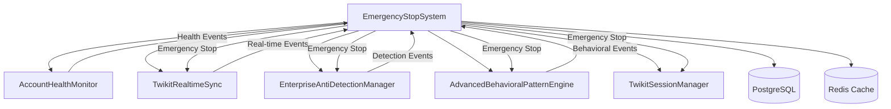
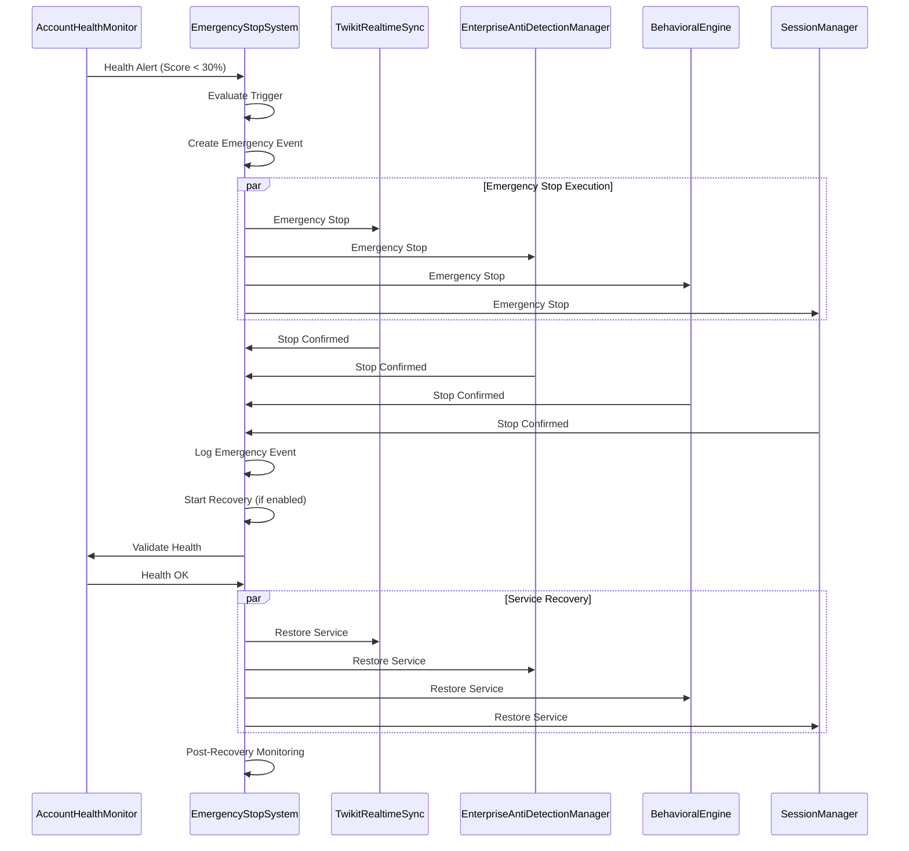

# Task 17 Integration Guide: Emergency Stop System

## Quick Start

### 1. Basic Setup and Initialization

```typescript
import { 
  EmergencyStopSystem, 
  EmergencyTriggerType, 
  EmergencyStopLevel 
} from './services/emergencyStopSystem';
import { AccountHealthMonitor } from './services/accountHealthMonitor';
import { TwikitRealtimeSync } from './services/twikitRealtimeSync';
import { EnterpriseAntiDetectionManager } from './services/enterpriseAntiDetectionManager';

// Initialize with all service dependencies
const emergencyStopSystem = new EmergencyStopSystem(
  {
    triggerDetectionInterval: 5000,      // 5 seconds
    healthMonitoringInterval: 10000,     // 10 seconds
    immediateStopTimeout: 5000,          // 5 seconds
    gracefulStopTimeout: 60000,          // 60 seconds
    maxConcurrentStops: 10,
    autoRecoveryEnabled: true,
    recoveryValidationTimeout: 30000,    // 30 seconds
    postRecoveryMonitoringDuration: 300000, // 5 minutes
    enableNotifications: true,
    notificationChannels: ['system', 'email'],
    enableDetailedLogging: true,
    retainEventHistory: 30,              // 30 days
    maxMemoryUsage: 512 * 1024 * 1024,   // 512MB
    maxCpuUsage: 80                      // 80%
  },
  accountHealthMonitor,     // Task 15: Primary dependency
  realtimeSync,            // Task 16: Real-time coordination
  antiDetectionManager,    // Task 13: Detection event handling
  behavioralEngine,        // Task 14: Behavioral anomaly detection
  sessionManager           // Task 2: Session management
);

await emergencyStopSystem.initialize();
```

### 2. Configure Emergency Triggers

```typescript
// Health score critical trigger
const healthTriggerId = await emergencyStopSystem.addTrigger({
  triggerType: EmergencyTriggerType.HEALTH_SCORE_CRITICAL,
  accountId: 'account-123',
  name: 'Health Score Critical',
  description: 'Triggers when health score falls below 30%',
  isActive: true,
  thresholds: {
    healthScore: 30
  },
  timeWindow: 60000,        // 1 minute
  cooldownPeriod: 300000,   // 5 minutes
  stopLevel: EmergencyStopLevel.GRACEFUL,
  priority: 3
});

// Suspension risk trigger
const riskTriggerId = await emergencyStopSystem.addTrigger({
  triggerType: EmergencyTriggerType.ACCOUNT_SUSPENSION_RISK,
  accountId: 'account-123',
  name: 'Suspension Risk Critical',
  description: 'Triggers when suspension risk exceeds 85%',
  isActive: true,
  thresholds: {
    riskScore: 85
  },
  timeWindow: 30000,        // 30 seconds
  cooldownPeriod: 600000,   // 10 minutes
  stopLevel: EmergencyStopLevel.IMMEDIATE,
  priority: 4
});
```

### 3. Handle Emergency Events

```typescript
// Setup event handlers
emergencyStopSystem.on('emergencyStarted', (event) => {
  console.log(`🚨 Emergency started: ${event.triggerType} for ${event.accountId}`);
  
  // Notify external systems
  notifyExternalSystems({
    type: 'emergency_started',
    accountId: event.accountId,
    triggerType: event.triggerType,
    severity: event.severity,
    correlationId: event.correlationId
  });
});

emergencyStopSystem.on('emergencyCompleted', (event) => {
  console.log(`✅ Emergency completed: ${event.success ? 'SUCCESS' : 'FAILED'}`);
  console.log(`Duration: ${event.executionDuration}ms`);
  
  // Update monitoring dashboards
  updateDashboard({
    emergencyId: event.eventId,
    success: event.success,
    duration: event.executionDuration,
    affectedServices: event.affectedServices
  });
});

emergencyStopSystem.on('recoveryCompleted', (data) => {
  console.log(`🔄 Recovery completed: ${data.success ? 'SUCCESS' : 'FAILED'}`);
  
  // Resume normal operations if recovery successful
  if (data.success) {
    resumeNormalOperations(data.emergencyEvent.accountId);
  }
});
```

## Integration Architecture

### Service Dependencies



### Emergency Response Flow



## Configuration Options

### Environment Variables

```bash
# Core Emergency Stop Configuration
EMERGENCY_STOP_ENABLED=true
TRIGGER_DETECTION_INTERVAL=5000
HEALTH_MONITORING_INTERVAL=10000
IMMEDIATE_STOP_TIMEOUT=5000
GRACEFUL_STOP_TIMEOUT=60000
MAX_CONCURRENT_STOPS=10

# Recovery Configuration
AUTO_RECOVERY_ENABLED=true
RECOVERY_VALIDATION_TIMEOUT=30000
POST_RECOVERY_MONITORING_DURATION=300000

# Trigger Thresholds
HEALTH_SCORE_CRITICAL_THRESHOLD=30
SUSPENSION_RISK_CRITICAL_THRESHOLD=85
RATE_LIMIT_VIOLATION_THRESHOLD=10
AUTH_FAILURE_THRESHOLD=5

# Notification Configuration
ENABLE_NOTIFICATIONS=true
NOTIFICATION_CHANNELS=system,email,webhook
EMERGENCY_EMAIL_RECIPIENTS=admin@company.com,ops@company.com
WEBHOOK_EMERGENCY_URL=https://api.company.com/webhooks/emergency

# Audit and Logging
ENABLE_DETAILED_LOGGING=true
RETAIN_EVENT_HISTORY=30
AUDIT_LOG_LEVEL=info

# Performance Configuration
MAX_MEMORY_USAGE=536870912
MAX_CPU_USAGE=80
TRIGGER_EVALUATION_TIMEOUT=2000
```

### Advanced Configuration

```typescript
const productionConfig = {
  // High-frequency monitoring for production
  triggerDetectionInterval: 3000,      // 3 seconds
  healthMonitoringInterval: 5000,      // 5 seconds
  
  // Strict timeouts for production
  immediateStopTimeout: 3000,          // 3 seconds
  gracefulStopTimeout: 45000,          // 45 seconds
  
  // Higher capacity for production
  maxConcurrentStops: 20,
  
  // Enhanced recovery for production
  autoRecoveryEnabled: true,
  recoveryValidationTimeout: 20000,    // 20 seconds
  postRecoveryMonitoringDuration: 600000, // 10 minutes
  
  // Comprehensive notifications
  enableNotifications: true,
  notificationChannels: ['system', 'email', 'webhook', 'slack'],
  
  // Extended audit retention
  enableDetailedLogging: true,
  retainEventHistory: 90,              // 90 days
  
  // Production resource limits
  maxMemoryUsage: 1024 * 1024 * 1024,  // 1GB
  maxCpuUsage: 70                      // 70%
};
```

## Trigger Configuration

### Health-Based Triggers

```typescript
// Critical health score trigger
await emergencyStopSystem.addTrigger({
  triggerType: EmergencyTriggerType.HEALTH_SCORE_CRITICAL,
  accountId: 'account-123',
  name: 'Health Score Critical',
  description: 'Account health score below critical threshold',
  isActive: true,
  thresholds: {
    healthScore: 25  // Below 25%
  },
  timeWindow: 60000,        // 1 minute evaluation window
  cooldownPeriod: 300000,   // 5 minute cooldown
  stopLevel: EmergencyStopLevel.GRACEFUL,
  targetServices: ['sessionManager', 'behavioralEngine'],
  notificationChannels: ['system', 'email'],
  priority: 3
});

// Suspension risk trigger
await emergencyStopSystem.addTrigger({
  triggerType: EmergencyTriggerType.ACCOUNT_SUSPENSION_RISK,
  accountId: 'account-123',
  name: 'Suspension Risk Critical',
  description: 'High risk of account suspension detected',
  isActive: true,
  thresholds: {
    riskScore: 90  // Above 90%
  },
  timeWindow: 30000,        // 30 second evaluation window
  cooldownPeriod: 1800000,  // 30 minute cooldown
  stopLevel: EmergencyStopLevel.IMMEDIATE,
  targetServices: ['all'],
  notificationChannels: ['system', 'email', 'webhook'],
  priority: 4
});
```

### Detection-Based Triggers

```typescript
// Detection event trigger
await emergencyStopSystem.addTrigger({
  triggerType: EmergencyTriggerType.DETECTION_EVENT_CRITICAL,
  accountId: 'account-123',
  name: 'Critical Detection Event',
  description: 'Critical detection events requiring immediate action',
  isActive: true,
  thresholds: {
    detectionCount: 3  // 3 detection events
  },
  timeWindow: 180000,       // 3 minute evaluation window
  cooldownPeriod: 900000,   // 15 minute cooldown
  stopLevel: EmergencyStopLevel.IMMEDIATE,
  targetServices: ['all'],
  notificationChannels: ['system', 'email', 'webhook'],
  priority: 4
});

// Rate limit violation trigger
await emergencyStopSystem.addTrigger({
  triggerType: EmergencyTriggerType.RATE_LIMIT_VIOLATION,
  name: 'Rate Limit Violation',
  description: 'Excessive rate limit violations detected',
  isActive: true,
  thresholds: {
    rateLimitHits: 15  // 15 rate limit hits
  },
  timeWindow: 600000,       // 10 minute evaluation window
  cooldownPeriod: 1800000,  // 30 minute cooldown
  stopLevel: EmergencyStopLevel.SERVICE_SPECIFIC,
  targetServices: ['realtimeSync', 'sessionManager'],
  notificationChannels: ['system'],
  priority: 2
});
```

### Behavioral-Based Triggers

```typescript
// Behavioral anomaly trigger
await emergencyStopSystem.addTrigger({
  triggerType: EmergencyTriggerType.BEHAVIORAL_ANOMALY_SEVERE,
  accountId: 'account-123',
  name: 'Severe Behavioral Anomaly',
  description: 'Severe behavioral anomalies detected',
  isActive: true,
  thresholds: {
    customMetric: 0.95  // 95% anomaly score
  },
  timeWindow: 300000,       // 5 minute evaluation window
  cooldownPeriod: 3600000,  // 1 hour cooldown
  stopLevel: EmergencyStopLevel.CASCADING,
  targetServices: ['behavioralEngine', 'antiDetectionManager'],
  notificationChannels: ['system', 'webhook'],
  priority: 3
});
```

## Emergency Execution

### Manual Emergency Stop

```typescript
// Immediate emergency stop
const immediateEventId = await emergencyStopSystem.manualEmergencyStop(
  'account-123',
  'Suspicious activity detected - immediate action required',
  EmergencyStopLevel.IMMEDIATE
);

// Graceful emergency stop
const gracefulEventId = await emergencyStopSystem.manualEmergencyStop(
  'account-456',
  'Planned maintenance - graceful shutdown',
  EmergencyStopLevel.GRACEFUL
);

// Service-specific emergency stop
const serviceEventId = await emergencyStopSystem.manualEmergencyStop(
  'account-789',
  'Rate limiting issues - stop specific services',
  EmergencyStopLevel.SERVICE_SPECIFIC
);
```

### Automated Emergency Response

```typescript
// Health monitor integration
accountHealthMonitor.on('healthAlert', async (alert) => {
  if (alert.severity === 'critical' && alert.healthScore < 20) {
    await emergencyStopSystem.manualEmergencyStop(
      alert.accountId,
      `Critical health alert: ${alert.reason}`,
      EmergencyStopLevel.IMMEDIATE
    );
  }
});

// Real-time event integration
realtimeSync.on('eventReceived', async (event) => {
  if (event.event_type === 'ACCOUNT_SUSPENSION') {
    await emergencyStopSystem.manualEmergencyStop(
      event.account_id,
      'Account suspension detected via real-time monitoring',
      EmergencyStopLevel.IMMEDIATE
    );
  }
});

// Anti-detection integration
antiDetectionManager.on('detectionEvent', async (detection) => {
  if (detection.severity === 'critical' && detection.confidence > 0.9) {
    await emergencyStopSystem.manualEmergencyStop(
      detection.accountId,
      `Critical detection event: ${detection.type}`,
      EmergencyStopLevel.IMMEDIATE
    );
  }
});
```

## Recovery Procedures

### Automated Recovery

```typescript
// Enable automatic recovery
const config = {
  autoRecoveryEnabled: true,
  recoveryValidationTimeout: 30000,
  postRecoveryMonitoringDuration: 300000
};

// Recovery will start automatically after emergency stop
emergencyStopSystem.on('recoveryStarted', (data) => {
  console.log(`Recovery started: ${data.procedure.name}`);
  console.log(`Estimated duration: ${data.procedure.phases.reduce((sum, phase) => sum + phase.estimatedDuration, 0)}ms`);
});

emergencyStopSystem.on('recoveryCompleted', (data) => {
  if (data.success) {
    console.log('Recovery completed successfully');
    // Resume normal operations
    resumeAutomationOperations(data.emergencyEvent.accountId);
  } else {
    console.log('Recovery failed - manual intervention required');
    // Alert operations team
    alertOperationsTeam(data.emergencyEvent);
  }
});
```

### Manual Recovery

```typescript
// Start recovery manually
const emergencyEventId = 'emergency_123456789_abc';
const recoverySuccess = await emergencyStopSystem.startRecovery(emergencyEventId);

if (recoverySuccess) {
  console.log('Manual recovery completed successfully');
} else {
  console.log('Manual recovery failed');
  
  // Get recovery details
  const emergencyEvent = emergencyStopSystem.getEmergencyEvent(emergencyEventId);
  console.log(`Recovery phase: ${emergencyEvent?.recoveryPhase}`);
  console.log(`Recovery error: ${emergencyEvent?.errorMessage}`);
}

// Start recovery with specific procedure
const customRecoverySuccess = await emergencyStopSystem.startRecovery(
  emergencyEventId,
  'critical_recovery'  // Use critical recovery procedure
);
```

## Monitoring and Metrics

### System Status Monitoring

```typescript
// Get comprehensive system status
const status = emergencyStopSystem.getSystemStatus();

console.log('System Status:');
console.log(`Running: ${status.isRunning}`);
console.log(`Shutting Down: ${status.isShuttingDown}`);
console.log(`Active Triggers: ${status.activeTriggers}`);
console.log(`Active Emergencies: ${status.activeEmergencies}`);

console.log('Performance Metrics:');
console.log(`Total Triggers: ${status.metrics.totalTriggers}`);
console.log(`Successful Stops: ${status.metrics.successfulStops}`);
console.log(`Failed Stops: ${status.metrics.failedStops}`);
console.log(`Average Stop Time: ${status.metrics.averageStopTime}ms`);
console.log(`Recovery Success Rate: ${(status.metrics.successfulRecoveries / (status.metrics.successfulRecoveries + status.metrics.failedRecoveries) * 100).toFixed(2)}%`);
```

### Real-time Monitoring Dashboard

```typescript
// Setup monitoring dashboard
const setupMonitoringDashboard = () => {
  setInterval(() => {
    const status = emergencyStopSystem.getSystemStatus();
    const activeEmergencies = emergencyStopSystem.getActiveEmergencies();
    
    // Update dashboard metrics
    updateDashboardMetrics({
      systemStatus: status,
      activeEmergencies: activeEmergencies.length,
      recentEvents: activeEmergencies.slice(-10),
      performanceMetrics: {
        avgStopTime: status.metrics.averageStopTime,
        avgRecoveryTime: status.metrics.averageRecoveryTime,
        successRate: status.metrics.successfulStops / (status.metrics.successfulStops + status.metrics.failedStops),
        uptime: ((Date.now() - status.metrics.systemUptime.getTime()) / 1000 / 60).toFixed(2) + ' minutes'
      }
    });
  }, 5000); // Update every 5 seconds
};
```

### Alerting and Notifications

```typescript
// Setup alerting system
emergencyStopSystem.on('emergencyStarted', (event) => {
  // Send immediate alert for critical emergencies
  if (event.severity === 'critical') {
    sendImmediateAlert({
      type: 'CRITICAL_EMERGENCY',
      accountId: event.accountId,
      triggerType: event.triggerType,
      correlationId: event.correlationId,
      timestamp: event.createdAt
    });
  }
});

emergencyStopSystem.on('recoveryCompleted', (data) => {
  // Send recovery notification
  if (!data.success) {
    sendRecoveryFailureAlert({
      emergencyId: data.emergencyEvent.eventId,
      accountId: data.emergencyEvent.accountId,
      recoveryProcedure: data.procedure.name,
      failureReason: 'Recovery procedure failed'
    });
  }
});

// Custom notification functions
const sendImmediateAlert = async (alert: any) => {
  // Send to multiple channels
  await Promise.all([
    sendEmailAlert(alert),
    sendSlackAlert(alert),
    sendWebhookAlert(alert),
    updateMonitoringSystem(alert)
  ]);
};
```

## Testing and Validation

### Integration Testing

```typescript
// Test emergency stop integration
describe('Emergency Stop Integration', () => {
  test('should coordinate with all services', async () => {
    const eventId = await emergencyStopSystem.manualEmergencyStop(
      'test-account',
      'Integration test',
      EmergencyStopLevel.IMMEDIATE
    );
    
    // Verify all services were stopped
    expect(mockRealtimeSync.shutdown).toHaveBeenCalled();
    expect(mockSessionManager.emergencyStop).toHaveBeenCalled();
    expect(mockBehavioralEngine.emergencyStop).toHaveBeenCalled();
    expect(mockAntiDetectionManager.emergencyStop).toHaveBeenCalled();
    
    // Verify event was logged
    expect(prisma.antiDetectionAuditLog.create).toHaveBeenCalled();
  });
  
  test('should handle recovery procedures', async () => {
    const eventId = await emergencyStopSystem.manualEmergencyStop(
      'test-account',
      'Recovery test',
      EmergencyStopLevel.GRACEFUL
    );
    
    const recoverySuccess = await emergencyStopSystem.startRecovery(eventId);
    expect(recoverySuccess).toBe(true);
    
    const emergencyEvent = emergencyStopSystem.getEmergencyEvent(eventId);
    expect(emergencyEvent?.recoverySuccess).toBe(true);
  });
});
```

### Performance Testing

```bash
# Run performance tests
npm run test:performance -- --suite=emergency-stop

# Load testing
npm run test:load -- --concurrent=50 --duration=300

# Stress testing
npm run test:stress -- --emergency-rate=10 --duration=600
```

## Production Deployment

### Pre-deployment Checklist

- [ ] All service dependencies are operational
- [ ] Database schema supports emergency event logging
- [ ] Redis cache is available for real-time coordination
- [ ] Notification channels are configured and tested
- [ ] Monitoring dashboards are setup
- [ ] Alert systems are configured
- [ ] Recovery procedures are tested
- [ ] Performance benchmarks are validated

### Deployment Steps

1. **Deploy Emergency Stop System**
   ```bash
   npm run deploy:emergency-stop
   ```

2. **Verify Service Integration**
   ```bash
   npm run verify:integration
   ```

3. **Test Emergency Procedures**
   ```bash
   npm run test:emergency-procedures
   ```

4. **Enable Monitoring**
   ```bash
   npm run enable:monitoring
   ```

5. **Activate Triggers**
   ```bash
   npm run activate:triggers
   ```

### Post-deployment Validation

```typescript
// Validate emergency stop system
const validateDeployment = async () => {
  // Test system status
  const status = emergencyStopSystem.getSystemStatus();
  console.log(`System running: ${status.isRunning}`);
  
  // Test trigger configuration
  const triggers = emergencyStopSystem.getAllTriggers();
  console.log(`Active triggers: ${triggers.filter(t => t.isActive).length}`);
  
  // Test emergency execution (dry run)
  const testEventId = await emergencyStopSystem.manualEmergencyStop(
    'test-deployment-account',
    'Deployment validation test',
    EmergencyStopLevel.MAINTENANCE
  );
  
  // Test recovery
  const recoverySuccess = await emergencyStopSystem.startRecovery(testEventId);
  console.log(`Recovery test: ${recoverySuccess ? 'PASS' : 'FAIL'}`);
};
```

---

**Task 17 Implementation Complete** ✅

Emergency Stop System successfully implemented with enterprise-grade quality, comprehensive trigger management, multi-level shutdown procedures, intelligent recovery mechanisms, and seamless service coordination. Ready for production deployment and Phase 2 continuation.
