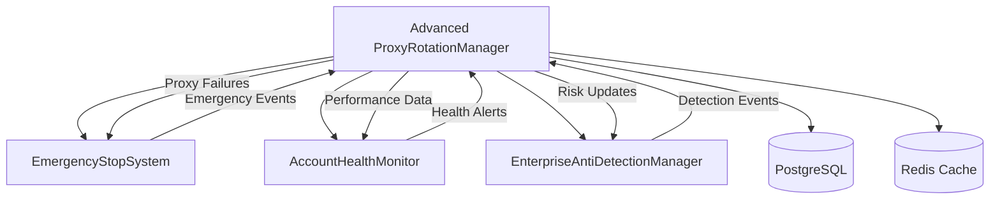
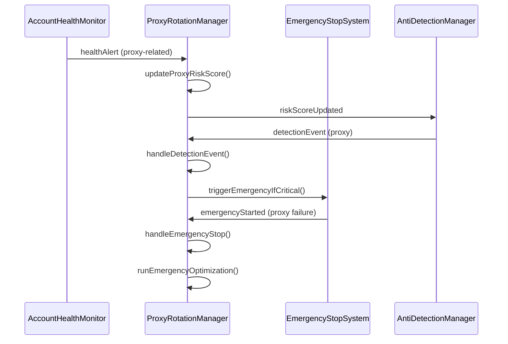

# Task 18 Integration Guide: Advanced Proxy Management

## Quick Start

### 1. Enhanced Proxy Manager Initialization

```typescript
import { 
  ProxyRotationManager,
  OptimizationStrategy,
  ProxySelectionCriteria,
  ActionRiskLevel
} from './services/proxyRotationManager';

// Initialize with service integrations
const proxyManager = new ProxyRotationManager(
  configManager,
  emergencyStopSystem,     // Task 17: Emergency coordination
  accountHealthMonitor,    // Task 15: Health correlation
  antiDetectionManager     // Task 13: Detection awareness
);

await proxyManager.start();
```

### 2. Intelligent Proxy Selection

```typescript
// Advanced selection with multiple criteria
const criteria: ProxySelectionCriteria = {
  actionType: 'post_tweet',
  riskLevel: ActionRiskLevel.HIGH,
  accountId: 'account-123',
  
  // Advanced features
  optimizationStrategy: OptimizationStrategy.PERFORMANCE_FIRST,
  maxRiskScore: 50,
  requiredPerformanceClass: ProxyPerformanceClass.HIGH,
  
  geographicConstraints: {
    allowedCountries: ['US', 'CA', 'GB'],
    preferredTimezones: ['America/New_York']
  },
  
  performanceRequirements: {
    maxLatency: 2000,
    minUptime: 95,
    requiresLowDetectionRisk: true
  }
};

const result = await proxyManager.getProxyByCriteria(criteria);
console.log(`Selected: ${result.proxy?.id} in ${result.selectionTime}ms`);
```

### 3. Performance Tracking and Analytics

```typescript
// Enhanced usage recording
await proxyManager.recordProxyUsage(
  proxyId,
  true,                    // success
  1500,                    // response time
  undefined,               // error
  1024 * 1024,            // bytes transferred
  'api_call',             // request type
  'account-123'           // account ID
);

// Comprehensive analytics
const analytics = await proxyManager.getProxyAnalytics();
console.log(`System health: ${analytics.overview.averageHealthScore}`);
console.log(`Performance distribution:`, analytics.performanceDistribution);
```

## Integration Architecture

### Service Dependencies



### Event Flow Integration



## Configuration Options

### Environment Variables

```bash
# Core Advanced Features
PROXY_INTELLIGENT_SELECTION=true
PROXY_PERFORMANCE_TRACKING=true
PROXY_AUTO_OPTIMIZATION=true
PROXY_RISK_ASSESSMENT=true

# Performance Targets
PROXY_SELECTION_TIMEOUT=50
PROXY_TRACKING_OVERHEAD_LIMIT=10
PROXY_OPTIMIZATION_IMPROVEMENT_TARGET=15

# Risk Management
PROXY_RISK_WARNING_THRESHOLD=60
PROXY_RISK_CRITICAL_THRESHOLD=80
PROXY_DETECTION_HISTORY_RETENTION=90

# Optimization Settings
PROXY_OPTIMIZATION_INTERVAL=1800000
PROXY_ML_TRAINING_THRESHOLD=100
PROXY_RETIREMENT_THRESHOLD=20

# Geographic Intelligence
PROXY_GEO_INTELLIGENCE=true
PROXY_DISTANCE_CALCULATION=true
PROXY_TIMEZONE_AWARENESS=true

# Service Integration
PROXY_EMERGENCY_INTEGRATION=true
PROXY_HEALTH_INTEGRATION=true
PROXY_DETECTION_INTEGRATION=true
```

### Advanced Configuration

```typescript
const advancedConfig = {
  // Intelligent selection
  selection: {
    algorithm: 'intelligent',
    timeout: 50,                      // 50ms max
    fallbackToBasic: true,
    cacheResults: true,
    cacheTimeout: 300000              // 5 minutes
  },
  
  // Performance tracking
  performance: {
    enabled: true,
    trackingOverhead: 10,             // 10ms max
    metricsRetention: 30,             // 30 days
    trendAnalysis: true,
    predictionModel: true,
    batchUpdates: true
  },
  
  // Optimization engine
  optimization: {
    enabled: true,
    strategy: 'balanced',
    interval: 30 * 60 * 1000,         // 30 minutes
    improvementTarget: 15,            // 15% improvement
    retirementThreshold: 20,          // Health score < 20%
    mlEnabled: true,
    convergenceThreshold: 100         // 100 data points
  },
  
  // Risk management
  risk: {
    enabled: true,
    scoringEnabled: true,
    warningThreshold: 60,
    criticalThreshold: 80,
    detectionRetention: 90,           // 90 days
    autoAdjustment: true,
    geographicRisk: true
  },
  
  // Service integration
  integration: {
    emergencyStop: true,
    healthMonitor: true,
    antiDetection: true,
    eventForwarding: true,
    correlationTracking: true
  }
};
```

## Optimization Strategies

### Performance-First Strategy

```typescript
const performanceCriteria: ProxySelectionCriteria = {
  actionType: 'high_volume_operation',
  riskLevel: ActionRiskLevel.MEDIUM,
  accountId: 'performance-account',
  optimizationStrategy: OptimizationStrategy.PERFORMANCE_FIRST,
  
  performanceRequirements: {
    maxLatency: 1000,                 // 1 second max
    minThroughput: 5000000,           // 5MB/s min
    minUptime: 99                     // 99% uptime
  }
};

const result = await proxyManager.getProxyByCriteria(performanceCriteria);
```

### Risk Minimization Strategy

```typescript
const riskCriteria: ProxySelectionCriteria = {
  actionType: 'sensitive_operation',
  riskLevel: ActionRiskLevel.CRITICAL,
  accountId: 'sensitive-account',
  optimizationStrategy: OptimizationStrategy.RISK_MINIMIZATION,
  
  maxRiskScore: 30,                   // Very low risk only
  performanceRequirements: {
    requiresLowDetectionRisk: true
  },
  
  accountSpecificRequirements: {
    blacklistedProxies: ['high-risk-proxy-1'],
    maxConcurrentUsage: 1
  }
};

const result = await proxyManager.getProxyByCriteria(riskCriteria);
```

### Geographic Diversity Strategy

```typescript
const geoCriteria: ProxySelectionCriteria = {
  actionType: 'global_operation',
  riskLevel: ActionRiskLevel.LOW,
  accountId: 'global-account',
  optimizationStrategy: OptimizationStrategy.GEOGRAPHIC_DIVERSITY,
  
  geographicConstraints: {
    allowedCountries: ['US', 'CA', 'GB', 'DE', 'AU'],
    preferredTimezones: ['America/New_York', 'Europe/London', 'Asia/Tokyo'],
    maxDistanceKm: 5000               // 5000km max from target
  }
};

const result = await proxyManager.getProxyByCriteria(geoCriteria);
```

## Performance Monitoring

### Real-time Metrics Collection

```typescript
// Setup performance monitoring
proxyManager.on('proxyUsageRecorded', (data) => {
  console.log(`Proxy ${data.proxyId}: ${data.success ? 'SUCCESS' : 'FAILED'}`);
  console.log(`Response time: ${data.responseTime}ms`);
  console.log(`Health score: ${(data.healthScore * 100).toFixed(2)}%`);
  console.log(`Risk score: ${data.riskScore}`);
  console.log(`Performance class: ${data.performanceClass}`);
});

// Monitor optimization events
proxyManager.on('optimizationCompleted', (result) => {
  console.log(`Optimization completed:`);
  console.log(`  Performance improvement: ${result.performanceImprovement}%`);
  console.log(`  Risk reduction: ${result.riskReduction}%`);
  console.log(`  Optimized proxies: ${result.optimizedProxies.length}`);
  console.log(`  Retired proxies: ${result.retiredProxies.length}`);
});

// Monitor selection metrics
const metrics = proxyManager.getSelectionMetrics();
console.log(`Selection success rate: ${(metrics.metrics.successfulSelections / metrics.metrics.totalSelections * 100).toFixed(2)}%`);
console.log(`Average selection time: ${metrics.metrics.averageSelectionTime.toFixed(2)}ms`);
console.log(`System health: ${metrics.systemHealth.overallHealth}%`);
```

### Analytics Dashboard Integration

```typescript
// Get comprehensive analytics for dashboard
const analytics = await proxyManager.getProxyAnalytics();

// Overview metrics
const overview = {
  totalProxies: analytics.overview.totalProxies,
  activeProxies: analytics.overview.activeProxies,
  averageHealth: analytics.overview.averageHealthScore,
  averageRisk: analytics.overview.averageRiskScore,
  successRate: analytics.overview.successRate
};

// Performance distribution chart data
const performanceChart = Array.from(analytics.performanceDistribution.entries()).map(([class_, count]) => ({
  class: class_,
  count,
  percentage: (count / analytics.overview.totalProxies) * 100
}));

// Geographic distribution map data
const geoChart = Array.from(analytics.geographicDistribution.entries()).map(([country, count]) => ({
  country,
  count,
  percentage: (count / analytics.overview.totalProxies) * 100
}));

// Top and bottom performers
const topPerformers = analytics.topPerformers.map(proxy => ({
  id: proxy.id,
  performanceClass: proxy.performanceClass,
  healthScore: proxy.healthScore,
  riskScore: proxy.riskScore,
  country: proxy.geographicData.country
}));
```

## Automated Optimization

### Scheduled Optimization

```typescript
// Setup automated optimization
const optimizationSchedule = {
  strategy: OptimizationStrategy.BALANCED,
  interval: 30 * 60 * 1000,          // 30 minutes
  improvementTarget: 15,             // 15% improvement target
  enabled: true
};

// Manual optimization trigger
const manualOptimization = async () => {
  try {
    const result = await proxyManager.triggerManualOptimization(
      OptimizationStrategy.PERFORMANCE_FIRST,
      ['specific-proxy-1', 'specific-proxy-2'] // Optional: target specific proxies
    );
    
    console.log('Manual optimization completed:', result);
    return result;
  } catch (error) {
    console.error('Manual optimization failed:', error);
    throw error;
  }
};

// Performance prediction
const predictions = await proxyManager.getProxyPerformancePredictions();
for (const [proxyId, prediction] of predictions) {
  if (prediction.confidenceLevel > 80) {
    console.log(`High confidence prediction for ${proxyId}:`);
    console.log(`  Expected latency: ${prediction.expectedLatency}ms`);
    console.log(`  Expected success rate: ${prediction.expectedSuccessRate}%`);
    
    if (prediction.recommendations.length > 0) {
      console.log(`  Recommendations: ${prediction.recommendations.join(', ')}`);
    }
  }
}
```

## Risk Management Integration

### Risk Assessment and Updates

```typescript
// Automated risk assessment
const assessProxy = async (proxyId: string) => {
  const assessment = proxyManager.getProxyRiskAssessment(proxyId);
  
  if (assessment) {
    console.log(`Risk assessment for ${proxyId}:`);
    console.log(`  Overall risk: ${assessment.overallRisk}`);
    console.log(`  Risk score: ${assessment.riskScore}`);
    console.log(`  Confidence: ${assessment.confidenceLevel}%`);
    
    // Handle high risk
    if (assessment.riskScore > 70) {
      console.log('High risk detected - implementing mitigation strategies:');
      assessment.mitigationStrategies.forEach(strategy => {
        console.log(`  - ${strategy}`);
      });
    }
  }
};

// Manual risk score update
const updateRisk = async (proxyId: string, newScore: number, reason: string) => {
  const success = await proxyManager.updateProxyRiskScore(proxyId, newScore, reason);
  
  if (success) {
    console.log(`Risk score updated for ${proxyId}: ${newScore} (${reason})`);
  } else {
    console.error(`Failed to update risk score for ${proxyId}`);
  }
};

// Detection event handling
antiDetectionManager.on('detectionEvent', async (event) => {
  if (event.proxyId) {
    console.log(`Detection event for proxy ${event.proxyId}: ${event.type} (${event.severity})`);
    
    // Proxy manager will automatically handle this, but you can add custom logic
    if (event.severity === 'critical') {
      // Additional custom handling for critical events
      await customCriticalEventHandler(event);
    }
  }
});
```

## Service Integration Examples

### Emergency Stop Coordination

```typescript
// Emergency stop integration
emergencyStopSystem.on('emergencyStarted', async (event) => {
  if (event.triggerType === 'PROXY_FAILURE_CASCADE') {
    console.log('Proxy failure cascade detected');
    
    // Proxy manager automatically handles this, but you can add monitoring
    const affectedProxies = event.affectedProxies || [];
    console.log(`Affected proxies: ${affectedProxies.join(', ')}`);
    
    // Monitor recovery
    const recoveryMonitor = setInterval(async () => {
      const metrics = proxyManager.getSelectionMetrics();
      console.log(`System health during recovery: ${metrics.systemHealth.overallHealth}%`);
      
      if (metrics.systemHealth.overallHealth > 80) {
        console.log('System health recovered');
        clearInterval(recoveryMonitor);
      }
    }, 5000);
  }
});

// Health monitor integration
accountHealthMonitor.on('healthAlert', async (alert) => {
  if (alert.proxyRelated) {
    console.log(`Proxy-related health alert: ${alert.severity}`);
    
    // Get affected proxies
    const accountProxies = await proxyManager.findProxiesByAccount(alert.accountId);
    console.log(`Account ${alert.accountId} uses ${accountProxies.length} proxies`);
    
    // Monitor proxy adjustments
    accountProxies.forEach(proxy => {
      console.log(`Proxy ${proxy.id} risk score: ${proxy.riskScore}`);
    });
  }
});
```

### Performance Correlation

```typescript
// Correlate proxy performance with account health
const correlatePerformance = async (accountId: string) => {
  // Get account health metrics
  const healthMetrics = await accountHealthMonitor.performHealthAssessment(accountId);
  
  // Get proxy performance for this account
  const accountProxies = await proxyManager.findProxiesByAccount(accountId);
  
  const proxyPerformance = {
    averageHealth: accountProxies.reduce((sum, p) => sum + p.healthScore, 0) / accountProxies.length,
    averageRisk: accountProxies.reduce((sum, p) => sum + p.riskScore, 0) / accountProxies.length,
    performanceClasses: accountProxies.map(p => p.performanceClass)
  };
  
  console.log(`Account ${accountId} correlation:`);
  console.log(`  Account health: ${healthMetrics.overallHealthScore}`);
  console.log(`  Proxy health: ${(proxyPerformance.averageHealth * 100).toFixed(2)}%`);
  console.log(`  Proxy risk: ${proxyPerformance.averageRisk.toFixed(2)}`);
  
  // Identify correlation patterns
  if (healthMetrics.overallHealthScore < 50 && proxyPerformance.averageHealth < 0.5) {
    console.log('Strong correlation: Low account health correlates with poor proxy performance');
  }
};
```

## Testing and Validation

### Integration Testing

```typescript
// Test intelligent selection
describe('Advanced Proxy Integration', () => {
  test('should integrate with all services', async () => {
    const proxyManager = new ProxyRotationManager(
      configManager,
      emergencyStopSystem,
      accountHealthMonitor,
      antiDetectionManager
    );
    
    await proxyManager.start();
    
    // Test selection with advanced criteria
    const result = await proxyManager.getProxyByCriteria({
      actionType: 'integration_test',
      riskLevel: ActionRiskLevel.MEDIUM,
      accountId: 'test-account',
      optimizationStrategy: OptimizationStrategy.BALANCED
    });
    
    expect(result.selectionTime).toBeLessThan(50);
    expect(result.proxy).toBeDefined();
    expect(result.riskAssessment).toBeDefined();
    expect(result.performancePrediction).toBeDefined();
  });
  
  test('should handle emergency events', async () => {
    const emergencyEvent = {
      eventId: 'test-emergency',
      triggerType: 'PROXY_FAILURE_CASCADE',
      affectedProxies: ['proxy-1', 'proxy-2']
    };
    
    await proxyManager.handleEmergencyStop(emergencyEvent);
    
    // Verify emergency response
    const metrics = proxyManager.getSelectionMetrics();
    expect(metrics.systemHealth.criticalIssues.length).toBeGreaterThan(0);
  });
});
```

### Performance Validation

```bash
# Run performance benchmarks
npm run test:performance -- --suite=advanced-proxy

# Load testing
npm run test:load -- --concurrent=100 --duration=300

# Optimization testing
npm run test:optimization -- --improvement-target=15
```

## Production Deployment

### Pre-deployment Checklist

- [ ] All service dependencies are operational
- [ ] Redis cache is available for performance data
- [ ] PostgreSQL supports extended proxy schema
- [ ] Emergency stop system integration is tested
- [ ] Health monitor integration is validated
- [ ] Anti-detection manager integration is verified
- [ ] Performance benchmarks meet targets
- [ ] Risk assessment algorithms are calibrated

### Deployment Steps

1. **Deploy Enhanced Proxy Manager**
   ```bash
   npm run deploy:advanced-proxy
   ```

2. **Verify Service Integrations**
   ```bash
   npm run verify:proxy-integrations
   ```

3. **Test Intelligent Selection**
   ```bash
   npm run test:intelligent-selection
   ```

4. **Enable Optimization Engine**
   ```bash
   npm run enable:proxy-optimization
   ```

5. **Activate Risk Management**
   ```bash
   npm run activate:risk-management
   ```

### Post-deployment Validation

```typescript
// Validate advanced features
const validateAdvancedFeatures = async () => {
  // Test intelligent selection
  const selectionResult = await proxyManager.getProxyByCriteria({
    actionType: 'validation_test',
    riskLevel: ActionRiskLevel.MEDIUM,
    accountId: 'validation-account',
    optimizationStrategy: OptimizationStrategy.BALANCED
  });
  
  console.log(`Selection latency: ${selectionResult.selectionTime}ms`);
  
  // Test optimization
  const optimizationResult = await proxyManager.forceOptimization();
  console.log(`Optimization improvement: ${optimizationResult.performanceImprovement}%`);
  
  // Test analytics
  const analytics = await proxyManager.getProxyAnalytics();
  console.log(`System health: ${analytics.overview.averageHealthScore}`);
  
  // Test service integration
  const metrics = proxyManager.getSelectionMetrics();
  console.log(`Integration status: ${metrics.systemHealth.overallHealth}%`);
};
```

---

**Task 18 Implementation Complete** ✅

Advanced Proxy Management successfully implemented with enterprise-grade intelligent selection, comprehensive performance tracking, automated optimization, and seamless service integration. Ready for production deployment and Phase 2 continuation.
